> OSI模型（7层）：这是一种事实上被TCP/IP（4层）模型淘汰的协议。

```javascript
链路	以太网（硬件接口）
网络	IP（不可靠）
运输	TCP用于数据分块和确认接收（可靠）、超时重传等（与UDP的区别）
                TCP和UDP采用16 bit的端口号来识别应用程序
                任何TCP/IP实现所提供的服务都用知名的 1～1023之间的端口号（知名端口号分配机构（ IANA）来管理）
                有时，一个I P地址和一个端口号也称为一个插口（ s o c k e t）
                Telnet是采用端口号为23的TCP/IP标准
应用	HTTP

第7层 应用层 HTTP
第6层 表现层 数据转换、加密和压缩
第5层 会话层 确保打开足够长的时间可以传数据//也可次设置几MB为检查点以备断传之后续传
第4层 传输层 TCP 数据   分 数据段
第3层 网络层 IP  数据段 分 数据包
第2层 数据链路层 Wi-Fi      数据包 分 帧
第1层 物理层                帧 分 二进制
```


---

> 网关/IP路由器/路由器 是同个东西。

```javascript
网桥		在链路层连结网络
路由器		在网络层连接网络
```


---


```javascript
InterNIC将IP地址分为五类:
    A类保留给ZF或大型企业，1.0.0.0-127.255.255.255，默认子网掩码为255.0.0.0
    B类分配给中等规模的公司，128.0.0.0-191.255.255.255，默认子网掩码为255.255.0.0
    C类分配给小公司或个人，192.0.0.0-223.255.255.255，默认子网掩码是255.255.255.0
    D类用于组播，
    E类用于实验，
    
ABC的专用IP地址： 就是我们在3类地址中常见到内网的IP段
    10.0.0.0-10.255.255.255（一个A类地址）
    172.16.0.0－172.31.255.255（16个B类地址）
    192.168.0.0－192.168.255.255（256个C类地址）
    //你要建网络（局域网），网络数多，且网络内主机较少（254以下）用192开头的合适；
    //你要建网络（局域网），网络数一般，且网络内主机较少（254以上，64516以下）用172开头的合适
```


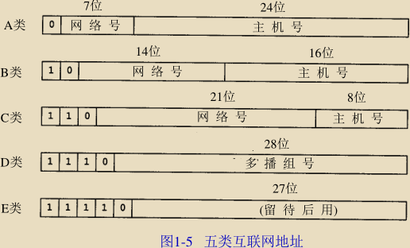


> IP 分为：分类号、网络号（InterNIC分配）、主机号	（互联网络信息中心（InterNIC）)

```javascript
网络号标识某个网络，主机号标识在该网络上的一个特定的主机
    即网络信息中心 N I C负责分配顶级域和委派其他指定地区域的授权机构
```


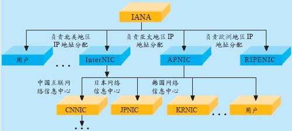

> 这些32位的地址通常写成四个十进制的数，其中每个整数对应一个字节。(二进制1111 1111就是等于255)

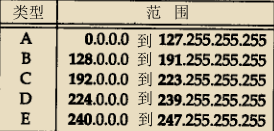

```javascript
地址范围
192.0.0.0到223.255.255.255
私有地址//私有IP地址则是在局域网中使用的IP地址
192.168.0.0到192.168.255.255
   NAT－Network Address Translation 网络地址转换, 当私有网络内的主机要与位于公网上的主机进行通讯时必须经过地址转换，将其私有地址转换为合法公网地址才能对外访问。
```

> TCP/IP协议栈：边传输边加各传输层头部，各头部都有一段协议域标识段

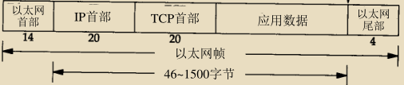

> TCP/IP协议栈 被解析分发

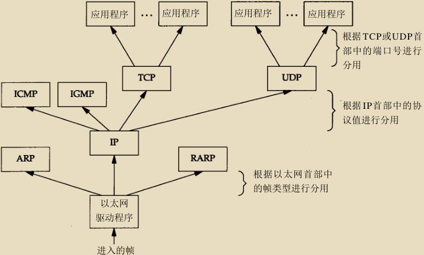


---

```javascript
ARP	(地址解析协议)		从(IP)到(MAC地址）进行动态映射,自动完成，不必关心
RARP	是被那些没有磁盘驱动器的系统使用（一般是无盘工作站或 X终端），它需要系统管理员进行手工设置
ICMP经常被认为是 I P层的一个组成部分。它传递差错报文以及其他需要注意的信息, ICMP封装在IP数据报内部
    多播(multicast) 处于单播和广播之间：帧仅传送给属于多播组的多个主机。
```


---

> 子网掩码:	根据子网掩码就可知道子网号与主机号之间的分界线（值为1的比特（255）留给网络号和子网号，为0的比特（0）留给主机号）

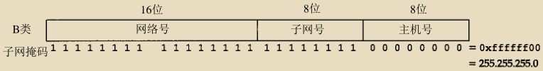

eg: 8bit子网号 8bit主机号

---

域名系统（D N S）是一种用于T C P / I P应用程序的分布式数据库，它提供主机名字和 I P地址之间的转换及有关电子邮件的选路信息。

> D N S最常用的版本（包括解析器和名字服务器）

```javascript
主机名 转 IP ：称为 解析器
解析器 使用 TCP/IP协议（主要是UDP）与 名字服务器 通信来完成这种相互转换
解析器 通常是应用程序的一部分，在一个应用程序请求 TCP打开一个连接或使用UDP发送一个数据报之前。心须将一个主机名转换为一个 IP地址
Internet组管理协议（IGMP）
```


---

> TCP

> 这一过程与打电话很相似，先拨号振铃，等待对方摘机说“喂”，然后才说明是谁

---

> TCP头部，20个字节，160位，切分如下

```javascript
序号是32 bit的无符号数，包含该连接的初始序号ISN（由这个主机选择）,用于计数每个传输的字节，当某个主机开启一个TCP会话时，
他的初始序列号是随机的，可能是0和4,294,967,295之间的任意值， I S N随时间而变化，因此每个连接都将具有不同的 I S N
```


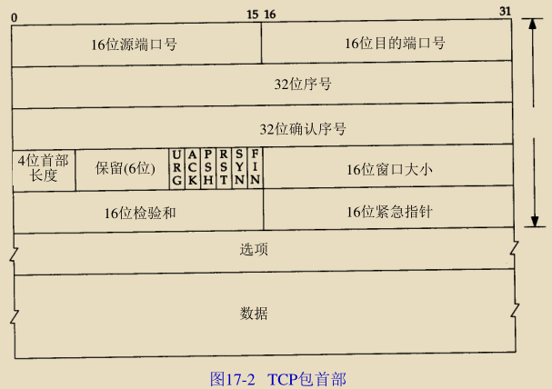


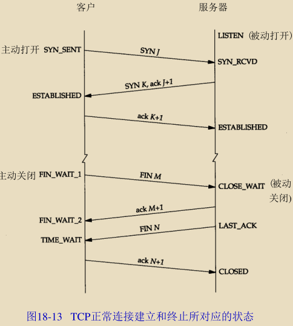

> 建立（三次握手确认双方都有发送和接受信息的能力）

```javascript
1) 请求端（通常称为客户）发送一个 S Y N段指明客户打算连接的服务器的端口，以及初始序号（I S N，在这个例子中为1 4 1 5 5 3 1 5 2 1）。这个S Y N段为报文段1。
2) 服务器发回包含服务器的初始序号的 S Y N报文段（报文段2）作为应答。同时，将确认序号设置为客户的I S N加1以对客户的S Y N报文段进行确认。一个S Y N将占用一个序号。
3) 客户必须将确认序号设置为服务器的 I S N加1以对服务器的S Y N报文段进行确认（报文段3）。
```


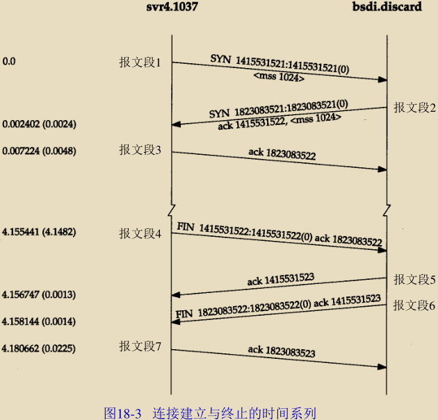

> 终止（四次挥手，tcp/ip双工传输，必须发送两次ack.）

```javascript
客户端发送一个F I N，用来关闭从客户到服务器的数据传送
当服务器收到这个 FIN，它发回一个ACK，确认序号为收到的序号加 1（报文段5） 
同时TCP服务器还向应用程序传送一个文件结束符。接着这个服务器程序就关闭它的连接，导致它的 TCP端发送一个FIN（报文段6），
客户必须发回一个确认，并将确认序号设置为收到序号加1（报文段7）。客户端进入TIME_WAIT状态;服务器收到客户端的ACK报文段以后，就关闭连接;此时，客户端等待2MSL后依然没有收到回复，则证明Server端已正常关闭，客户端也可以关闭连接了。
```

> 看到这里有没有发现最后的挥手状态，并不是四次挥手，而是三次挥手？？？

>     这是因为关闭连接有两种方式，当一方关闭连接，另外一方没有数据发送时，马上关闭连接，也就将第二步的ack与第三步的fin合并为一步了

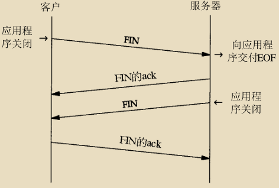

TCP首部中6个标志比特中的4个

```javascript
URG 	紧急指针（u rgent pointer）有效（见2 0 . 8节）。
ACK 	确认序号有效。
PSH 	接收方应该尽快将这个报文段交给应用层。
RST 	重建连接。
SYN 	同步序号用来发起一个连接。这个标志和下一个标志将在第 1 8章介绍。
            为了应对 同时主动打开，但仅建立一个连接（每一方必须发送一个SYN，且这些SYN必须传递给对方）
            也就是说 ，你不能没等我说好就建立，不然你建一个我建一个，我们要一起说好再建立一个
```


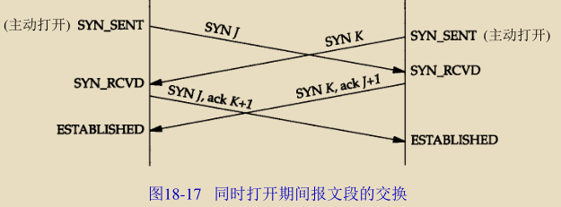

1. FIN 	发端完成发送任务。

---

> TCP与UDP的区别

```javascript
1、TCP面向连接（如打电话要先拨号建立连接）;UDP是无连接的，即发送数据之前不需要建立连接
2、TCP提供可靠的服务。也就是说，通过TCP连接传送的数据，无差错，不丢失，不重复，且按序到达;UDP尽最大努力交付，即不保 证可靠交付
3、TCP面向字节流，实际上是TCP把数据看成一连串无结构的字节流;UDP是面向报文的
    例，TCP连接就像是打电话，两者之间必须有一条不间断的通路，数据不到达对方，对方就一直在等待，除非对方直接挂断电话。先说的话先到，后说的后到，有顺序。
4、每一条TCP连接只能是点到点的;UDP支持一对一，一对多，多对一和多对多的交互通信
5、TCP首部开销20字节;UDP的首部开销小，只有8个字节
6、TCP的逻辑通信信道是全双工的可靠信道，UDP则是不可靠信道
```

