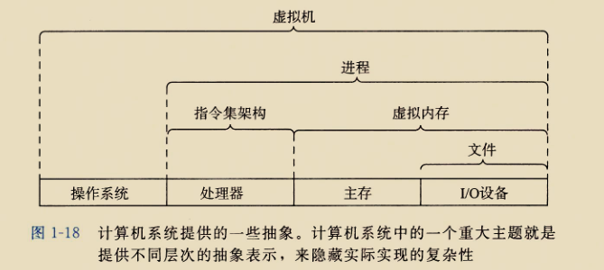
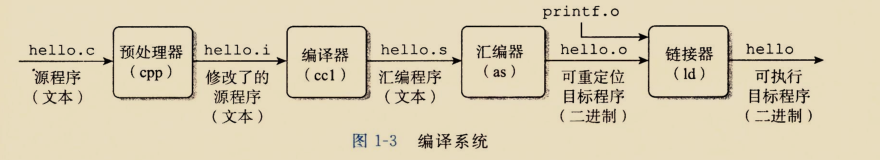
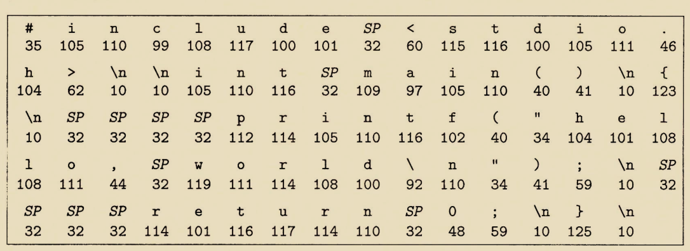
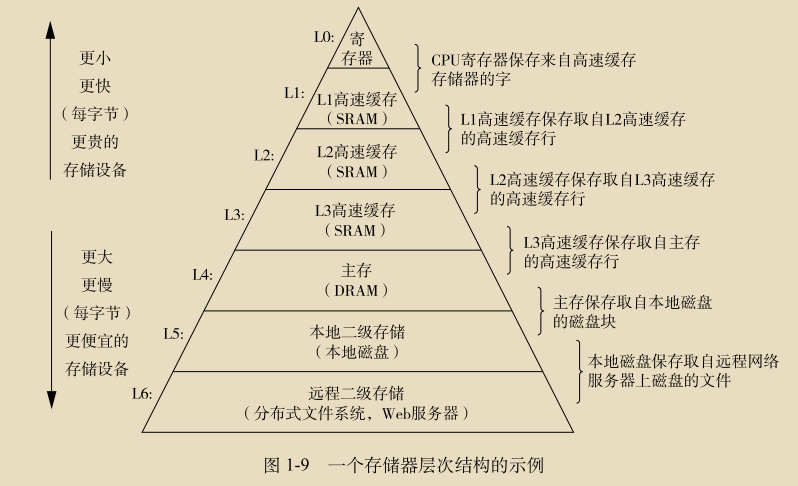
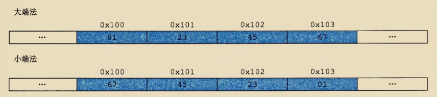
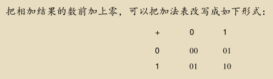
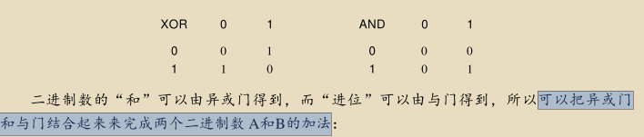
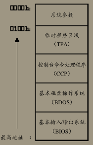

```javascript
IA32:英特尔32位架构处理器
X86-64:英特尔64位架构处理器
AMD:高级微信设备(公司)
ISA:指令集架构
PC:程序计数器,用%rip表示下一条指令在内存中的地址
寄存器:汇编%rsp指向的地址总是栈顶
IPC:进程间通信

GCC编译器:
-Og:优化生成的代码的可读性
-o:生成二进制
-S:生成汇编代码.s文件
-c:编译并汇编代码,生成二进制.o文件
```





---

```javascript
hello.i:插入了#include<stdio.h>的内容等
链接器:printf函数已经预编译好在printf.o中了,链接在一起
```




```javascript
hello.c以字节序列,如35 105 ,即是#i
```




```javascript

```


---

```javascript
总线:传送定长8个字节(64位)或者4个字节(32位) 的字节1 块(字)
PC:程序计数器(寄存器):大小为一个字节块(被高速缓存存储器替代)
```


---

```javascript
shell程序将字符逐一读入	寄存器,再把它们放到 内存 中
```





```javascript
第一个字节在前，就是"大头方式"（Big endian），第二个字节在前就是"小头方式"（Little endian）。
```





---

# <<编码>>

```javascript
与门：1	1才是1
或门（表示图形的左边是弧形）
与非门（有个小原点）：1	1才是0
异或门：一个1才是1，两个1不是1
反向器
缓冲器：没什么用，就是缓冲
A S C I I码是7位编码，用二进制代码 0 0 0 0 0 0 0～1111111 ,即十六进制代码0 0 h～7 F h来表示
U n i c o d e采用1 6位编码，每一个字符需要 2个字节。这意味着U n i c o d e的字符编码范围从0 0 0 0 h～F F F F h，可以表示65 536个不同字符。对世界上所有可用计算机进行来通信的语言来说，有足够的扩展空间。
```


```javascript
用逻辑门实现加法的方法：
```






```javascript
锁存器：也就是RAM

控制面板:控制0和1的开关板

键盘：代替了控制面板

文件系统：把大文件存放在不连续扇区的这种能力

假如2048的目录区，目录项的长度为32，则可以存放2048/32（64）个文件
目录项的32分配区存放文件名，文件类型，最后一块的扇区数，磁盘存储表（可以推算大小）等

引导程序把磁盘最开始的 1 2 8个字节的扇区装入内存并执行，这个扇区包含有把 C P / M的其余部分装入内存的代码，整个这个过程称为引导操作系统。

控制台指的是键盘和显示器
```




