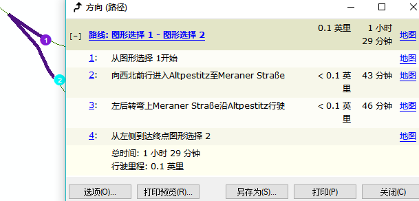
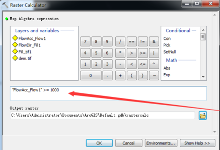
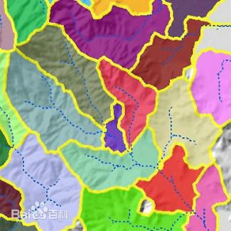
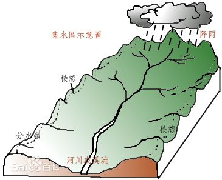
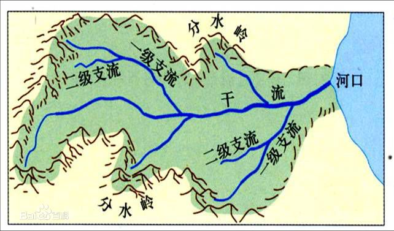
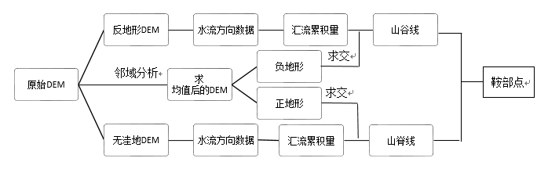

---

> 最短路径

```java
要有方向，就是告诉你在哪条路转弯的话，就需要有个街道名的字段，并且设置	网络数据集属性-方向-常规-街道字段！！！！
要用打断工具把	折线	打断成单独的	很多小的独立的直线！！！！！！
地理坐标系可以量测长度，但无法在字段直接计算几何出要素的长度，要转换成投影坐标系才可以！！！
如果想要分析完能看到所需的时间，就要在要进行网络分析的图层添加所需时间-字段，也就是某段折线所需的时间。
```


```java
修改完要进行网络分析的图层后要 重新新建路径 或 重新构建网络数据集 才能生效！！！
```





---

```java
矢量空间分析
    近邻分析：各学校最近的医院？
    
栅格空间分析   
    密度分析：闪电事件是很多的点来表示，2500万个闪电点主要集中再哪里?????
    欧氏距离：每个栅格距离河流的距离？？？
    成本距离：哪条路最短？花费最少？最安全？
    廊道分析：连接栖息地斑块的最佳路径？？
    
制作三维地形图
    数据获取途径：地图下载器
    在ArcScene中制作，两个东西：底图(.tif)和高程图（.dem)一个是颜色，一个是高程。
    
Aspect：坡向
提取坡向（范围内1，范围外0）：栅格计算器
Krging：克里金插值工具
提取指定范围：栅格计算器
Focus Statistics：焦点统计（邻域分析）mean平均值11x11
Contour：等值线（等高线）

拓补检查
    所有要素都要闭合：需要规则：不能有伪结点、不能有悬挂点、不能重叠、不能相交    
    共享要素：两个连着的多边形的共有边，它其实有两条，只不过叠再一起了，修改边的时候会把两条一起修改了，
        因为软件分辨不出来你要选哪条边，这时候就用到了共享要素，再共享要素窗口里勾选哪条软件就编辑哪条    
    要素不闭合：先用编辑工具-选择，选中要素，让要素为可编辑状态！！再用拓补工具-拓补编辑-选择，在点拓补工具-修改要素，在弹出的工具条中选择-延长要素！！！！

```


```java
//6 分析3D
    要进行3D分析，先要把要分析的数据全部转为3d数据！！！！！！
    用下面两个工具就可以转，转之前先在图层属性里设置拉伸！！！注意输出都是shp，不能放gdb，要放文件夹！！！！
    
    面转3d用这个！！！！！！！！[3D图层转要素类]
    
    点转3d用这个！！！！！！！！[依据属性实现要素转3D]
    
    天际线
        对于2维数据，只生成一个圆
        天际线的输出要素类：
            OBSV_PT_ID - 用于创建天际线的观察点 FID。
            ORIGFTR_ID - 要素（如建筑物）的 FID。
    
    3D 线与多面体相交
        可选点输出用于表示输入线和多面体要素之间的交叉点，并包含下列属性：
            LINE_OID - 沿原始线	找到交集的原始线的 OBJECTID。
            MPATCH_OID - 在此处与线相交的多面体的 OBJECTID。
            DIST_3D - 沿原始线	找到交集的 3D 距离。
    可选线输出会在交点处对输入线要素进行分割，并包含下列属性：
        LINE_OID - 派生新线的原始线的 OBJECTID。
        FROM_MP_ID - 与线的起点相交的多面体要素的 OBJECTID。值 -1 用于表示线的起点不是交点。
        TO_MP_ID - 与线的终点相交的多面体的 OBJECTID。值 -1 用于表示线的起点不是交点。
    注:如果线与多面体不相交，则直接将线复制到输出中，而且线的 FROM_MP_ID 和 TO_MP_ID 字段将包含 -1。
        DIST_3D - 沿原始线	  找到表示  新线起点   的  相交位置的 3D 距离。
        LENGTH_3D - 此新线的 3D 长度。从原始线派生的各新线的长度总和将等于原始线的 3D 长度。
    
    通视(线)
    
    可视域(面)

```


---

> 河流 山谷

```java
可以用提取的 河道网络 为出水口，对流域进行子流域划分！！！！！！！
-->Fill：填洼
-->Flow Direction:流向
-->Flow Accumulation(流量）
-->栅格计算（要流量累计>1000的)得到二值图层
-->重分类（0值设为NoDate）得到纯河流
-->河网联接－→河网分级
-->栅格河网矢量化得到最终结果
```





```java
分水线：又叫 分水岭线，是分水岭的脊线，一般是几个山围起来
```





```java
分水岭：将一流域与另一流域分开的山岭(分水岭division)，被分水线包起来
```





```java
流域，指由分水线（脊线）所包围的河流集水区//在ArcGIS里的工具是分水岭（WaterShed）！！！！！！！
```




```java
一个盆域是一个大流域，由好多分水岭组成
    //两条一级河道汇合后的河道称为二级河道
```


---

> 鞍部提取

```java
    ArcGIS是10.2版本，envi是 4.8版本，VS2010,  office2010
    鞍部提取：鞍部是两个山脊（分水线）和两个山谷（集水线）会合的地方，山脊线与山谷线的交点的位置便是鞍部点
    
原理:山脊部位流量累积为0，且海拔大于0。
    焦点统计（邻域分析）mean平均值11x11
    原始数据（减）mean平均值图层，再重分类，分级界线为0。
    生成等值线、山体阴影	//用于判断
    大于0为1，小于0赋值为0  即得到正地形（dem值>0的区域)，负地形则相反
    填洼-->流向-->流量，提取累积量为0的值（因为这是山脊的特征！！），但你发现好多都不是山脊，所以你要进行3x3邻域分析，求均值，数据光滑
    现在要用  等值线图和晕渲图  跟平滑后的山脊图层进行对比，山脊图层属性值越接近1越可能是山脊线，最终确定一个值，如0.56以上的是山脊，其他不是，再重分类为（1，0）
    为消除存在于负地形区域的错误山脊线！！！将重分类后的山脊（1，0）与正地形数据相乘，再重分类，不为1就不是山脊线，就设为NODATA，就得到了山脊线
    同理做山谷线
    将山脊线数据与山谷线数据相乘，得到结果为鞍部区（不准）
    鞍部区与正地形数据相乘得到鞍部点（较准）
    配合等高线和晕渲数据，删除处于样区边缘以及内部的伪鞍部点（超准）

反地形：abs(dem-2000),原来1400米就变成了600米，原来-500米就变成了2500米！即地形反过来了！！！
```





---

