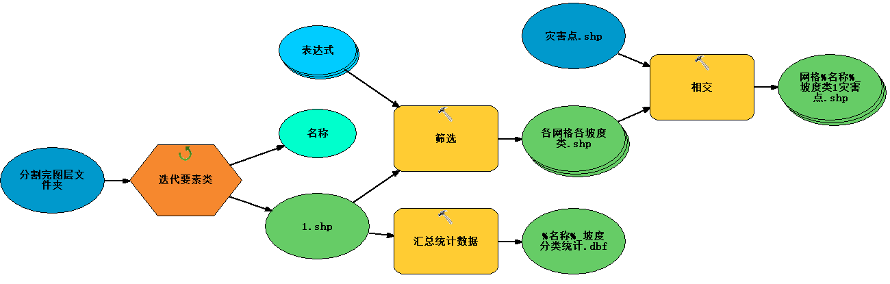
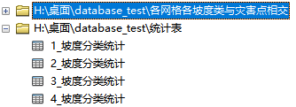
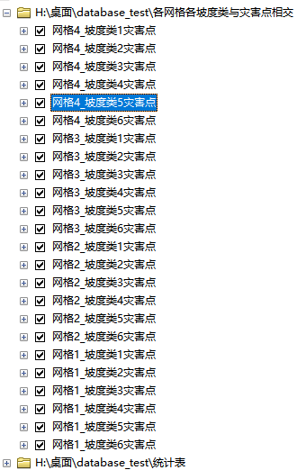
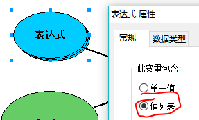
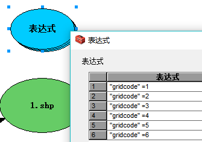
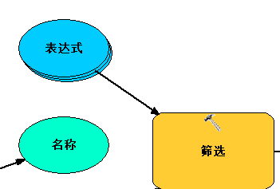
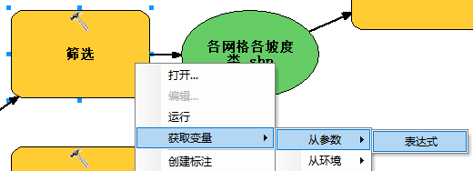
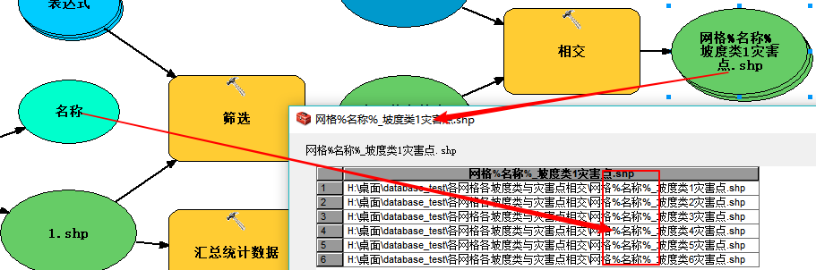

```java
迭代器，整个模型只能由一个，因为有迭代器后模型是一遍完整走完 再 一遍完整走完的。
如何让整个模型重新运行？（模型运行过的部分会有阴影，怎么消去？）——点下图的勾，再运行
托管：就不用设置路径
```


```java
以下模型的运行结果如下
```










```java
怎么设置工具的运行顺序？——我要让他先，就把他设为我的前提条件（右键工具-属性-前提条件）

用某工具处理某文件夹的所有要素类？——插入一个迭代要素类

有多种情况？例如把坡度筛选成六类？
```







```java
图中蓝色的表达式椭圆是怎么搞出来的？
```







```java
下图中这些模型模型参数是怎么来的？
```


```java
如何让输出要素的名称都不同？——用行内变量
```





