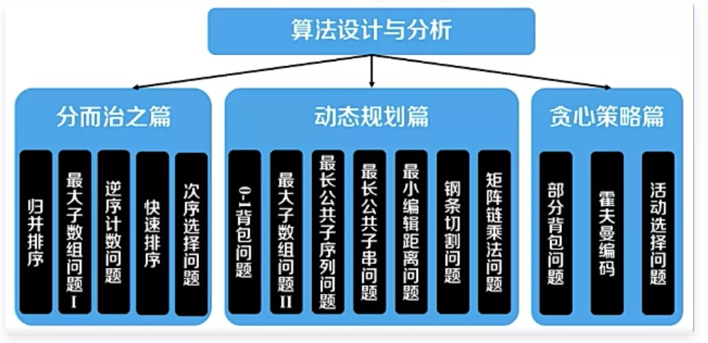
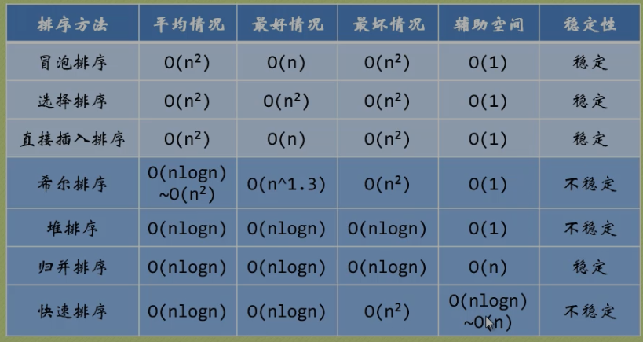
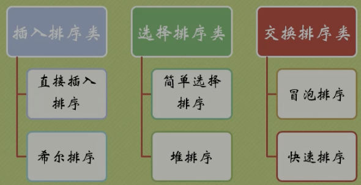

```javascript
慕课网上的课程《玩儿转算法面试》
  02 时间复杂度
         02 时间复杂度基础
         03 时间复杂度的通用代码
         04 时间复杂度实验
         05 递归时间复杂度
         06 摊销时间
         07 摊销时间 2
  03 使用数组
         01 二分查找
         02 二分查找二
         03 移动零点
         04 移动零点 II
         05 排序颜色
         06 二和二
         07 最小大小子数组和
         08 不重复字符的最长子串
  04 使用哈希表
         01 两个数组的交集
         02 两个数组的交集 II
         03 更多关于设置和地图
         04 二和
         05 4Sum II
         06 回旋镖数量
         07 包含副本 II
         08 包含副本 III
  05 关于链表
         01 反向链表
         02 测试你的链表
         03 删除链表元素
         04 成对交换节点
         05 删除链表中的节点
         06 从列表末尾删除第 N 个节点
  06 堆栈和队列
         01 有效括号
         02 递归和堆栈
         03 递归算法的非递归实现
         04 二叉树级顺序遍历
         05 完美的正方形
         06 优先队列
         07 Top K 频繁元素
         可选 01 经典非递归前序遍历
         可选02经典非递归中序遍历
         可选03经典非递归后序遍历
         可选 04 二叉树莫里斯遍历
         可选05字梯
  07 二叉树和递归
         01 二叉树的最大深度
         02 反转二叉树
         03 路径总和
         04 二叉树路径
         05 路径总和 III
         06 二叉搜索树的最低共同祖先
  08 递归和回溯
         01 02 电话号码的字母组合
         03 排列
         04 组合
         05 组合优化
         06 词搜索
         07 岛屿数量
         08 N皇后区
  09 动态规划//递归有重叠子问题就可以用 可以用记忆化搜索(自上而下)的, 就可以用动态规划(自下而上)
         01 斐波那契
         02 爬楼梯
         03 整数中断
         04 房子强盗
         05 0 1 背包
         06 0 1 背包优化
         07 分区相等子集和
         08 最长递增子序列
         09 最长公共子序列
         可选 01 更多关于斐波那契
         可选 02 更多关于 LIS
  10 贪心算法
          01 分配 Cookie
          02 非重叠区间    
          
第一章-线性表基础
1、链表（List）及经典问题
2、线程池与任务队列（Task-Queue）
3、递归与栈（Stack）：解决表达式求值
第二章-树结构基础
1、二叉树（Binary-Tree）与经典问题
2、堆（Heap）与优先队列
3、并查集（Union-find）及经典问题
第三章-排序算法
1、快速排序（Quick-Sort）及优化
2、归并排序（Merge-Sort）：从二路到多路
3、算法杂谈系列（Algorithm）：有趣的排序思想
第四章-查找与搜索
1、二分算法（Binary-Search）：致敬经典，超越经典
2、哈希表（Hash-Table）与布隆过滤器（Bloom-Filter）
3、深搜（DFS）与广搜（BFS）：初识问题状态空间
第五章-单调栈与单调队列
1、单调队列（Monotone-Queue）及经典问题
2、单调栈（Monotone-Stack）及经典问题
3、专项面试题解析
第六章-手撕平衡二叉树排序树
1、手撕 AVL 树
2、手撕红黑树（上）-插入调整
3、手撕红黑树（下）-删除调整

第七章-从递推算法到动态规划
    1、递推算法及解题套路
    2、动态规划算法
    3、动态规划算法优化
第八章-字符串匹配问题
    1、经典匹配算法：KMP、Sunday 与 Shift-[And/Or] 算法
    2、字典树（Trie）与双数组字典树（Double-Array-Trie）
    3、哈弗曼编码（Halfman-Coding）与二叉字典树
第九章-算法杂谈系列月
    1、从前缀和到树状数组（Binary-Indexed-Tree）
    2、一个公式引发的算法学习惨案
    3、有趣的莫比乌斯反演（Möbius Inversion）
第十章-金融系统中的 RSA 算法
    第十一章-傅立叶变换与信息隐写术
    第十二章-状态机模型与语言解释器


《前端算法精进之路》
第一章-线性表基础
1、LRU缓存算法---Vue源码中的链表
2、React Fiber解构拆解---React源码中的链表
3、event-loop--浏览器中的微任务和宏任务队列
4、JSX是如何工作的--React生态源码中的栈
第二章-树结构基础
1、戏说虚拟dom---树形结构
2、现代浏览器是如何渲染页面的---树形结构解析
3、React源码任务优先级调度（优先级队列）
第三章-排序算法
1、常见排序算法js版
2、Javascript自带的sort是怎么实现排序的--V8引擎中的排序算法
第四章-查找与搜索
1、ES6里的Map原理 （哈希表）
2、布隆过滤器思想在前端的应用//用来告诉你 “某样东西一定不存在或者可能存在”
3、趣谈搜索算法
第五章-算法思想
1、何为贪心算法
2、二分算法的实战
3、Vue3源码中的贪心和二分
第六章-平衡树
1、号称前端面试天花板的红黑树
2、JS手撕红黑树
第七章-动态规划
1、何为动态规划
2、动态规划套路详解
3、团灭常见leetcode动态规划题
第八章
1、虚拟dom算法深究--最长递增子序列
2、从最短编辑路径看前端性能优化
第九章
1、前端算法杂谈
2、从算法角度看待前端发展历程
第十章
1、前端加密算法
2、前端常见加密算法实战
第十一章
1、截图信息隐写术
2、编译原理初识
第十二章
1、前端状态机
2、vue和React源码中的编译原理
3、javascript解释器
```




```javascript
线性表
    适合读取,不适合增删
链表
    删除技巧//设置虚拟头节点
    相反
    判断有环:
        1.两个指针,A一直一步一步的走, B每次从头走到A, 看看AB次数是否一致
        2.快慢指针不相遇
```

```javascript
确定边界最重要
滑动窗口最大值问题?
回溯法:一条路走到黑, 碰壁了再回来重置条件

平衡二叉树删除, 找到右子节点的最小值,替换要删除的
```


```javascript
1、排序
    非重点：
        归并排序//  2个一组，排完组内，再合并排序
        堆排序  //变成一个堆，从下往上让子向根(父)对比，让堆顶最大(大顶堆)，再递归其他，得到大到小的序列

稳  定: 插入排序、合并排序、冒泡排序等
不稳定: 堆排序、快速排序等
//不稳定排序的主要缺点是，多重排序时可能会产生问题。eg:
    //假设有一个姓和名的列表，按照“先姓，后名”进行排序。开发者可能会先按名字排序，再按姓氏进行排序。
     //如果排序算法是稳定的，这样也可以达到“先姓，后名”的排序效果。如果是不稳定的，就不行。
     
2、堆栈、队列、链表
    堆栈一定要准备JS的top、push、shift、unshift这四个api，本身就帮我们实现了堆栈和队列。
    
    链表和数组区别 //内存不连续,改快读慢,长度动态
    
3、递归 //特征:要返回,也叫回溯, 真正的回溯是有手动恢复状态的
    递归是一定不能偷懒的。算法比较难的时候，一般要用到递归。
    尾递归:函数调用出现在调用者函数的尾部, 因为是尾部, 所以根本没有必要去保存任何中间局部变量, 节省内存
    
4、波兰式和逆波兰式


总结：
    比如阿里，如果基础题答的很好，但是算法不会，那可能通不过。
    还有金融类的，必考算法。比如阿里云，里面的业务就是算法的，所以肯定考算法。
```


```javascript
取模(mod)==求余(rem)
```







