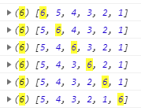
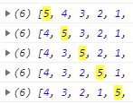
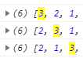
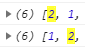

重点

```javascript
//js代码
(function (arr) {
    function swap(arr,i,j){
       var temp = arr[i];
        arr[i] = arr[j];
        arr[j ] = temp;
    }
    var i = 0;
    while (i < arr.length) {
        for (var j = 0; j < (arr.length - i); j++) {//每次缩小排序区间，最后肯定是最大的，不用对比了
            if (arr[j] > arr[j + 1]) {//大就换到后面
                 swap(arr,i,i+1)
            }
        }
        i++;//每次缩小排序区间，最后肯定是最大的，不用对比了
    }
    console.log(arr)
})([5, 4, 3, 2, 1]);
```


---

冒泡排序

1. 从左向右，两两对比，6比跟它对比的都大，结果被交换到最后



1. 从左向右，最后肯定是最大的，不用对比了，直接对比前5项，5比跟它对比的都大，结果被交换到最后



1. 从左向右，最后肯定是最大的，不用对比了，直接对比前4项，4比跟它对比的都大，结果被交换到最后


1. 从左向右，最后肯定是最大的，不用对比了，直接对比前3项，3比跟它对比的都大，结果被交换到最后



1. 从左向右，最后肯定是最大的，不用对比了，直接对比前2项，2比跟它对比的都大，结果被交换到最后



