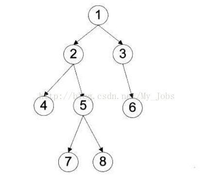

```javascript
树遍历的4种方式：
    前序遍历：中左右,根结点 ---> 左子树 ---> 右子树 //前中后指的是根节点是第一/二/三个遍历的
    中序遍历：左中右,左子树---> 根结点 ---> 右子树
    后序遍历：左右中,左子树 ---> 右子树 ---> 根结点
    层次遍历：只需按层次遍历即可
    
BST//二叉搜索树
```

例如，求下面二叉树的各种遍历



```javascript
前序遍历：[1]  2  4  5  7  8    3  6 
中序遍历： 4   2  7  5  8 [1]   3  6
后序遍历： 4   7  8  5  2  6    3 [1]
层次遍历：[1]  2  3  4  5  6    7  8
```


---

```javascript
字节（Byte ）最常用的是8位的二进制数
1字符=1字节
1汉字=2字节=2字符
ASCII码：一个英文字母（不分大小写）占一个字节的空间。 
一个二进制数字序列，在计算机中作为一个数字单元，一般为8位二进制数，换算为十进制
```

