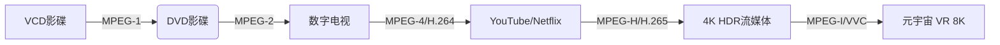

### 🤖 Assistant

**MPEG**（Motion Picture Experts Group）是制定**音视频压缩编码标准**的国际组织，属于 ISO/IEC（国际标准化组织/国际电工委员会）的一部分。它的标准深刻影响了数字媒体领域，以下是核心要点：

---

### 🔍 **MPEG 核心标准概览**
| **标准**      | **诞生年份** | **核心应用**                                | **关键技术**                          |
|---------------|------------|--------------------------------------------|---------------------------------------|
| **MPEG-1**    | 1993       | VCD 光盘、MP3 音频                         | 首次实现音频 (Layer I/II/III) 视频同步压缩 |
| **MPEG-2**    | 1995       | DVD、数字电视（DVB）、卫星广播              | 支持隔行扫描、多声道音频（AC3）        |
| **MPEG-4**    | 1999       | 网络视频（DivX/Xvid）、H.263 视频通话      | **H.264/AVC**（最广泛应用）脱颖而出    |
| **MPEG-H**    | 2013       | 超高清电视（4K/8K HDR）、流媒体（HEVC/H.265） | **H.265/HEVC**（省带宽50%）            |
| **MPEG-I**    | 2020       | 沉浸式媒体（VR/AR）、点云压缩、H.266/VVC    | **VVC**（H.266）面向8K/VR新场景       |

> 📌 **关键数字**：  
> - H.264（MPEG-4 Part 10）覆盖 **90%** 网络视频  
> - H.265（HEVC）节省 **50%** 带宽（4K时代核心）  
> - H.266（VVC）再省 **30-50%** 带宽（2023年商用化）

---

### 💡 **MPEG的三大领域突破**
1. **视频压缩**  
   - 发明 **I/P/B帧**（帧间预测+运动补偿）  
   - 推动分辨率从 VCD(352x240) → 8K(7680x4320)

2. **音频编码**  
   - **MP3**（MPEG-1 Layer III）引发数字音乐革命  
   - **AAC**（MPEG-4音频）成流媒体主流格式（Spotify/Apple Music）

3. **系统层封装**  
   - **MPEG-2 TS**（传输流）：卫星电视/DVB核心协议  
   - **MP4**（MPEG-4 Part 14）：网络视频通用容器  

---

### 🌐 **现实影响示例**

---

### ⚠️ **易混淆概念澄清**
| **术语**       | **性质**         | **与MPEG关系**                              |
|----------------|------------------|--------------------------------------------|
| **MPEG**       | **标准体系**      | 规范制定组织（定义编码规则）               |
| **H.264/H.265**| **编码标准**      | MPEG-4/MPEG-H 的核心技术                    |
| **MP4**        | **封装格式**      | MPEG-4 Part 14 定义的容器                    |
| **FFmpeg**     | **开源工具**      | 软件项目（支持MPEG标准编/解码）             |

> 简言之：**MPEG制定规则，FFmpeg等工具实现规则**。

---

### 🔮 **未来方向**
- **VVC（H.266）**：面向8K/VR的低码率压缩  
- **MPEG-5 EVC**：免专利费的基础编码器  
- **点云压缩**：元宇宙3D场景高效传输  

若您需要了解某个标准的具体技术细节（如 H.264 的 GOP 结构）或编解码实现，可随时告诉我！

