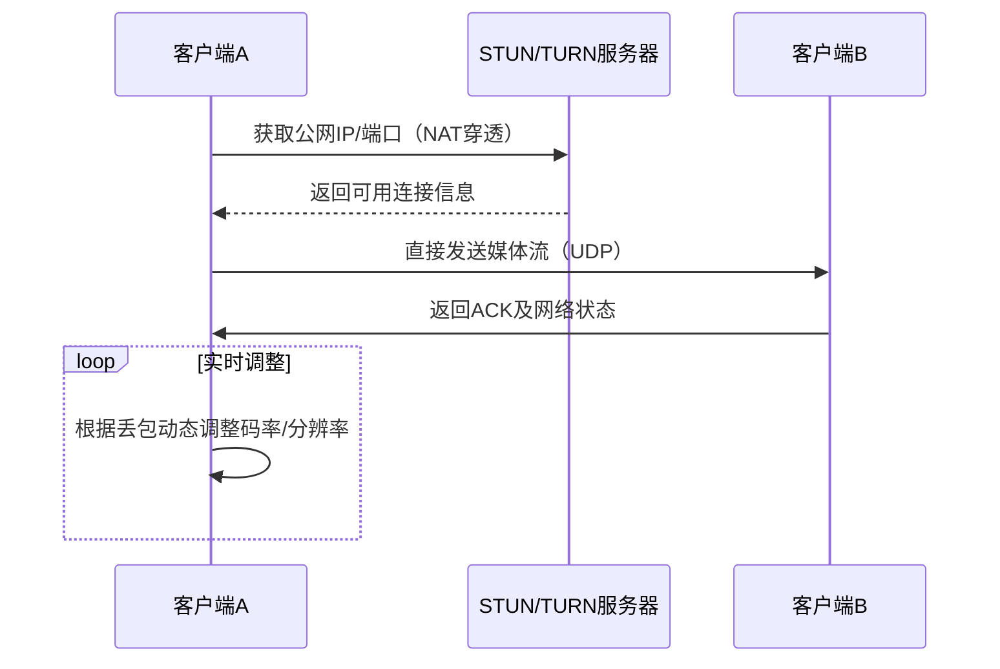
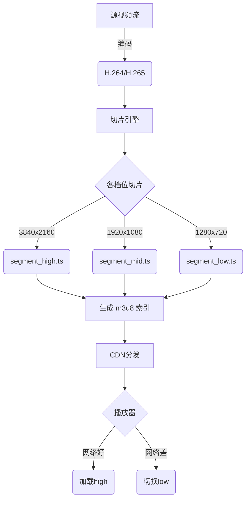

### 🤖 Assistant


您点到了**流媒体传输协议**的核心！WebRTC和HLS是两种完全不同的技术路线，与其说是“编码标准”或“封装格式”，不如说是**传输层协议+播放策略**的系统级方案。以下是硬核解析：

---

### 🌐 **WebRTC vs HLS 的本质区别**
| **维度**       | **WebRTC (Web Real-Time Communication)**      | **HLS (HTTP Live Streaming)**               |
|----------------|--------------------------------------------|--------------------------------------------|
| **核心目标**    | **实时交互**（<200ms 延迟）                 | **稳定自适应**（抗网络抖动）                 |
| **技术协议**    | UDP + ICE/STUN/SCTP + DTLS/SRTP            | HTTP + TCP + TS/FMP4 切片                   |
| **典型场景**    | 视频会议、在线教育、远程控制                 | 点播（Netflix）、直播（Twitch低延时模式）    |
| **延迟范围**    | **50ms~1s**（端到端）                       | **3s~60s**（普通模式） / **<3s**（低延时）    |
| **编码要求**    | 强制 VP8/VP9/H.264（Safari 需 H.264）        | 任意编码（H.264/H.265/AAC/Opus 等均可）       |

---

### ⚙️ **底层架构对比**
#### **WebRTC 工作流**（实时通信王者）

**关键技术**：  
- **NAT穿透**：通过 STUN/TURN 服务器解决防火墙阻碍  
- **抗丢包加密**：SRTP 保护媒体流 + SCTP 传数据   
- **动态适应**：WebRTC GCC 算法实时控流  

> 💡 **核心限制**：浏览器必须支持 `PeerConnection API`（不能用在纯原生App）

---

#### **HLS 工作流**（自适应流标杆）

**关键技术**：  
- **切片分档**：多分辨率/码率版本同步生成  
- **索引驱动**：`m3u8` 文件描述片段顺序/位置  
- CDN 友好：HTTP 协议无缝兼容缓存系统  

> 📌 **致命延迟瓶颈**：至少需要缓存 **3个切片** 才能起播（默认切片时长=10s → 基础延迟30s）  

---

### 🚀 **低延时改进方案**
| **协议**           | **手段**                          | **可达延迟** | **代价**                     |
|--------------------|----------------------------------|-------------|-----------------------------|
| **WebRTC**         | 原生支持实时                      | <1s         | 开发复杂/NAT穿透难           |
| **LHLS**           | 缩短切片 + 分块传输(chunked)       | 1~3s        | 播放器需改造                 |
| **LL-HLS**         | 预加载提示 + 部分片段加载           | <2s         | 需HLS v10+支持（兼容性差）   |
| **DASH-MS**        | CMAF切片+Chunked                 | 2~5s        | 部署复杂                      |

> 🔥 2023趋势：**WebRTC为底座 + 聚合CDN**（如Cloudflare Stream）

---

### 🛠️ **FFmpeg 操作实例**
#### 1. **生成 HLS 切片流**
```bash
ffmpeg -i input.mp4 \
  -c:v libx264 -profile:v high -level 4.0 \
  -c:a aac -b:a 128k \
  -vf scale=w=-2:h=360:force_original_aspect_ratio=decrease \
  -hls_time 4 -hls_playlist_type event \
  output_360p.m3u8
```

#### 2. **推送 WebRTC 流（需 SDP 协商）**
```bash
# 使用 SRS 等媒体服务器中转
ffmpeg -i input.mp4 \
  -c:v libx264 -tune zerolatency \
  -preset ultrafast -f rtp \ 
  rtp://your_server_ip:20000?pkt_size=1200
```

---

### ❗ **选择指南**
- **选 WebRTC 当**：  
  ✔ 需要**双向实时**对话（视频会议/远程医疗）  
  ✔ 弱网下仍要 **<1s延迟**（如云游戏控制）  
  ❌ 避免点播/单向直播（杀鸡用牛刀）  

- **选 HLS 当**：  
  ✔ **广播性质**内容（赛事直播/课程点播）  
  ✔ 需**跨设备高兼容**（老年机也能播）  
  ❌ 强互动场景不适用（连麦延迟太高）  

当前实战组合拳：**HLS 兜底 + WebRTC 实时增强端**（如主播端用 WebRTC 推流，观众端用 LHLS 播放）  

需要具体场景的架构设计或命令调优，欢迎继续提问！ 👨‍💻📡

