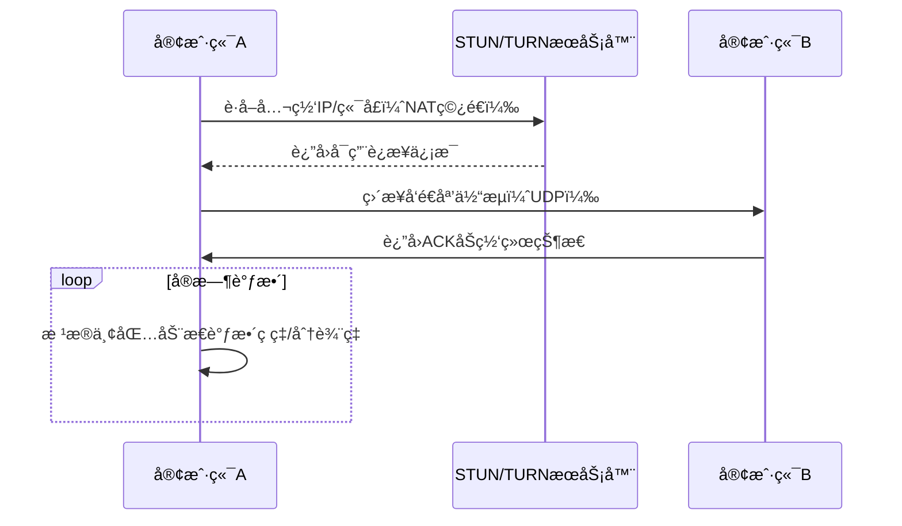
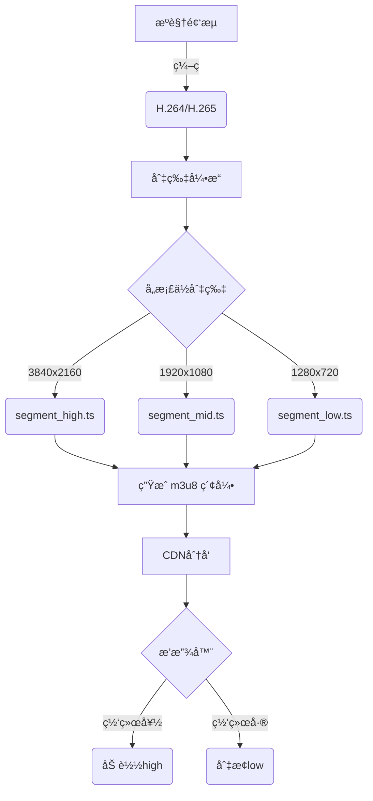

### 🤖 Assistant


您点到了**æµåª’体传输åè®®**的核心ï¼WebRTCå’ŒHLS是两ç§å®Œå…¨ä¸åŒçš„技术路线，ä¸å…¶è¯´æ˜¯â€œç¼–ç æ ‡å‡†â€æˆ–“å°è£…æ ¼å¼â€ï¼Œä¸å¦‚说是**传输层åè®®+播放策略**的系统级方案。以下是硬核解æ：

---

### 🌠**WebRTC vs HLS 的本质区别**
| **维度**       | **WebRTC (Web Real-Time Communication)**      | **HLS (HTTP Live Streaming)**               |
|----------------|--------------------------------------------|--------------------------------------------|
| **核心目标**    | **å®æ—¶äº¤äº’**（<200ms 延迟）                 | **稳定自适应**（抗网络抖动）                 |
| **技术åè®®**    | UDP + ICE/STUN/SCTP + DTLS/SRTP            | HTTP + TCP + TS/FMP4 切片                   |
| **å…¸å‹åœºæ™¯**    | 视频会议ã€åœ¨çº¿æ•™è‚²ã€è¿œç¨‹æ§åˆ¶                 | 点播（Netflix）ã€ç›´æ’­ï¼ˆTwitchä½å»¶æ—¶æ¨¡å¼ï¼‰    |
| **延迟范围**    | **50ms~1s**（端到端）                       | **3s~60s**（普通模å¼ï¼‰ / **<3s**（ä½å»¶æ—¶ï¼‰    |
| **ç¼–ç è¦æ±‚**    | 强制 VP8/VP9/H.264（Safari 需 H.264）        | ä»»æ„ç¼–ç ï¼ˆH.264/H.265/AAC/Opus ç­‰å‡å¯ï¼‰       |

---

### âš™ï¸ **底层æ¶æ„对比**
#### **WebRTC 工作æµ**（å®æ—¶é€šä¿¡ç‹è€…）

**关键技术**：  
- **NATç©¿é€**：通过 STUN/TURN æœåŠ¡å™¨è§£å†³é˜²ç«å¢™é˜»ç¢  
- **抗丢包加密**：SRTP ä¿æŠ¤åª’ä½“æµ + SCTP ä¼ æ•°æ®   
- **动æ€é€‚应**：WebRTC GCC 算法å®æ—¶æ§æµ  

> 💡 **核心é™åˆ¶**：æµè§ˆå™¨å¿…é¡»æ”¯æŒ `PeerConnection API`（ä¸èƒ½ç”¨åœ¨çº¯åŸç”ŸApp）

---

#### **HLS 工作æµ**（自适应æµæ ‡æ†ï¼‰

**关键技术**：  
- **切片分档**：多分辨ç‡/ç ç‡ç‰ˆæœ¬åŒæ­¥ç”Ÿæˆ  
- **索引驱动**：`m3u8` 文件æ述片段顺åº/ä½ç½®  
- CDN å‹å¥½ï¼šHTTP å议无ç¼å…¼å®¹ç¼“存系统  

> 📌 **致命延迟瓶颈**：至少需è¦ç¼“å­˜ **3个切片** æ‰èƒ½èµ·æ’­ï¼ˆé»˜è®¤åˆ‡ç‰‡æ—¶é•¿=10s → 基础延迟30s）  

---

### 🚀 **ä½å»¶æ—¶æ”¹è¿›æ–¹æ¡ˆ**
| **åè®®**           | **手段**                          | **å¯è¾¾å»¶è¿Ÿ** | **代价**                     |
|--------------------|----------------------------------|-------------|-----------------------------|
| **WebRTC**         | åŸç”Ÿæ”¯æŒå®æ—¶                      | <1s         | å¼€å‘å¤æ‚/NATç©¿é€éš¾           |
| **LHLS**           | 缩短切片 + 分å—传输(chunked)       | 1~3s        | 播放器需改造                 |
| **LL-HLS**         | 预加载æ示 + 部分片段加载           | <2s         | 需HLS v10+支æŒï¼ˆå…¼å®¹æ€§å·®ï¼‰   |
| **DASH-MS**        | CMAF切片+Chunked                 | 2~5s        | 部署å¤æ‚                      |

> 🔥 2023趋势：**WebRTC为底座 + èšåˆCDN**（如Cloudflare Stream）

---

### ğŸ› ï¸ **FFmpeg æ“作å®ä¾‹**
#### 1. **ç”Ÿæˆ HLS 切片æµ**
```bash
ffmpeg -i input.mp4 \
  -c:v libx264 -profile:v high -level 4.0 \
  -c:a aac -b:a 128k \
  -vf scale=w=-2:h=360:force_original_aspect_ratio=decrease \
  -hls_time 4 -hls_playlist_type event \
  output_360p.m3u8
```

#### 2. **æ¨é€ WebRTC æµï¼ˆéœ€ SDP å商）**
```bash
# 使用 SRS 等媒体æœåŠ¡å™¨ä¸­è½¬
ffmpeg -i input.mp4 \
  -c:v libx264 -tune zerolatency \
  -preset ultrafast -f rtp \ 
  rtp://your_server_ip:20000?pkt_size=1200
```

---

### â— **选择指å—**
- **选 WebRTC 当**：  
  ✔ 需è¦**åŒå‘å®æ—¶**对è¯ï¼ˆè§†é¢‘会议/远程医疗）  
  ✔ 弱网下ä»è¦ **<1s延迟**（如云游æˆæ§åˆ¶ï¼‰  
  ⌠é¿å…点播/å•å‘直播（æ€é¸¡ç”¨ç‰›åˆ€ï¼‰  

- **选 HLS 当**：  
  ✔ **广播性质**内容（赛事直播/课程点播）  
  ✔ 需**跨设备高兼容**（è€å¹´æœºä¹Ÿèƒ½æ’­ï¼‰  
  ⌠强互动场景ä¸é€‚用（è¿éº¦å»¶è¿Ÿå¤ªé«˜ï¼‰  

当å‰å®æˆ˜ç»„åˆæ‹³ï¼š**HLS 兜底 + WebRTC å®æ—¶å¢å¼ºç«¯**（如主播端用 WebRTC æ¨æµï¼Œè§‚众端用 LHLS 播放）  

需è¦å…·ä½“场景的æ¶æ„设计或命令调优，欢è¿ç»§ç»­æé—®ï¼ ğŸ‘¨â€ğŸ’»ğŸ“¡

