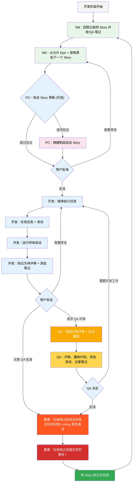

# BMad-Method BMAd 代码用户指南  
  
本指南将帮助您理解并有效使用 BMad 方法进行敏捷的 AI 驱动规划和开发。  
  
## BMad 规划和执行工作流程  
  
首先，这是完整的标准 Greenfield 规划 + 执行工作流程。Brownfield  与 Greenfield 非常相似，但建议您在着手 Brownfield 项目之前，即使是在一个简单的项目上，也先了解 Greenfield。BMad  方法需要安装到新项目文件夹的根目录下。  
在规划阶段，您可以选择使用强大的 Web 代理来执行，这样可能会以比提供您自己的 API 密钥或某些 Agentic 工具中的积分所需成本更低的成本获得更高质量的结果。  
对于规划，强大的思维模型和更广阔的背景——以及与代理的合作将获得最佳结果。  
  
如果您打算将 BMad 方法用于 Brownfield 项目（现有项目），请查看** [在 Brownfield 中工作](./working-in-the-brownfield.md)** 。  
  
如果您没有看到渲染后的图表，可以将 Markdown All in One 以及 Markdown Preview Mermaid Support 插件安装到 VSCode（或其中一个 fork 的克隆版本）。  
使用这些插件，如果您在打开时右键单击选项卡，应该会出现一个“打开预览”选项，或者查看 IDE 文档。  
  
### 规划工作流程（Web UI 或强大的 IDE 代理）  
  
在开发开始之前，BMad 遵循结构化的规划工作流程，理想情况下，该工作流程最好在 Web UI 中完成，以提高成本效益：  
   




## 安装

### 可选

如果您想使用 Claude（Sonnet 4 或 Opus）、Gemini Gem（2.5 Pro）或 Custom GPT 在 Web 中进行规划：

1. 导航到 `dist/teams/` 
2. 复制 `team-fullstack.txt` 
3. 创建新的 Gemini Gem 或 CustomGPT 
4.
上传带有说明的文件：“您的关键操作说明已附上，请勿按照指示中断字符” 
4. 键入 `/help` 查看可用命令

### IDE 项目设置

```bash 
# 交互式安装（推荐）
npx bmad-method install 
``` 

## 特殊代理

有两个 bmad 代理 - 将来它们将被合并为单个 bmad-master。

### **BMad-Master**

除了实际的故事实现之外，此代理可以执行所有其他代理可以执行的任何任务或命令。
此外，此代理可以在网络上通过访问知识库并向您解释有关该过程的任何内容来帮助解释 BMad 方法。

如果您不想在开发人员以外的不同代理之间切换，那么这就是适合您的代理。
只需记住，随着情境的增长，代理的性能会下降，因此，指示代理压缩对话并以压缩对话作为初始消息开始新对话非常重要。
经常执行此操作，最好在每个故事实现后执行。

### **BMad-Orchestrator**编排者

此代理不应在 IDE 中使用，它是一个重量级的特殊用途代理，利用大量上下文，并且可以转换为任何其他代理。
它的存在仅仅是为了方便团队使用 Web Bundles。如果您使用 Web Bundle，您将会收到 BMad Orchestrator 的提示。

### 代理如何工作

#### 依赖系统

每个代理都有一个 YAML 部分来定义其依赖关系：

```yaml
依赖项：
  模板：
    - prd-template.md 
    - user-story-template.md
  任务：
    - create-doc.md 
    - shard-doc.md
  数据：
    - bmad-kb.md 
``` 

**要点：** 

- 代理仅加载所需的资源（精益上下文）
- 捆绑过程中会自动解决依赖关系
- 代理之间共享资源以保持一致性

#### 代理交互

**在 IDE 中：** 

```bash 
# 某些 Ide，例如 Cursor 或 Windsurf，使用手动规则，因此使用“@”符号完成交互
@pm 为任务管理应用程序创建 PRD 
@architect 设计系统架构
@dev 实现用户身份验证

# 有些，例如 Claude Code 使用斜线命令代替
/pm 创建用户故事
/dev 修复登录错误
``` 

#### 交互模式

- **增量模式**：逐步进行用户输入
- **YOLO 模式**：以最少的交互快速生成

## IDE 集成

### IDE 最佳实践

- **上下文管理**：仅将相关文件保留在上下文中，根据需要保持文件精简和集中
- **代理选择**：为任务使用合适的代理
- **迭代开发**：处理小型、集中的任务
- **文件组织**：保持干净的项目结构
- **定期提交**：经常保存你的工作

## 技术偏好系统

BMad 通过位于 `.bmad-core/data/` 中的 `technical-preferences.md` 文件包含一个个性化系统 - 这可以帮助 PM 和架构师推荐您对设计模式、技术选择或任何其他您想在这里放的内容的偏好。

### 与 Web Bundles 一起使用

创建自定义 Web Bundles 或上传到 AI 平台时，请包含您的 `technical-preferences.md` 内容，以确保代理从任何对话开始就拥有您的偏好。

## 核心配置

`bmad-core/core-config.yaml` 文件是一个关键配置，它使 BMad 能够与不同的项目结构无缝协作，未来将提供更多选项。
目前最重要的是 yaml 中的 devLoadAlwaysFiles 列表部分。

### 开发人员上下文文件

定义开发代理应始终加载的文件：

```yaml 
devLoadAlwaysFiles：
  -docs/architecture/coding-standards.md 
  -docs/architecture/tech-stack.md 
  -docs/architecture/project-structure.md```
您

将需要通过分片架构来验证这些文档是否存在，它们是否尽可能精简，并且是否包含您希望开发代理始终加载到其上下文中的信息。
这些是代理将遵循的规则。

随着项目的增长和代码开始构建一致的模式，编码标准应该减少到仅包含代理仍然遵循的标准。
代理将查看文件中的周边代码，以推断与当前任务相关的编码标准。

## 获取帮助

- **Discord 社区**：[加入 Discord](https://discord.gg/gk8jAdXWmj) 
- **GitHub Issues**：[报告错误](https://github.com/bmadcode/bmad-method/issues) 
- **文档**：[浏览文档](https://github.com/bmadcode/bmad-method/docs) 
- **YouTube**：[BMadCode 频道](https://www.youtube.com/@BMadCode) 

## 结论

请记住：BMad 旨在增强您的开发流程，而非取代您的专业知识。您可以
使用它作为强大的工具来加速您的项目，同时保持对设计决策和实现细节的控制。