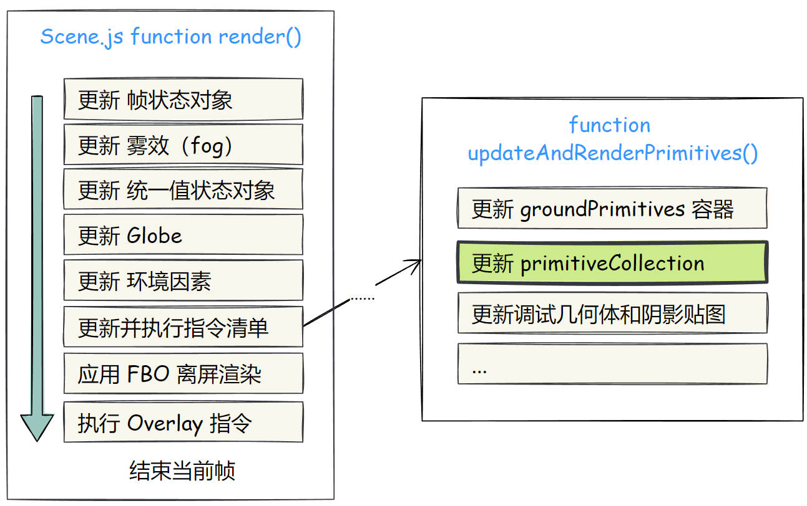
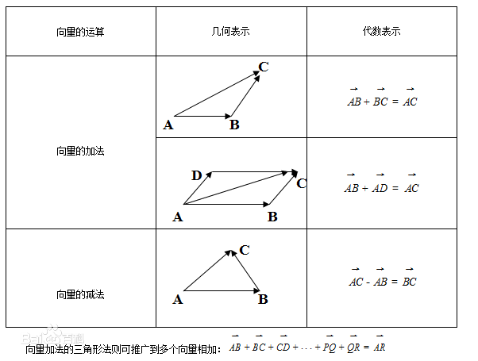
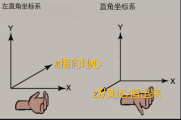
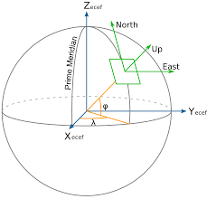
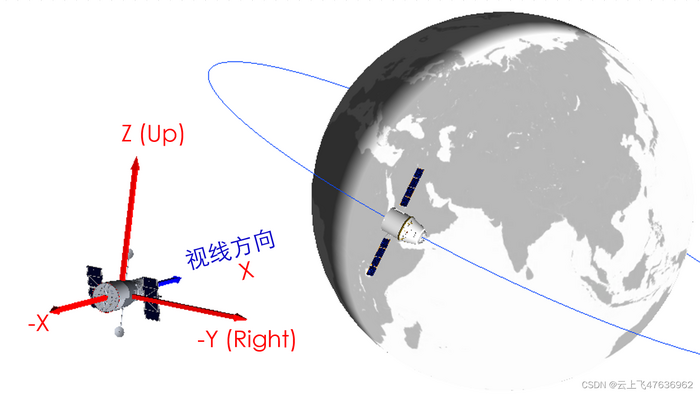
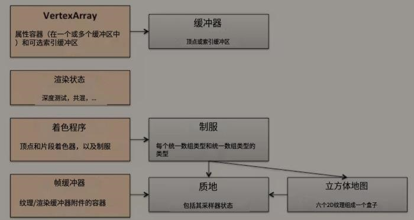

## 资源
[gw3_construkted/construkted.js at master · stefanciorici/gw3_construkted · GitHub](https://github.com/stefanciorici/gw3_construkted/blob/master/wp-content/themes/gowatch-child/js/construkted.js)泄露了官方的测量/距离/面积/模型位置编辑器插件
[Construkted-Reality/edd6b-Construkted](https://github.com/Construkted-Reality/edd6b-Construkted/tree/ba5418eaa26710e0b63440167c177a5014e046e5)具体分支
[master](https://github1s.com/Construkted-Reality/edd6b-Construkted/blob/master/edd-cesiumjs-customize/includes/js/CesiumIonSDKPlugin.js)
[Construkted-Reality/3DT-Local-viewer: Local viewer for 3D Tiles --- Construkted-Reality/3DT-Local-viewer：3D Tiles 的本地查看器](https://github.com/Construkted-Reality/3DT-Local-viewer)2023年4月6日尝试了，不可用
[Construkted-Reality/3DTG：将 3d 模型转换为 3d tiles](https://github.com/Construkted-Reality/3DTG)目前该工具只接受带纹理的 OBJ 文件
[My Assets | Cesium ion --- 我的资产 |铯离子](https://ion.cesium.com/assets/)可以在线免费转3DTiles再下载下来

```javascript
Cesium.Resource.fetchJson(url)
原生支持加载glb/gltf //用viewer.entities.add即可
经纬度转相机参数{postition世界坐标，orientation相机朝向}//官网《3D Models.html》有提到

Scene//是一个Cesium应用程序的根对象，它包含用于场景渲染和交互的所有元素。它是一个虚拟的3D环境，包括地球表面、天空、相机、光源等。
    View//是Scene的一部分，表示场景中的一个视图，通常是一个图像帧或视频帧。它定义了一个矩形区域，指定场景中需要渲染的部分。
        View.prototype.createPotentiallyVisibleSet用于生成可能可见的命令frustumCommands/对象集合frustumCommands.commands。被Scene.executeCommandsInViewport调用
        函数首先获取相机的视点和方向，然后根据命令所在的 pass 类型将其添加到对应的命令数组中（computeList 或 overlayList），
        如果是普通渲染命令，函数会计算它与相机视锥体的交并得出它的可见性和深度信息，并将其添加到对应的块（bin）中。
        同时，函数还更新了 shadowNear 和 shadowFar 变量来记录所有能接收阴影且离相机最近的物体的近平面距离和远平面距离。
        最后，函数划分了相机视锥体的多个子锥体生成一组 frustumCommandsList 数组来存储所有在不同锥体内的可见命令，以及一个 frustumSplits 数组来存储每个子锥体的近平面或远平面位置。
总体而言，这个方法的作用是生成当前视野中需要绘制的物体集合，以便优化渲染性能并提高可视效果。
    Globe//是Scene的一部分，表示在场景中渲染地球的部分。它包括地球的几何形状、地形、图像纹理和其他相关属性，使得场景中的地球可以进行交互和探索。
```
## 执行流程 与 对象

```javascript
多源//来源于遥感影像、摄像头、问卷调查、手机信令、GPS追踪等
异构//结构化数据, 非结构化数据, 时空数据

如何压平:
    在压平区域的多边形正上方模拟一个相机，离屏渲染多边形区域的深度图，并将深度图传入模型（或者3DTile）的顶点着色器中，在顶点着色器中将模型顶点转换到模拟的相机空间下，
    然后转换到投影空间，投影空间下的坐标在【0~1】的范围内，并在多边形的区域内，使用多边形的高度，不在范围内不用处理
        模型的update更新循环方法，会一直调用updateModel方法
        u_isFlatten是关键 
             Model.prototype.update调用了Source/Scene/processPbrMaterials.js的processPbrMaterials方法，进而遍历调用了generateTechnique生成着色器代码在返回的techniqueId对象里
             //processPbrMaterials：https://github.com/CesiumGS/cesium/blob/1.96/Source/Scene/processPbrMaterials.js#L448-L465 新版cesium已经废弃了它//详见https://cesium.com/blog/2022/10/05/tour-of-the-new-gltf-architecture-in-cesiumjs/
    

CEO解释如何渲染一帧//https://cesium.com/blog/2015/05/14/graphics-tech-in-cesium/  https://cesium.com/blog/2015/05/26/graphics-tech-in-cesium-stack/
CesiumJS 2022^ 源码解读[7] - 3DTiles 的请求、加载处理流程解析 _ https://www.cnblogs.com/onsummer/p/16432909.html    


初始化主更新循环 //https://cdn.jsdelivr.net/npm/cesium@1.99.0/Build/CesiumUnminified/Cesium.js
    startRenderLoop (Cesium.js:212021)  
	    在此requestAnimationFrame(   render(frameTime){主更新循环体}  ) 
    set (Cesium.js:212336)
    CesiumWidget (Cesium.js:212236)
    Viewer (Cesium.js:215480)

DrawCommand.prototype.execute 被谁调用，完整的调用链是什么样的：
    简述: 由Scene更新时遍历绘制命令触发gl的draw函数
    主更新循环体 → Scene.render → Scene.executeCommand 
    → 遍历了frustumCommands.commands[Pass_default.GLOBE]  → DrawCommand.execute 
    → Context.draw → Context.continueDraw → gl绘制调用drawElements


【Cesium 历史博客】Cesium 中的图形技术：渲染体系结构  https://www.cnblogs.com/onsummer/p/14022405.html   
czm_xxx//如 czm_getWgs84EllipsoidEC() ，如czm_viewRotation，Cesium 提供了一个庞大的 GLSL 函数库，包括函数、结构体、常量。如果你的代码需要用到自定义 glsl 代码，你完全可以不声明、不加入 #include 预编译指令，可以直接使用它们。


// 模型分析（裁剪、压平、淹没） 基础类
//原理：利用绘制的点数组，先计算其外包矩形，然后根据点创建一个polygonGeometry，然后利用此geometry创建指令，绘制出polygon纹理，
//源码里会根据此纹理判断模型顶点是否在polygon纹理中，如果在就进行后续操作

//多处压平思考：创建多个polygon纹理有点不大合理，一张FBO里多个polygon纹理，可能会导致压平闪烁（因为到着色器里，增大了顶点和polygon纹理的比对误差）
//多处压平思路之一张FBO里多个polygon纹理：就是想办法在我创建的FBO帧缓存里绘制多少polygon纹理，创建polygon数组，每次绘制都是往这里添加polygon，
//遍历polygon，依次创建指令绘制到fbo里

//建筑物混合遮挡 // 1.楼块不能遮挡道路、水系、绿地和标注等地图元素；// 2.楼快之间，需要实现不透明的实际遮挡效果。
//原理：自己创建FBO，把收集到的所有瓦片绘制指令，都绘制到这个FBO里，开启深度检测，然后再贴屏

//场景雾效果
//原理：根据深度图的深度值，对片元进行不同程度的模糊

// 雪覆盖 效果 
//原理：法线越垂直与地面越白 

//后处理实现倒影
//原理：利用空间镜面反射技术，计算倒影射线的UV进行采样

//视频融合（投射3D，贴物体表面）
//原理：在可视域的基础上，着色器里传入纹理，再计算UV进行贴图

//视频融合（投射2D平面）
//原理：根据相机位置，方向等参数，在相机前面生成一个平面，然后贴视频纹理


BaiduMercatorTilingScheme: 该对象定义了一个使用百度墨卡托投影的切片方案。
Batched3DModel3DTileContent: 该类表示一个可以用于渲染大批量三维模型的瓦片内容。
BoundingSphere 是一个用于表示包围球的类，可以用它来描述一个物体(几何体)的边界。
CallbackProperty 是cesium中的一个属性，当属性被访问时，会执行指定的函数从而得到新值，常用于动态渲染场景。 1536
Cartesian2 是由两个实数表示的二维笛卡尔坐标空间中的点。比如在屏幕上，鼠标点击事件的位置就可以使用Cartesian2 来进行确定。
Cartesian3 是由三个实数表示的三维笛卡尔坐标系中的点。常常被用于描述具有位置信息的对象，例如地图上的标记点。
Cartographic: 该类表示地球上的一个经纬度位置。
Cesium3DTileset: 该类表示一个包含3D瓦片集合的场景，可以用于高性能的3D可视化。
CesiumMath是 Cesium 中的一个数学工具库，提供了循环函数、随机数生成等一些与数学计算相关的API。
CesiumTerrainProvider: 该类提供了一个获取Cesium自己的地形数据的接口。
checkHalfAxes: 该函数可以检查给定的值是否为HalfAxis对象。
Clock: 该类表示一个时钟，可以用于控制时间相关功能。
Composite3DTileContent: 该类表示一个复合的3D瓦片内容，可以由多个子瓦片组成。
ComputeCommand 表示对 GPU 计算渲染器的命令（使用老式 GPGPU,即在NVIDIA CUDA和OpenCL之前的一种GPGPU编程方式，早期使用GPU进行通用计算时，通常需要借助可编程图形渲染管线（例如OpenGL或Direct3D）以及专门的API和库来实现。这种方法存在诸多限制和难点，相比于现代的CUDA和OpenCL编程方式已经不太常用。）
defaultValue 用于判断某个值是不是 undefined 或null。若是，则返回defaultValue中的默认值，否则返回该值本身。
defined: 该函数可以检查给定的值是否已被定义。
destroyObject 可以销毁一个物体（对象），并将其置为无效状态，在内存回收方面会很有帮助。
Ellipsoid: 该类表示一个椭球体，用于处理地球几何学计算。
EllipsoidGeometry: 该类表示一个椭球体的几何形状。
EllipsoidTerrainProvider: 该类提供了一个获取Cesium默认椭球体地形数据的接口。
Entity: 该类表示一个可视化实体，如点、线和面等等。
EntityCollection: 该类表示多个实体的集合。
FrameState: 该类表示当前场景的状态和参数。
GBTilingScheme: 该对象定义了一个使用国测局投影的切片方案。
GeographicProjection: 该类表示一个基于经纬度坐标系的投影方式。
GeographicTilingScheme: 该对象定义了一个使用经纬度投影的切片方案。
GeoJsonDataSource: 该类表示从GeoJSON格式数据创建的数据源。
getHeadingPitchRoll 是Cesium中的一个方法，可以用于计算相机的朝向角度x，俯仰角度y和平行旋转角度z。
getWidgetOrigin 返回一个屏幕上的原点（左上角），一般用来修正页面偏移。
GlobeFS: 该对象包含了Globe着色器程序的代码。
GlobeSurfaceShaderSet: 该类管理了表达地球表面材质的所有着色器。
GlobeSurfaceTileProvider: 该类表示一个提供地球表面图块数据的提供者。
GlobeVS：定义所有 3D 地球场景（又名“球体”）上的“顶点着色器”，这些着色器负责管理非常大的几何对象，例如地形和 3D 模型。
GroundAtmosphere: 该类管理和呈现地球大气层。
HeadingPitchRoll 是由三个实数分别表示方向角、俯仰角、旋转角的类。
ImageryLayerCollection: 该类表示多个图像图层的集合。
Instanced3DModel3DTileContent: 该类表示一个可重用的3D模型实例。
JulianDate: 该类表示一个儒略日日期。
kdbush: 该类提供了一种使用kd树进行快速空间搜索的方法。
knockout 用于一个变量跟另一个变量联动，是 JavaScript 的 MVVM 框架，也是Cesium中关键的一部分，是cesium总体架构中，MVC 模式实现MVVM的另一种表现方式。提供相关的工具函数，常常作为依赖注入框架使用。
Math: 该对象包含了常用的数学函数和常量。
Matrix3是 Cesium 中的一个矩阵类，用于计算三维点之间的各种运算。
Matrix4类表示四乘四矩阵，用于对三维坐标系中的向量和旋转矩阵进行操作运算。
ModelInstanceCollection: 该类表示多个3D模型实例的集合。
PerspectiveOffCenterFrustum: 该类表示一个透视投影视锥体。
QuadtreePrimitive: 该类表示一个波段化的网格，并将其存储在四叉树用于高效的提取和渲染。
Quaternion 是由四个实数表示的 xywz四元素 对象，它们广泛应用于旋转问题，特别是在3D游戏引擎领域中被广泛使用。
Rectangle: 该类表示地球上的一个矩形区域。
RequestScheduler: 该类管理异步请求和处理它们的顺序。
Resource：一个工具类，用于从异步 URL 加载并使用 HTTP 访问各种类型资源。
RotationEditor 是Cesium中的一个编辑器，主要用于控制场景中的物体/相机对象的旋转。
ScaleEditor 是一个CESIUM编辑器，用于缩放 场景物体。
SceneMode：定义 3D 场景的模式，可以是 3D、2D 或 单独的 Columbus 视图。
SceneTransforms 是cesium中的一个位于场景中的任意点位置。可以将任意三维坐标
ShaderSource: 定义导入外部光源的光来计算阴影，并将其添加到当前材质的蒙版中的片段着色器。
Simon1994PlanetaryPositions: 根据 Simon J. Kring 提供方法计算太阳系行星的位置。
TerrainQuantization: 用于划分地面高程数据以便更有效地处理和传输。BITS12 属性代表使用 12 位无符号整数量化高度值时的位数。这可以用来确定地形的精度等级，也可以用来计算每个节点所需的字节数
Transforms：旋转、平移和尺度转换功能使用户在转换不同坐标系统和参考框架时轻松操作数据。
Transforms.computeIcrfToFixedMatrix 是一个转换矩阵计算函数，用于计算从平均值为零，单位比例的坐标系（也称惯性坐标系，即国际天文学联合会参考系）到固定参考系（如地心连续参考系或某些基准系）的四维变换矩阵。
Transforms.computeTemeToPseudoFixedMatrix是一个函数，用于计算由True Equator Mean Equinox (TEME)参考系转换到Pseudo-Fixed参考系的4x4变换矩阵。TEME是基于地球的特定时刻而定义的参考系。它的轴和赤道面与平均恒星时定义有关。Pseudo-Fixed参考系是在地球自转平衡的理想参考系，其中地球的自转速率是常量，该速率等于观测到的太阳周围平均旋转速率。 这个函数返回一个视图矩阵，允许将从TEME参考系下的位置和方向转换到Pseudo-Fixed参考系下的位置和方向。
TranslationEditor 是 cesium 中提供的位移编辑器，常用于控制场景中物体的位置。能够相对地图自由的移动三维模型（Transforms）和倾斜摄影结果（QuadtreeTile）。
turfEx是 cesium中的一个拓展库，封装了大量GIS分析和处理函数，可以有效地减少开发者书写GIS分析和处理代码的时间。
VertexFormat：定义属性化对象的顶点集合格式。 例如，颜色、纹理坐标或法线。 它还包含其他有用的参数，例如顶点大小以及定制顶点格式的创建方法。
WebMercatorProjection：一个处理与 Web Mercator 投影相关的数学类。
WebMercatorTilingScheme: 以经典的WebMercator投影方式对图层进行瓦片化,构建瓦片树网格结构
when：一个实用工具，对带有错误处理的 promise 进行分装， 允许等待所有 promise 完成以及在适当的时间捕获潜在的失败。
```

## 类图 
[cesium.jpg (3561×3574)](http://mars3d.cn/dev/img/jiagou/cesium.jpg)
```javascript
通用类/空间计算
	Cartesian3
	Catographic
	Matrix3(3x3矩阵，旋转变换)
	Quaternion(围绕某个向量旋转一定角度的变换)
	Matrix4(4x4矩阵，旋转加平移变换)
	Transforms(包含将位置转换为各种参考系的功能)
Viewer
	其他一大堆UI组件
		Animation
		BaseLayerPicker
		Cesium3DTilesInspector
		CesiumInspector
		CesiumWidget
		FullscreenButton
		Geocoder
		HomeButton
		InfoBox
		NavigationHelpButton
		ProjectionPicker
		SceneModePicker
		SelectionIndicator
		Timeline
		VRButton
    CesiumWidget//不包含任何UI组件的viewer，纯地球和星空
        //Viewer.scene === Viewer.cesiumWidget.scene
        Scene//用来操作一切
			Event 事件
		        pick/drillpick
				preUpdate
				postUpdate
				preRender
				postRender
            Camera
	            position(位置)
				heading(方位角)/绕z轴旋转
				pitch(俯仰角)/绕y轴旋转
				roll(翻滚角)/绕x轴旋转
            环境对象
	            skyAtmosphere(大气圈)
				skyBox(天空盒)
				sun(太阳)
				moon(月亮)
				flog(雾化)
				ParticleSystem(粒子系统)
            Globe //地球
				terrainProvider 地形
	                ArcGISTiledElevationTerrainProvider
					CesiumTerrainProvider
					EllipsoidTerrainProvider
					GoogleEarthEnterpriseTerrainProvider
					VRTheWorldTerrainProvider
                imageryLayers:ImageryLayerCollection影像
                    ImageryLayer
                    ImageryProvider
                        xxxImageryProvider
	                    ArcGisMapServerImageryProvider
						BingMapsImageryProvider
						GoogleEarthEnterpriselmageryProvider
						GridImageryProvider(开发调试)
						IonImageryProvider
						MapboxImageryProvider
						MapboxStylelmageryProvider
						OpenStreetMapImageryProvider
						SingleTilelmageryProvider
						TileCoordinatesImageryProvider(开发调试)
						TileMapServicelmageryProvider
						UrITemplateImageryProvider
						WebMapServicelmageryProvider
						WebMapTileServicelmageryProvider
                Ellipsoid//平面的地形
                Color
            ScreenSpaceCameraController  
                enableRotate|enableTranslate|enableZoom等
            primitives:PrimitiveCollection //它的removeAll()会把Cesium自己添加的东西也移除掉,慎用!
	            Visualizer //对象（呈现 3D 几何图形的实例）转换为 `Primitive` 并呈现在场景中
			        GeometryVisualizer：用于 `GeometryInstance` 
                Primitive
	                modelMatrix
                    Appearance
                        XXXAppearance
                            material   MaterialProperty
	                            ColorMaterialProperty颜色材质
								ImageMaterialProperty贴图材质
								CheckerboardMaterialProperty棋盘纹理
								StripeMaterialProperty条纹纹理
								GridMaterialProperty网格
								PolylineGlowMaterialProperty发光材质
								PolylineOutlineMaterialProperty外轮廓材质
								PolylineArrowMaterialProperty带有箭头的线
								PolylineDashMaterialProperty
                            renderState
						EllipsoidSurfaceAppearance
						MaterialAppearance
						PerInstanceColorAppearance
							可设置renderState: { depthTest: { enabled: true}}
						PolylineColorAppearance
						PolylineMaterialAppearance
                   GeometryInstance，1或n个'每个可以有自己的modelMatrix'
                        XXXGeometry
                            geometry
                            modelMatrix
						BoxGeometry/BoxOutlineGeometry(立方体)
						CircleGeometry/CircleOutlineGeometry(圆形或者拉伸的圆形)
						CoplanarPolygonGeometry/CoplanarPolygonOutlineGeometry(任意面组成的多边形)
						CorridorGeometry/CorridorOutlineGeometry(走廊)
						CylinderGeometryy/CylinderOutlineGeometry(圆柱、圆锥或者载断的圆锥)
						EllipseGeometry/EllipseOutlineGeometry(椭圆或者拉伸的椭圆)
						EllipsoidGeometry/EllipsoidOutlineGeometry(球)
						FrustumGeometry/FrustumOutlineGeometry(视体)
						PlaneGeometry/PlaneOutlineGeometry(原点为中心的平面的几何形状)
						PolygonGeometry/PolygonOutlineGeometry(多边形，可以具有空洞或者拉伸一定的的高度)
						PolylineGeometry/SimplePolylineGeometry(多段线，可以具有一定的宽度)
						PolylineVolumeGeometry/PolylineVolumeOutlineGeometry(多段线柱体)
						RectangleGeometry/RectangleOutlineGeometry(矩形或者拉伸的矩形)
						SphereGeometry/SphereOutlineGeometry(球体)
						WallGeometry/WallOutlineGeometry()
                BillboardCollection //面朝屏幕的图片, 广告牌
                LabelCollection//面朝屏幕的文字
                GroundPolylinePrimitive
					GeometryInstance
						GroundPolylineGeometry
					Appearance
				GroundPrimitive
					GeometryInstance
					Appearance
				Cesium3DTileset
                    classificationType //将这个3dtile变成ClassificationPrimitive
				ClassificationPrimitive//一个不可见封闭的体,被它罩住的,就要用它的颜色附着
					GeometryInstance
					Appearance
				PointPrimitiveCollection
				PolylineCollection
				Model
				ParticleSystem
            grounPrimitives//贴地的
                GroundPolylinePrimitive  
    Clock
    ScreenSpaceEventHandler
    dataSourceDisplay
        dataSources
        defaultDataSource(CustomDataSource)
            entities
    dataSources:DataSourceCollectior//是dataSourceDisplay的属性的快捷方式
        DataSourceCollection 
            GeoJsonDataSource
            CustomDataSource
			CzmIDataSource
			KmIDataSource
    entities:EntityCollection//是defaultDataSource的属性的快捷方式，primitive的简化版.底层用的还是primitive
        //Viewer.entities === Viewer.dataSourceDisplay.defaultDataSource.entities
        Entity 
            XXXGriaphics(可修改样式)
			availability:TimeIntervalCollection
			BillboardGraphics(广告牌
			BoxGraphics(盒子)
			CorridorGraphics(走廊)
			CylinderGraphics(圆柱、圆锥或者截断的圆锥)
			EllipseGraphics(圆或者拉伸的椭圆)
			EllipsoidGraphics(椭圆)
			LabelGraphics(标签)
			ModelGraphics(模型)
			Cesium3DTilesetGraphics(三维瓦片
			PathGraphics(路径)
			PlaneGraphics(平面)
			PointGraphics(点)
			PolygonGraphics(多边形)
			PolylineGraphics(多线段)
			PolylineVolumeGraphics(多段线柱体)
			RectangleGraphics(矩形)
			WallGraphics(墙)


PolygonGraphics和PolygonGeometry的区别
	- PolygonGraphics用于创建多边形或多边形网格效果的可视化对象，主要应用于地图呈现和展示等场景
		- PolygonGeometry用于储存和编辑多边形的坐标和相关信息，主要用于几何计算和数据处理的场景。
	- PolygonGraphics可以通过Cesium API提供的多种属性来调整和修改多边形对象的外观效果，如边框、填充颜色、透明度、轮廓线等
		- PolygonGeometry则需要手动设置每个点的坐标、索引等信息。
	- PolygonGraphics支持一些交互事件，如鼠标点击、悬浮等，可以在用户与界面进行交互时进行响应
		- PolygonGeometry不支持这些事件，只是简单的几何体。
	- PolygonGraphics更加适用于可视化的场景
		- PolygonGeometry则更适合于几何计算和数据处理的场景。


Cesium.Ellipsoid.WGS84
	定义了一个符合WGS84椭球体标准的椭球体	
	radii：表示椭球体在x、y和z轴上的半径。
	maximumRadius：表示椭球体的最大半径。
	minimumRadius：表示椭球体的最小半径。
	radiiSquared：表示椭球体在x、y和z轴上的半径的平方。
	radiiToTheFourth：表示椭球体在x、y和z轴上的半径的四次方。
	oneOverRadii：表示椭球体在x、y和z轴上的半径的倒数。
	oneOverRadiiSquared：表示椭球体在x、y和z轴上的半径的平方的倒数。
	用于各种计算，例如在地球表面上绘制点、线、面、矢量等时，需要将其投影到三维椭球体上进行计算。
```
## 源码-创建worker

```js
'TaskProcessor 的创建'
	1.在加载Cesium.js就触发各种TaskProcessor的创建
		TaskProcessor (TaskProcessor.js:204)
		（匿名） (HeightmapTerrainData.js:187) 类似还有:
			各自用TaskProcessor对应创建的worker
			HeightmapTerrainData: Workers/createVerticesFromHeightmap //NoThrottle
			HeightmapTerrainData: Workers/createVerticesFromHeightma  //Throttle
			QuantizedMeshTerrainData: Workers/createVerticesFromQuantizedTerrainMesh //NoThrottle
			QuantizedMeshTerrainData: Workers/createVerticesFromQuantizedTerrainMesh //Throttle
			QuantizedMeshTerrainData: Workers/upsampleQuantizedTerrainMesh
			GoogleEarthEnterpriseMetadata: Workers/decodeGoogleEarthEnterprisePacket
			GoogleEarthEnterpriseTerrainData: Workers/createVerticesFromGoogleEarthEnterpriseBuffer //NoThrottle
			GoogleEarthEnterpriseTerrainData: Workers/createVerticesFromGoogleEarthEnterpriseBuffer //Throttle
			GoogleEarthEnterpriseTerrainData: Workers/upsampleQuantizedTerrainMesh
			GoogleEarthEnterpriseTerrainProvider: Workers/decodeGoogleEarthEnterprisePacket
			KTX2Transcoder: Workers/transcodeKTX2
			Primitive: Workers/combineGeometry
			Vector3DTileGeometry: Workers/createVectorTileGeometries
			Vector3DTilePoints: Workers/createVectorTilePoints
			Vector3DTilePolygons: Workers/createVectorTilePolygons
			Vector3DTilePolylines: Workers/createVectorTilePolylines
			Vector3DTileClampedPolylines: Workers/createVectorTileClampedPolylinesVector3DTileClampedPolylines
		（匿名） (Cesium.js:1)
	2.Primitive.update.loadAsynchronous 时创建
		createGeometryTaskProcessors[navigator.hardwareConcurrency] = new TaskProcessor("createGeometry");
		//创建cpu核数创建n个Workers/createGeometry

主线程
	Viewer (Viewer.js:488)
	CesiumWidget (CesiumWidget.js:399)
	set (CesiumWidget.js:621)
	startRenderLoop (CesiumWidget.js:69)
	requestAnimationFrame（异步）
	render2 (CesiumWidget.js:42)
	CesiumWidget.render (CesiumWidget.js:842)
	Scene4.render (Scene.js:3859)
	tryAndCatchError (Scene.js:3769)
	render (Scene.js:3750)
	Scene4.updateAndExecuteCommands (Scene.js:2860)
	executeCommandsInViewport (Scene.js:3115)
	updateAndRenderPrimitives (Scene.js:3339)
	PrimitiveCollection.update (PrimitiveCollection.js:377)
	Primitive.update (Primitive.js:2170)
	Primitive.update.loadAsynchronous (Primitive.js:1270) 
	TaskProcessor.scheduleTask (TaskProcessor.js:251)
		createWorker (TaskProcessor.js:151)
			Worker.postMessage（异步）TaskProcessor的worker线程发消息给 cesiumWorkerBootstrapper的worker线程
		TaskProcessor的worker线程发消息给之前createTaskProcessorWorker创建出来的worker

		
cesiumWorkerBootstrapper 的worker线程
	self.onmessage (cesiumWorkerBootstrapper.js:30)
		接收到:
		{
			"loaderConfig": {
				"paths": {
					"Workers": "https://sandcastle.cesium.com/CesiumUnminified/Workers"
				},
				"baseUrl": "https://sandcastle.cesium.com/CesiumUnminified/"
			},
			"workerModule": "Workers/createGeometry" 或 "Workers/createVerticesFromQuantizedTerrainMesh" 或 "Workers/combineGeometry" 等
		}
createTaskProcessorWorker根据"workerModule"匹配 TaskProcessor根据传入的workerPath 创建出来的worker线程, 见'TaskProcessor 的创建'
		接收到:
		{
			"id": 0,
			"parameters": {
				"subTasks": [
					{
						"moduleName": "createBoxGeometry",
						"geometry": {"0": -200000,"1": -150000,"2": -250000,"3": 200000,"4": 150000,"5": 250000,"6": 1,"7": 1,"8": 0,"9": 0,"10": 0,"11": 0,"12": -1},
						"offset": 0
					}
				]
			},
			"canTransferArrayBuffer": true
		}
```

## 实践
```javascript
概念
    Cesium ion是一个提供瓦片图和3D地理空间数据的平台
    使用geojson加载线数据在30万左右，矢量建筑面8万左右尚可
    OSGB//Open Scene Gragh Binary 是模型的二进制表示，所有纹理都包含在一个独立文件中。 OpenSceneGraph 是一个开源的高性能 3D 图形工具包 

    Matrix4//4x4转换矩阵，用于转换图块的根图块
    Ellipsoid//由方程在笛卡尔坐标系中定义的二次曲面//椭球体    
    I3S//(索引3D场景)Esri针对3D场景提出的一种数据格式，ArcGIS的场景服务都默认采用这种数据格式
    报错：
        //我发现原因是KHR_technique_webgl扩展新版Cesium已经不支持的缘故，需要升级一下gltf数据，使用KHR_techniques_webgl扩展即可(注意多了一个s)
        //Cesium在使用这个扩展时，gltf2.0也在逐步进化，居然连KHR_technique_webgl这个扩展的名字都改了，technique后面加了一个s。。所以现在的扩展名叫KHR_techniques_webgl

        
ECEF (Earth-Centered, Earth-Fixed)是一种表示地球中物体位置的坐标系，它是以地球的中心为原点并固定在地球上的坐标系。在ECEF坐标系中，三维坐标（x, y, z）表示物体与地球中心的距离。

坐标: //详见 https://github.com/Fang-Lansheng/Cesium
    pick：屏幕坐标 
        new Cesium.Cartesian2(x, y)     // 表示一个二维笛卡尔坐标系，也就是直角坐标系（屏幕坐标系）
    Cartesian3 //世界坐标（三维坐标） 3D笛卡尔点对象 //米单位;原点是地球几何中心； +x是中央经线，-x是180度经线
        new Cesium.Cartesian3(x, y, z)  // 表示一个三维笛卡尔坐标系，也是直角坐标系（就是真实世界的坐标系）
        //二维屏幕坐标系到三维坐标系的转换
            const pick = new Cesium.Cartesian2(window.innerWidth, window,innerHeight);	// 屏幕坐标
            const cartesian= scene.globe.pick(viewer.camera.getPickRay(pick), scene) // 世界坐标
    Cartographic(longitude, latitude/*弧度*/, height) //地理坐标（弧度）
    point：经纬度坐标
    


实体模型分2种：
       Primitive API针对图形开发人员的低级应用程序(定制化高,更偏底层)
       Entity API针对数据驱动的可视化的高级应用程序(定制化低)
           

  
   
Cesium.Ion.defaultAccessToken = 'your_access_token';
const viewer = new Cesium.Viewer('cesiumContainer',{
    //viewer用于构建应用程序的基本小部件。它将所有标准Cesium小部件组合到一个可重用的程序包中
      animation: true,              // 是否显示动画小部件（左下角仪表盘）
      baseLayerPicker: true,        // 是否显示图层选择器
      fullscreenButton: true,       // 是否显示全屏按钮
      geocoder: true,               // 是否显示 geocoder 小部件（右上角查询按钮）
      vrButton: false,              // 是否显示 VR 按钮
      homeButton: true,             // 是否显示 Home 按钮
      infoBox: true,                // 是否显示信息框
      sceneModePicker: true,        // 是否显示 3D/2D 选择器
      selectionIndicator: false,    // 是否显示指示器组件
      timeline: false,              // 是否显示时间轴
      navigationHelpButton: false,  // 是否显示右上角的帮助按钮
      scene3DOnly: false,           // 如果设置为 true，则所有几何图形以 3D 模式绘制以节约GPU资源
      shadows : true,               // 是否显示阴影
      shouldAnimate : true,         // 是否显示动画
      imageryProvider: new Cesium.BingMapsImageryProvider({
							   url: 'https://dev.virtualearth.net',
							   key: 'YourBingMapKey',
							   mapStyle: Cesium.BingMapsStyle.AERIAL
						   }),//亦可viewer.imageryLayers.addImageryProvider
								var imageryViewModels = Cesium.createDefaultImageryProviderViewModels();//选择不同的地图图层
								viewer.imageryLayers.addImageryProvider(imageryViewModels[0].createProvider());
      // 加载地形系统
      terrainProvider : Cesium.createWorldTerrain({
								requestWaterMask : true,        // 动态水纹
								requestVertexNormals: true      // 光效
							  })
});


viewer.cesiumWidget.creditContainer.style.display = "none";//隐藏版权信息
viewer.entities.add  //点、标记、标签、线、模型、形状和物体\
viewer.trackedEntity = entity; // 镜头追踪，将镜头固定在对象上
viewer.scene.globe.enableLighting=true; // 阳光照射区域不高亮
viewer.scene.debugShowFramesPerSecond = true;  // 显示帧率
viewer.scene.globe.depthTestAgainstTerrain = true; // 控制视角不转到地下（确保在地形后面的物体被正确地遮挡，只有最前端的对象可见）


// 初始化相机参数
const initialOrientation = new Cesium.HeadingPitchRoll.fromDegrees(0, -90, 0);
const homeCameraView = {
	destination: new Cesium.Cartesian3.fromDegrees(114.29045969, 30.56173526, 40000),
	orientation: {
		//Heading //想象再飞机头,左右方向的改变
		//Pitch //飞机头俯仰角度的改变
		//Roll //飞机身向左右翻滚
		//Range //距中心的距离，以米为单位。
		//HeadingPitchRange【目标物与相机之间的距离和角度】指的是目标物距离相机的距离、相机的垂直角度和水平角度
		//HeadingPitchRoll【相机的旋转角度】指的是相机在水平、垂直和平面的旋转角度。
		heading: initialOrientation.heading //不知道设多少可以从控制台的camera.heading获取！！
		pitch: initialOrientation.pitch,
		roll: initialOrientation.roll
	}
};
viewer.scene.camera.setView(homeCameraView) // 设置初始视野视角
//也可以重写 homeButton
viewer.homeButton.viewModel.command.beforeExecute.addEventListener((e)=>{e.cancel = true;viewer.camera.flyTo(homeCameraView)});
//viewer.zoomTo(tileset);//定位过去

viewer
	canvas
	scene
		globe
			ellipsoid
		camera
	entities
	clock


Radian、Degree和Cartesian3数据类型的示例值：
	- Radian类型：
	  - π：Cesium.Math.PI
	  - π/2：Cesium.Math.PI_OVER_TWO
	  - 2π：Cesium.Math.TWO_PI
	  
	- Degree类型：
	  - 90度：Cesium.Math.toRadians(90)
	  - 45度：Cesium.Math.toRadians(45)
	  - 180度：Cesium.Math.toRadians(180)
	  
	- Cartesian3类型：
	  - (1, 0, 0)：new Cesium.Cartesian3(1, 0, 0)
	  - (0, 1, 0)：new Cesium.Cartesian3(0, 1, 0)
	  - (0, 0, 1)：new Cesium.Cartesian3(0, 0, 1)
  
	其中，Radian类型表示弧度值，Degree类型表示角度值，Cartesian3类型表示三维笛卡尔坐标系中的点。

获取当前视图中心的经纬度：
	var center = viewer.camera.positionCartographic;
	var longitude = Cesium.Math.toDegrees(center.longitude);
	var latitude = Cesium.Math.toDegrees(center.latitude);
	var height = center .height;
	[longitude,latitude,height]


笛卡尔3转弧度 //Cesium.Cartographic.fromCartesian(center)
	var center = tileset.boundingSphere.center;
	var cartographic = Cesium.Cartographic.fromCartesian(center);
	var longitude = Cesium.Math.toDegrees(cartographic.longitude);
	var latitude = Cesium.Math.toDegrees(cartographic.latitude);
	var height = cartographic.height;
	[longitude,latitude,height]

弧度(小数形式的经纬度)转经纬度
      var longitude = Cesium.Math.toDegrees(cartographic.longitude);
	  var latitude = Cesium.Math.toDegrees(cartographic.latitude);
      var height = cartographic.height;
      [longitude,latitude,height] 
      
笛卡尔3坐标转成经纬度
	// 将笛卡尔坐标系转换为地理坐标系
	const cartographic = viewer.scene.globe.ellipsoid.cartesianToCartographic(笛卡尔3);	
	// 获取经度和纬度
	const longitude = Cesium.Math.toDegrees(cartographic.longitude);
	const latitude = Cesium.Math.toDegrees(cartographic.latitude);
    const height=cartographic.height;
     [longitude,latitude,height] 

完美修正拟合tileset的高度到地面上
      const cartographic = Cartographic.fromCartesian(tileset.boundingSphere.center);//获得原始中心
      const surface = Cesium.Cartesian3.fromRadians(cartographic.longitude,cartographic.latitude,0.0);
      const offset = Cesium.Cartesian3.fromRadians(cartographic.longitude,cartographic.latitude,-cartographic.height );//减去高度      
      const translation = Cesium.Cartesian3.subtract(offset,surface,new Cesium.Cartesian3());//计算偏移
      tileset.modelMatrix = Cesium.Matrix4.fromTranslation(translation);
      
根据geojson生成城市粗模(多边形+拉伸高度即可)
	看https://sandcastle.cesium.com/gallery/GeoJSON%20and%20TopoJSON.html
		  const promise = Cesium.GeoJsonDataSource.load("XXX./geojson");
          promise.then(function (dataSource) {
              viewer.dataSources.add(dataSource);
              
              const entities = dataSource.entities.values;
              for (let i = 0; i < entities.length; i++) {
                const entity = entities[i];                
                entity.polygon.extrudedHeight = entity.properties.geojson属性里的高度;
              }
            })
	设置颜色
	dataSource.entities.values.filter(i=>i.id.includes('200_')).forEach(i=>{
	    //dataSource.entities.remove(i)
	    i.polygon.material = Cesium.Color.RED.withAlpha(0.5);
	})
   
Cesium.CallbackProperty //用回调函数传入time,用于处理随时间变化的属性,如随时间改变,位置属性改变

viewer.scene.screenSpaceCameraController.inertiaZoom=0.9 //设置丝滑惯性缩放，默认0.8，越接近1惯性越大
```

## 向量

```js
一个平面可以由两个非平行的向量确定，而这两个向量的叉积即为法线向量

根据向量投影的定义，对于一个向量v和一个单位向量u，v在u方向上的投影向量proj_vu可以通过以下公式计算：
proj_vu = dot(v, u) * u
其中dot(v, u)是v和u的点积，表示v在u方向上的投影长度，u是一个单位向量，表示u的长度为1，方向与投影方向相同。
在这个例子中，杯子的移动向量为向右的单位向量(1,0,0)，桌面法线向量为向上的单位向量(0,1,0)。根据上述公式，投影向量proj_right_up可以计算为：
proj_right_up = dot((1,0,0), (0,1,0)) * (0,1,0) = 0 * (0,1,0) = (0,0,0)

	我不懂向量运算, dot((1,0,0), (0,1,0)) * (0,1,0) 的具体计算过程是?
		首先，dot((1,0,0), (0,1,0))表示向量(1,0,0)和向量(0,1,0)的点积，也称为内积。点积的计算公式是将两个向量对应位置的数值相乘，然后将乘积相加，即：		
		dot((1,0,0), (0,1,0)) = 1*0 + 0*1 + 0*0 = 0		
		所以，dot((1,0,0), (0,1,0))的结果为0。		
		接下来，我们将0乘以(0,1,0)。这个操作实际上是将向量(0,1,0)的每个分量都乘以0，得到的结果向量仍然是(0,1,0)本身。因此，		
		dot((1,0,0), (0,1,0)) * (0,1,0) = 0 * (0,1,0) = (0,0,0)		
		所以，这个计算的结果是(0,0,0)。		
		总结一下，这个计算的过程是：将向量(1,0,0)和向量(0,1,0)做点积，得到0，然后将0乘以向量(0,1,0)，得到的结果是(0,0,0)。
```


## 矩阵


```js
T如何移动一个点，举例矩阵相乘的详细步骤
	假设有一个点P(x, y, z)，现在想要将该点沿着X轴平移2个单位，沿着Y轴平移3个单位，沿着Z轴平移4个单位。可以使用变换矩阵来实现这个操作。变换矩阵可以表示为：	
	T = [1 0 0 2]
	    [0 1 0 3]
	    [0 0 1 4]
	    [0 0 0 1]	
	其中，第一列表示X轴的变换，第二列表示Y轴的变换，第三列表示Z轴的变换，最后一列表示平移向量。	
	现在，需要将点P应用该变换矩阵，以实现平移操作。可以按照以下步骤进行矩阵相乘：	
	1.  将点P表示为一个4维向量，即增加一个齐次坐标分量w=1：	
	P' = [x]
	     [y]
	     [z]
	     [1]	
	
	2.  将变换矩阵T表示为一个4x4的矩阵：		
	T = [1 0 0 2]
	    [0 1 0 3]
	    [0 0 1 4]
	    [0 0 0 1]	
	
	3.  将点P'和变换矩阵T相乘，得到一个新的4维向量P''：		
	P'' = T * P' = [1 0 0 2]   [x]
	               [0 1 0 3] * [y]
	               [0 0 1 4]   [z]
	               [0 0 0 1]   [1]	
	
	4.  对于新的4维向量P''，将其前三个分量（x, y, z）除以最后一个分量（w=1），即可得到平移后的新点坐标：		
	x' = P''[0] / P''[3] = x + 2
	y' = P''[1] / P''[3] = y + 3
	z' = P''[2] / P''[3] = z + 4		
	综上，通过矩阵相乘的方式，可以将点P沿着X轴平移2个单位，沿着Y轴平移3个单位，沿着Z轴平移4个单位。
	这种方法非常高效，可以同时对多个点进行平移操作，而且可以方便地组合不同的变换操作。


Cesium.Matrix4要注意阅读顺序的问题
	//不符合直觉的写法
		const v = [
		        1, 2, 3, 4, 
		        5,6,7,8, 
		        9,10,11,12,
		        13,14,15,16
		        ];
		
		const m = Cesium.Matrix4.fromArray(v);
		console.log(m.toString())
			//(1, 5, 9, 13)
			//(2, 6, 10, 14)
			//(3, 7, 11, 15)
			//(4, 8, 12, 16)
	//符合直觉的写法
		const v = [
		        1, 2, 3, 4, 
		        5,6,7,8, 
		        9,10,11,12,
		        13,14,15,16
		        ];
		const m = Cesium.Matrix4.fromRowMajorArray(v);//fromColumnMajorArray
		console.log(m.toString())
			//(1, 2, 3, 4)
			//(5, 6, 7, 8)
			//(9, 10, 11, 12)
			//(13, 14, 15, 16)
			

缩放模板，将z轴值放大1.00002，相当于向上移动了
const v = [
	1.0000, 0.0, 0.0, 1.0, 
	0.0, 1.0000, 0.0, 1.0, 
	0.0, 0.0, 1.00002, 1.0, 
	0.0, 0.0, 0.0, 1.0];
  const m = Cesium.Matrix4.fromArray(v);
  tileset.modelMatrix = m

cesium的tileset的modelMatix为,描述做了什么样的变化, 每行每列各有什么作用?
	(0, 0, 1, 6378137)//因为1在第三个,所以作用于z轴,将模型的z轴（垂直于模型表面的轴）沿着地球的表面朝向正上方，即垂直于地球表面，同时将模型的原点移动到地球表面上，距离地心的距离为6378137米（地球半径）。
	(1, 0, 0, 0)//将模型的x轴（水平于模型表面的轴）指向地球上的经度为0度的位置，即 Greenwich 本初子午线。
	(0, 1, 0, 0)//将模型的y轴（与x、z轴垂直的轴）指向地球上的纬度为0度的位置，即赤道。
	(0, 0, 0, 1)//不进行任何透视变换，即模型在投影到地球表面时大小不会发生变化。
	
	这个矩阵如何作用于点(2,3,4),描述一下结果和计算过程?		
		首先，将点(2, 3, 4)表示为一个列向量：		
		| 2 |
		| 3 |
		| 4 |
		| 1 |	
		接下来，将该向量与模型矩阵相乘，即：		
		| 0 0 1 6378137  |   | 2 |
		| 1 0 0 0        | x | 3 |
		| 0 1 0 0        |   | 4 |
		| 0 0 0 1        |   | 1 |	
		
		按照矩阵乘法的规则，可以将该计算分解为以下四个部分：		
		1. 第一列乘以向量的第一个元素：(0, 0, 1, 6378137) * 2 = (0, 0, 2, 12756274)。		
		2. 第二列乘以向量的第二个元素：(1, 0, 0, 0) * 3 = (3, 0, 0, 0)。		
		3. 第三列乘以向量的第三个元素：(0, 1, 0, 0) * 4 = (0, 4, 0, 0)。		
		4. 最后一列乘以向量的第四个元素：(0, 0, 0, 1) * 1 = (0, 0, 0, 1)。		
		将上述四个部分相加，得到最终的结果向量：		
		
		| 0 0 2 12756274 |
		| 3 0 0 0         |
		| 0 4 0 0         |
		| 0 0 0 1         |		
		
		因此，点(2, 3, 4)在该模型矩阵的作用下被转换为点(2, 3, 6.2756274e+06)，位于地球表面上的一个点。

Cesium.Matrix4.multiplyByMatrix3(m, rotation, m);替代了Cesium.Matrix4.multiply(m, Cesium.Matrix4.fromRotationTranslation(rotation), m);
```

### 坐标系


```js
- 在左手坐标系中，“east”对应笛卡尔坐标系中的x轴，即东方向；“north”对应笛卡尔坐标系中的y轴，即北方向；“up”对应笛卡尔坐标系中的z轴，即垂直于地面向上的方向。
- 在右手坐标系中，“east”对应笛卡尔坐标系中的x轴，即东方向；“north”对应笛卡尔坐标系中的y轴，即北方向；“up”则与笛卡尔坐标系中的z轴相反，即指向地心的方向。
```

```js
Cesium.Transforms.eastNorthUpToFixedFrame //是回退变换, 在地球上，每个点都有一个本地坐标系，它是以该点为原点，以地球表面的法线方向为z轴建立的一个坐标系。然而，当我们需要在计算机中对地球上的点进行处理时，通常需要将这些点转换为一个固定的坐标系，方便进行计算和可视化。
	,/eastNorthUp 坐标系主要用于处理经纬度和高度等地理信息数据/
	东北天坐标系（East-North-Up，ENU）是绿色的那个,是局部坐标系,# 垂直于当前地表的垂直坐标系
	固定坐标系（Fixed Frame）是蓝色的那个,是全局坐标系

```


### Quaternion 四元数

```js
Cesium还提供了许多方便的函数来创建和操作四元数，如`fromAxisAngle`、`fromRotationMatrix`、`multiply`等。

Cesium中的四元数（Quaternion）可以使用以下公式进行计算：
q = w + xi + yj + zk

其中，`w`、`x`、`y`和`z`是四元数的四个分量。

在Cesium中，通常使用单位四元数来表示旋转，因此四元数的长度应该为1，即：
|q| = sqrt(w^2 + x^2 + y^2 + z^2) = 1

四元数的乘法运算可以使用以下公式进行计算：
q1 * q2 = (w1*w2 - x1*x2 - y1*y2 - z1*z2) + (w1*x2 + x1*w2 + y1*z2 - z1*y2)i + (w1*y2 - x1*z2 + y1*w2 + z1*x2)j + (w1*z2 + x1*y2 - y1*x2 + z1*w2)k

其中，`q1`和`q2`是两个四元数，`*`表示乘法运算，`i`、`j`和`k`是虚部系数。

在上面的代码中，我们创建了一个绕 Z 轴旋转 45 度的四元数，代码如下：

var rotationQuaternion = Cesium.Quaternion.fromAxisAngle(Cesium.Cartesian3.UNIT_Z, Cesium.Math.toRadians(45));

这里我们使用了 `fromAxisAngle()` 方法来创建四元数。该方法接受两个参数：旋转轴和旋转角度（以弧度为单位）。

其中，`Cesium.Cartesian3.UNIT_Z` 表示 Z 轴的单位向量，`Cesium.Math.toRadians(45)` 将角度值从度转换为弧度。因此，这行代码创建的四元数表示绕 Z 轴旋转 45 度的旋转。

具体来说，它的四个分量值分别为：

x: 0
y: 0
z: 0.3826834323650898 （等于 sin(45/2)）
w: 0.9238795325112867 （等于 cos(45/2)）

这个四元数可以用来对任何物体进行绕 Z 轴旋转 45 度的变换操作。

在四元数中，`w` 分量也称为实部或标量部分，而 `x`、`y` 和 `z` 分量则称为虚部或向量部分。一个四元数可以表示为：

q = w + xi + yj + zk

其中，`i`、`j` 和 `k` 是虚部的基本单位向量。在 Cesium 中，我们通常使用 `x`、`y` 和 `z` 来表示虚部。

当使用 `Cesium.Quaternion.fromAxisAngle()` 方法创建一个四元数时，旋转轴和旋转角度的正弦余弦值用于计算虚部的分量（即 `x`、`y` 和 `z`）。而 `w` 分量的值等于旋转角度一半的余弦值。

这是因为四元数中的`w`分量与向量部分相乘后得到的是一个旋转的余弦值，而余弦值就是旋转矩阵中对角线上的元素之和的一半。所以，将余弦值除以2，就可以得到四元数的 `w` 分量。

同时，根据四元数的定义，每个四元数都应该满足其范数为1。通过简单的代数运算可以证明，如果虚部的长度为1，则实部的平方加上虚部的平方和应该等于1。因此，如果我们将旋转角度一半的余弦值作为实部，那么虚部的长度就应该等于旋转角度一半的正弦值。这样，我们就可以保证四元数的范数为1。

w = cos(45/2) ≈ 0.9239
x = y = 0
z = sin(45/2) ≈ 0.3827

因此，这个四元数可以表示为 `(0, 0, 0.3827, 0.9239)`。

从几何角度来看，这个四元数表示绕 Z 轴旋转 45 度的旋转。如果我们将其转换成旋转矩阵，则可以得到：

[ cos(45) -sin(45)   0 ]
[ sin(45)  cos(45)   0 ]
[    0        0      1 ]

这是一个绕 Z 轴旋转 45 度的旋转矩阵。我们可以看到，对角线上的元素之和为 `cos(45) + cos(45) = 2cos(45/2)^2`，即四元数中的 `w` 分量的平方。因此，实际上，四元数中的 `w` 分量等于旋转矩阵中对角线元素之和的一半的平方根，也就是旋转角度一半的余弦值。
```
### 为什么将变换矩阵中的前三行设置为局部坐标系的三个方向向量，第四行设置为 origin。我们就得到了一个将本地参考系中的向量转换为椭球体固定参考系中的向量的变换矩阵。

```js
对于任意一个在局部坐标系中的向量 v，都可以通过以下方式将其转换为椭球体固定参考系中的向量：

`v_global = M * (v_local - origin)`

其中，
M 表示我们构建的变换矩阵，
v_local 表示在局部坐标系中表示的向量，
v_global 表示在椭球体固定参考系中表示的向量。

这个式子的含义是：
首先将 v_local 减去 origin，得到相对于局部坐标系原点的偏移量；
然后用变换矩阵 M 将这个偏移量转换为椭球体固定参考系中的向量。
最终得到的 v_global 就是我们要求的结果。

因此，将变换矩阵中的前三行设置为局部坐标系的三个方向向量，第四行设置为 origin，就可以构建一个能够将本地参考系中的向量转换为椭球体固定参考系中的向量的变换矩阵。

可以代入一个最简单的实际例子让我更容易看懂吗
	假设有一个位于地球表面上的点 P，其经纬度坐标分别为 (40.0, 120.0)，高度为 1000 米。现在我们想将 P 的坐标转换到一个以赤道为 XY 平面、以北极为 Z 轴的固定参考系中。
	
	首先，需要通过经纬度坐标计算出 P 点所在的地心位置坐标。这个过程可以用一些地理工具库来实现，不过这里不展开讲解了。假设我们得到的地心位置坐标为 (x,y,z) = (4000 km, 3000 km, 5000 km)，那么 P 点在地球表面的位置就可以表示为：
	
	P_local = (1000 m, 0 m, 0 m)
	
	其中，P_local 表示相对于地心的局部坐标系中的位置向量。我们将其设置为 (1000, 0, 0)，是因为 P 点的高度为 1000 米，且位于经度为 120 度的地球表面上，也就是东经 120 度的交点处，因此它相对于经线和纬线交点的偏移量应该是东向 1000 米，北向 0 米，垂直于地球表面的距离为 0 米。
	
	接下来，需要构建一个从局部坐标系到全局坐标系的变换矩阵。在这个例子中，全局坐标系应该是以赤道为 XY 平面、以北极为 Z 轴的坐标系。根据上面提到的步骤，我们可以先计算出相对于 P 点的东向、北向和垂直于地球表面的向上的三个单位向量。具体来说，可以用以下式子计算它们：
	scratchThirdCartesian = normalize(P_local)
	scratchFirstCartesian = normalize(cross([0,0,1], scratchThirdCartesian))
	scratchSecondCartesian = cross(scratchThirdCartesian, scratchFirstCartesian)
	
	其中，normalize 表示将向量归一化，cross 表示向量的叉积。由于我们已经知道了 P 点的经纬度坐标，因此也就知道了 scratchThirdCartesian 这个向量（它指向地球表面的法线方向），可以通过简单的几何计算得到 scratchFirstCartesian 和 scratchSecondCartesian。
	
	最后，将 scratchFirstCartesian、scratchSecondCartesian 和 scratchThirdCartesian 作为变换矩阵的前三行，P_local 作为变换矩阵的第四行，就得到了局部坐标系到全局坐标系的变换矩阵 M。具体来说，变换矩阵的元素可以表示为：
	
	M = [ scratchFirstCartesian.x    scratchSecondCartesian.x    scratchThirdCartesian.x    P_local.x ]
	    [ scratchFirstCartesian.y    scratchSecondCartesian.y    scratchThirdCartesian.y    P_local.y ]
	    [ scratchFirstCartesian.z    scratchSecondCartesian.z    scratchThirdCartesian.z    P_local.z ]
	    [           0                        0                          0                    1        ]
	
	其中，.x、.y、.z 表示向量的 x、y、z 分量。这个变换矩阵可以将局部坐标系中的向量 P_local 转换为全局坐标系中的向量 P_global：
	
	P_global = M * (P_local - origin) = M * P_local
	
	由于 origin 在本例中为零向量，因此可以简化计算。最终得到的 P_global 就是 P 点相对于赤道-北极坐标系的位置向量。
	
	希望上面的解释已经让你对这个函数有了更深入的理解。下面来继续解释一下最后的部分。
	
	在本例中，origin 表示局部坐标系原点的位置向量，也就是 P 点在地心参考系中的位置向量。根据前面的假设，P 点的高度为 1000 米，因此 origin 的长度为：
	
	length(origin) = sqrt(x^2 + y^2 + z^2) = 7453.05 km
	
	由于 origin 在本例中为零向量，所以可以简化计算，得到以下式子：
	
	P_global = M * P_local
	
	其中，M 是变换矩阵，P_local 是相对于 origin 的 P 点在局部坐标系中的表示。具体来说，P_local 可以表示为：
	
	P_local = P - origin = (1000 m, 0 m, 0 m) - (4000 km, 3000 km, 5000 km)
	        = (-3999999 m, -3000000 m, -4999000 m)
	
	将 P_local 代入变换矩阵中，得到：
	
	P_global = M * P_local
	         = [ scratchFirstCartesian.x    scratchSecondCartesian.x    scratchThirdCartesian.x    P_local.x ]   [ -3999999 ]
	           [ scratchFirstCartesian.y    scratchSecondCartesian.y    scratchThirdCartesian.y    P_local.y ] * [ -3000000 ]
	           [ scratchFirstCartesian.z    scratchSecondCartesian.z    scratchThirdCartesian.z    P_local.z ]   [ -4999000 ]
	           [           0                        0                              0                1        ]   [     1    ]
	
	         = [ -2971.03 ]
	           [ -7607.76 ]
	           [  5701.89 ]
	           [     1    ]
	
	因此，P 点相对于赤道-北极坐标系的位置向量为 (X,Y,Z) = (-2971.03 m, -7607.76 m, 5701.89 m)。
```


## 概念

```js
与ClampToGround不同，clampToHeight属性允许您将对象放置在地球表面之上或之下的指定高度
	//clampToHeight属性通常用于放置对象，例如气球、无人机或飞行器等，这些对象需要在指定的高度上悬停或飞行
```

## 相机

```js
鼠标选转的其实是整个场景或者宇宙, 而不是相机,如果将相机viewer.camera.lookRight(10)偏移开,在再怎么旋转也看不到地球

const transform =Cesium.Transforms.eastNorthUpToFixedFrame(点)//根据传入的点坐标生成以该点为中心，x轴指向正东、y轴指向正北、z轴指向地表法线方向的右手笛卡尔坐标系
camera.lookAtTransform(transform,/*相机相对点的位置*/new Cesium.Cartesian3(0, 0, 120000.0));//让相机以该点为中心,而不是地心
camera.position//相对于transform的位置

在 Cesium 中，`camera.*WC` 表示相机的属性在世界坐标系中的值。具体来说，`camera` 是 `Viewer` 对象中的一个属性，用于表示当前的相机状态。`camera.*WC` 中的 `*` 可以是以下几个属性：
- `positionWC`：相机在世界坐标系中的位置，即相机在地球表面上的位置。相对于地心的位置,取位置转经纬度要取这个!!!!!!!!!!
- `directionWC`：相机在世界坐标系中的方向向量，即相机从当前位置朝向的方向。
- `upWC`：相机在世界坐标系中的上向量，即相机坐标系的 y 轴方向在世界坐标系中的方向。
- `rightWC`：相机在世界坐标系中的右向量，即相机坐标系的 x 轴方向在世界坐标系中的方向。
```

 
```js
Ion使用Durandal开发: https://ion.cesium.com/main.js
	是一个基于 Knockout.js 和 RequireJS 的前端 MVVM 框架,用来开发SPA。
	Durandal 的核心思想是模块化和组件化，它通过模块化的方式管理应用程序的各个部分，并且提供了一个强大的组件系统，可以让开发者轻松地构建可重用的 UI 组件。
	durandal/activator	
		Durandal 提供了一个名为 Activator 的工具，它用于管理 ViewModel 的生命周期。
		Activator 可以帮助开发者创建和销毁 ViewModel 实例，并且提供了一组方法，用于激活和停用 ViewModel 实例。	
		Activator 的主要作用是实现 ViewModel 的惰性加载和缓存，它可以在需要时动态地创建 ViewModel 实例，在不需要时销毁实例，并且可以缓存已经创建的实例，以提高性能和减少资源消耗。
		Activator 还提供了一些事件和钩子函数，可以让开发者在 ViewModel 的生命周期中执行一些自定义逻辑。
		例如：
			var MyViewModel = function() {
			  this.displayName = 'Hello, Durandal!';
			};		
			var activator = new DurandalActivator();
			var viewModel = activator.create(MyViewModel);
			
			// 激活 ViewModel
			activator.activate(viewModel);		
			// 停用 ViewModel
			activator.deactivate(viewModel);
	路由匹配
		https://ion.cesium.com/tilesetLocationEditor/1626609
		到了tilesetLocationEditor, 到了TilesetTransformEditor, define("Views/TilesetTransformEditor/TilesetTransformEditor 48250
		调用了它的activate方法//`activate`函数是Durandal中一个最常用的生命周期钩子函数，它会在路由激活时执行			
			const v = new D({ 48440 TransformEditor		
	
https://ion.cesium.com/ThirdParty/@cesiumgs/cesium-analytics/Cesium.js
	function Ja(e) { 182222 TransformEditorViewModel
	jA.prototype.handleLeftDown 182153 TranslationEditor

	
const transformEditor = new TransformEditor/TransformEditorViewModel/TranslationEditor({
      container: viewer.container,
      scene: viewer.scene,
      transform: tileset.modelMatrix,
      boundingSphere: tileset.boundingSphere,
      originOffset: tileset.boundingSphere.center // 可选, 是控件的原点偏移量cartesian值,
	      //TranslationEditor.prototype.update时
});
// 根据transform, 如果在地球球心即0,0,0 则将其移动到地球表面,也就是移动一个地球半径即z轴+6378137米

TranslationEditor.prototype.handleLeftDown获得offset
TranslationEditor.prototype.handleMouseMove改变transform为moveVector-offset

//更新控件位置, 基于transform和设置的控件偏移originOffset
TranslationEditor.prototype.update
```
## viewer.entities.add和scene.primitives.add的区别
Cesium 中的 Primitive 和 Entity 都是用于在地图上显示图形、模型和其他可视化对象的抽象概念。

主要区别在于，Primitive 是一种基本图形结构，用于表示几何形状或集合，例如点、线或多边形等。您可以直接访问和修改 `primitive` 对象，从而控制其外观和行为。但是，在使用 Primitive 时需要编写更多的代码来控制其细节。

Entity 是一种高级图形结构，它提供了一种简单的方法来添加和更新与时间和空间有关的元数据（例如位置，方向和速度）以及任意数量的属性（例如名称、详细信息和样式）。

创建 Primitive 需要更多的代码，并且需要精细控制其样式和行为。而对于 Entity，只需提供一组初始化参数，并将其添加到场景中即可方便地更新其状态和外观。

```js
scene.groundPrimitives.add(
//地面Primitive可以使图元沿着地球表面平铺，并且可以用于创建地面网格、地形剖面或其他需要沿着地球曲面分布的图元。 Ground Primitives 的渲染效率比常规 Primitive 高，因为它们不需要进行深度测试，而且可以通过强制将对象沿着地球曲面绘制来减少过程中的计算量。
	new Cesium.GroundPrimitive({
		geometryInstances: new Cesium.GeometryInstance({
		  geometry: new Cesium.PolygonGeometry({
			polygonHierarchy: { positions: positions },
			textureCoordinates: textureCoordinates,
		  }),
		}),
		appearance: new Cesium.EllipsoidSurfaceAppearance({
		  aboveGround: false,
		  material: new Cesium.Material({
			fabric: {
			  type: "Image",
			  uniforms: {
				image: "../images/Cesium_Logo_Color.jpg",
			  },
			},
		  }),
		}),
		classificationType: Cesium.ClassificationType.TERRAIN,
	})
)

viewer.entities.add({
  name: position.height.toFixed(1),
  position: ellipsoid.cartographicToCartesian(position),
  billboard: {
	verticalOrigin: Cesium.VerticalOrigin.BOTTOM,
	scale: 0.7,
	image: "../images/facility.gif",
  },
  label: {
	text: position.height.toFixed(1),
	font: "10pt monospace",
	horizontalOrigin: Cesium.HorizontalOrigin.CENTER,
	pixelOffset: new Cesium.Cartesian2(0, -14),
	fillColor: Cesium.Color.BLACK,
	outlineColor: Cesium.Color.BLACK,
	showBackground: true,
	backgroundColor: new Cesium.Color(0.9, 0.9, 0.9, 0.7),
	backgroundPadding: new Cesium.Cartesian2(4, 3),
  },
});

```
## DrawCommand 的 渲染的通道 pass

```js
  const drawCommand = new Cesium.DrawCommand({
    boundingVolume: primitive.boundingSphere,
    modelMatrix: primitive.modelMatrix,
    pass: Cesium.Pass.OPAQUE,
    shaderProgram: shaderProgram,
    renderState: renderState,
    vertexArray: vertexArray,
    count: indexCount,
    primitiveType: Cesium.PrimitiveType.TRIANGLES,
    uniformMap: uniformMap,
  });
  primitive.drawCommand = drawCommand;

pass表示渲染过程中的通道，主要用于渲染优化。在Cesium中，渲染过程会被划分为不同的通道，每个通道都会对场景中的物体进行不同的处理，比如：深度测试、透明度排序、光照计算等。不同的通道之间可能会有依赖关系，想要在正确的顺序下进行渲染，就需要指定正确的pass。

在这段代码中，pass指定为OPAQUE不透明的通道。这意味着所有不透明的物体（无论是地形、建筑、树木等）都会在这个通道中被渲染。这是渲染的第一个基础阶段，所有不透明的像素（即alpha小于1）都会被绘制。
```


## 着色器源码

```js
着色器程序使用原始 GLSL 源代码作为key进行缓存，以减少为初始化和使用着色器而进行的 WebGL 调用次数。
执行命令
	使用Context.draw执行命令 ，其中	
		如果它与上一个命令不同，则绑定帧缓冲区。
		应用与先前命令不同的渲染状态。由于渲染状态是不可变且被缓存的，所以可以通过比较前一个和当前的渲染状态，找到两者之间不同的部分，然后只设置这些不同的部分，而不是全部重新设置一遍渲染状态，这样可以提高效率。因此，会生成一个函数，这个函数只会设置发生了更改的状态，而不会重复设置已经存在且没有更改的状态。
		绑定着色器程序（并在需要时编译/链接它）并设置更改的制服，包括 Cesium 的AutomaticUniforms。
		绑定顶点数组并发出 drawElements 或 drawArrays。
		在每一帧结束时，  Context.endFrame 通过解除绑定着色器程序、帧缓冲区、绘图缓冲区和纹理来清理状态。这有助于减少渲染器在每次命令执行之间管理的状态量。

czm_material结构体包含以下属性：
1. diffuse：散射光线对材质表面的影响，均匀地在所有方向上散射。
2. specular：镜面反射的强度。
3. shininess：镜面反射的锐度。数值越大，反射高光区域越小，锐度越高。
4. normal：表面法线在眼空间中的方向。用于实现法线映射等效果。如果没有被修改，则默认为表面的法线方向。
5. emission：材质发射的均匀光源。默认为vec3(0.0)，即不发出任何光线。
6. alpha：该材质的透明度。0.0表示完全透明，1.0表示完全不透明。
```

```js
AutomaticUniforms 
	是cesium内置的 GLSL Uniform, 指的是以czm_开头的变量。这些变量可以在shader中直接使用，无需手动传递。
	包括光照信息（如 czm_lightColor、czm_sunDirectionEC 等）、视锥体信息、时间、相机位置、视口大小等。
	ShaderProgram 中，会先区分哪些是需要手动更新的 Uniform 变量，哪些是自动更新的 Uniform 变量，
		continueDraw中执行shaderProgram._setUniforms
			ShaderProgram 的 _setUniforms 执行所有 uniforms 的 WebGL 设置，这其中就会进行自动刷新
```
## 杂

```js
ArcType.RHUMB
	RHUMB 是弧线类型之一，用于创建在两个点之间呈现为大圆航线的分段线。RHUMB 弧线不遵循大圆弧规则，但对于长距离导航来说，它通常比标准的直接线更符合实际情况，因为它能够绕过地球转折的曲面造成的略微偏转。
```
[marsgis的study-cesium.pdf](http://marsgis.cn/doc/study-cesium.pdf)
1. dae转gltf转换:https://qithub.com/KhronosGroup/COLLADA2GLTF
2. obj转gltf转换:https://qithub.com/AnalyticalGraphicsInc/obi2gltf
3. 或 https://github.com/PrincessGod/objTo3d-tiles
4. 或 https://github.com/fanvanzh/3DTiles
5. gltf内部优化处理: https://github.com/AnalyticalGraphicsInc/altf-pipeline
## CDN
```bash
https://cesium.com/downloads/cesiumjs/releases/1.104/Build/Cesium/Cesium.js
https://cesium.com/downloads/cesiumjs/releases/1.104/Build/CesiumUnminified/Cesium.js
	200 https://cesium.com/downloads/cesiumjs/releases/1.104/Build/CesiumUnminified/Assets/approximateTerrainHeights.json
	#404 https://cesium.com/downloads/cesiumjs/releases/1.104/Build/CesiumUnminified/Widgets/widgets.css
	#404 https://cesium.com/downloads/cesiumjs/releases/1.104/Build/CesiumUnminified/Widgets/Images/ImageryProviders/bingAerial.png
	要设置 window.CESIUM_BASE_URL = 'https://cesium.com/downloads/cesiumjs/releases/1.104/Build/Cesium'; 才能解决404


https://cdn.bootcdn.net/ajax/libs/cesium/1.104.0/Cesium.js

https://unpkg.com/cesium@1.104.0/Build/CesiumUnminified/Cesium.js
#浏览https://unpkg.com/browse/cesium@1.104.0/Build/CesiumUnminified/Cesium.js


import Cesium from "https://esm.sh/cesium@1.104.0"

或

es-module-shims配合importmap导入https://ga.jspm.io/npm:cesium@1.105.1/Source/Cesium.js使用
	在jspm.io官网自动生成:
		<script type="importmap">
		 { "imports": { "cesium": "https://ga.jspm.io/npm:cesium@1.105.1/Source/Cesium.js" },"scopes": {...} } 
		</script>

默认情况下，JSPM 支持jspm.io、nodemodules、esm.sh、denoland、unpkg、skypack和jsdelivr包提供程序
```


## 兼容性
### CesiumJS 1.102 发布
CesiumJS 1.102 现已可用。CesiumJS 现在默认使用 WebGL2 上下文进行渲染。WebGL2 在所有平台上都得到广泛支持，这导致跨设备（尤其是移动设备）更好的功能支持。仍然支持 WebGL1。如果 WebGL2 不可用，CesiumJS 将自动回退到 WebGL1。

1. 在WebGL 2中，texture2D 已经被废弃，而 texture 是新的
2. 使用PixelFormat.RED代替PixelFormat.LUMINANCE，是因为在WebGL 2.0中，LUMINANCE也已经被废弃。
3. 将uniform中的texture重命名为noiseTexture，是为了避免与WebGL中的texture关键字产生冲突。

迁移到1.102以上：
1. texture2D替换为texture
2. 自定义hack了`tileset.content.getFeature(index).content._model._rendererResources.sourceShaders`的改为用[[Cesium-CustomShader#Cesium 1.97 发布]]
3. 


## 高阶学习
[Hello World - Cesium Sandcastle](https://sandcastle.cesium.com/#c=xRqLbts48le4wR5OThTFjzxcOynOzas5pGkQe7dYbIIsLdE2EVrSSlQSb+F/v+FTlGyn7d0C10cqkfOe4XBm1GecoWdKXkiGTlBMXtApyWkxD36Va979VijfT5OYYxqT7H7LR1/vY4TyWVKwaBDTOeakh3hWEF+sc5JlAHmbJc80IlkP4RdMuSEbZgTAvyQZi0YKcJAv4tBr3MfLRv8+vo/pBHk/KYmCPCQxCULgTV55MGEJ5jSe3iY05iNYKTLSUMK80DhKXgLMSMZB5gsNiVIBiriCzVGccJQXaZpknET3W4LhUvDc20NnZALqIYBKWMFpEqNkAvA0J2ia0eg+fgZDiacvNOIzsFWr3e2Xqx8Jnc64XZYkB4wlIWiL+IyskJLvv2JWgFjK8FLoTnsAVll4Jadth36jX5VWEA4TlggZcEQJ6DpJNG30LIk73IY8SQWz3w8PgqaPjpryp3zuyucuPD/0HYxTQVuiCCM70SE3PIkkf7T0U8PfDNhyAA++CahpH24AbNUBu28BVgSFUHtYY8d8hlOCPBqjOYEYzhvKDjPMJsblB80mEOmXG9brdkdSPZVBjjD4JmU4BuA0YYspxNSUJEA9W6CXGcncwFDOgjhmDI1FGMZwdogJO4N1UtVPEb9VtC81kCcPhGb4kZIMZ+Fs0XMxb2ubnnRv1XgYjkhOcdzxdq0JfLRbau34exPm34H4Q3i7byAKvAeF/gxZgrxeJBmkrp41Csmu4pzjOFRhP0hTgjPxGtx+Hl6Nrj7fPA5uzh6HI5uqJkUcylQRF/MxyUbJkGeQdTz1qlOTyGdqAf0DtdDJyQlq6i2ERJaIIoiUoIl4AlGRMKKp5ShPIEAwl1FyeT28hnCKxHmfp5SJgy0IZAQymxEg4MkFfSWR1xLyIbQUP+oQWkY3930oKIvqiQTOA4QgGi9QEWcJYyKdCklYkqQqLKnNfwplqDBOBNc/hHCQuHOORAZmJJ7KI/Tz1zIVBWp12b+/j/9AOxZN5nknZf2u4B7qcM8k3HfzVAUOZBOp0KPAtNlHFB2jFc59tLNDtS9qSuycKB6OFD9/pcsHpULN3SUMfWgsDfvlBgmUsD8ogtbQyCBU99YLoiHpQwD5o7H00bfAphkh8fcAjiFFfQ8cZukMN8QZsYZYUc06UaW/ExQyPE8VJd+1evPBXw0FtItaD4218aCiWFtInPuV6JI+gZgUfmkpv9R8UUUQv+QhlpIen6Cqv9fCl2EsbgeNulvBVDqgPVSNn7VQ/Q0sjLJz+lp1gkTzUdUxPuIbKY3hynpat7msrS21U8VvcfjzpMhCog99+Nf8UZSDGcUMiZcp4Z/0u+duXsVpwVHlbdWQFWr24cQQhrsbF6ykX6X2RlIBEroiVEbTpaRflSfIeSPIHDLyVz2QLX2DG0R0MilUSAvDB9l0XJfFwsqTYiFxHU6nbgPubpducOsNa6QXCocE6o8i58ncpHJ5mcgKQ5UXTvmh7aFc6pjauWatnWWumuBxRsOeuccKKNvhOs3tgj7Y2rS9OpFAO+9qjqfkKlI4S323q5Dq6X/lRaY6C7iNc1ZATwC3tr17rd/tparNNsEsJ+YeXDZqxhK6Y3vFy6wgltKMzimnz9oUDsRaY5RFgjKLkaVnn6TkEyYKjbJFqigixJTLIUtyErkryk9DLjssrV1EUj4bkZw7tiYxHrMqamlOifAJ50/VbUCII8je1jcf9IJkFwyubz8OHj9cn9+cvWXCmr3sa9Vct2ZZWcnUs6beyivV6WVt19NqGqyefZKaLFVNh0UbOcuSOClyV9HSgz3nWW1Bf/ZyS8MnaQWJskHLORReTB8O8QjaVbraT2IxmGTJ/JLxiepopdRFBqFwvxUEe/BnCDccI2eY4z1JJd9T6AOa6adHeAymbAxNtowmCt11Mb+Fmo4N6V+gQbfpuyKK2rHihVxUkbKbEZ0zSOz20SVUgKPIs6+C3FuAUljLc0hESQfbIsXjObQQcn5QI6F2gpxwMUhQxoggaGmM5antbajgW83Dw3a3Hbzrdt81293DFrQO+0fvOketVnDY7Xa6h0ddWNtvtVrtVjs4Oui+6zRb3ZbuE5NMJOc1LD4SLGL7lvJwdgfVLJQGraNmG9q29iEQPei8O+gAqyZQ3N/vdpqdzlFn/7D17tBHh0G722kdHXaa3U6n1Wm3FSs4LCNxjkXeQ26Cy+jrfnB1dn4zuhr9Zr0l70oOio7onOjCmeHcfY0hWf6SRhB0eqGQLxcZ+bMgcSjaPyhoDvpIegGK60h39yyJp5QXETkjjGMF1pFgZ0RUd7kRwAICzO7RUXBgBeFmeb8Z7JsO13S3baftFT0n+ejsOH2vEt50CJWISnJ+J5OZiKjzZ3DSNc05bGWeyeSeBIUiBSzi9E4/2WiEghZHi1qaLxsd8bcUQt1rBFq9hWikkgkwC9AIjoagD91hHMmWhuZwT47hKM9w+LQIZHtoTX+jy4XyKrFSaX9HcoAQeda1DSufXQICGvrfBYMoPxP5FZJ9TDwhi19CqrYN2cD4JqYBNIhlCAFqLXw0SFUzcSdVTSgDVUXXBSS0oZBtrRwa6AzqHQIXVbhBG0Ev+jEKVa2+3wLGOSviv3cMY/2zwRAVI+6st+Ky5OVQcbv6ShSaSVyNq5r+laM+35n0uU2P7w4LjafXchqZMk7v3STyAoOyDxIxNx28KU3+mZu6D5biAq7DBWL0SWDAqaBqXJoK+yUTdc0UY0ZDNLi9UhzsnFDztTGn373K/NZHb2mqtFujtmpfjNq2dDYVZ1ATwH3dlBvUHT4XqRqKD50kJhlcWQKuTJLg/Vpq3YZQllTLpCSJqbQP7EXDUy54Ft23OdbXedVfT0MpKhf+C9JOdvZXiciZT72+yaGWggT3VJtEyqghEBcCRlQ2atgMiRsaBx0PapptK/H/ObTV+alPXctR+B5q910Iew05E3gXRvRqhRhfg/qzIP8z4+VkEVxZPu+45Ladl0aF352hpwlvi0l2302cynjXZtq1foovMeQYQqC8qvHQKzouwcUk4tWmEwu6UKALDaqpAWx5KSoxxGhjoXkaDV/7LsRrMplATgC4V7RbWqICs7AwCw3jyF85/xUTG9LblsmOJbVtnhr9Sp9oDi6ASkJQWEXJ3GsAgmNrKGrqWK2gCbKVxdcscAZJEAyl25wPACtUSuHlyiqAy4CRLPU2T6hWpozuLKZGWcW9mPpo/fX20rRctnIMMwyV66me96x85ShrzFr+c+syHKO7yw8Dm/THGNpNBAe3/hli5UybfP63ZHL0dXMZ5UpfVlL1FF9qbwSz0a8l7JkH32ykoomqj/zLteDu/KwKK/o0vkhJFdqsBhfXnwcji2FGFlYO8UkSzNNzLFVuqQug55qu3MTi+9+HQpREonXqVYxqwJYlZ9lUZpVmRzWamedKk+F02KuZ7QssBqfXg0+3j6PPj+dnl+d+FWP0QxiiXZ3QUHZfF5RxIVUV/dMKRHB9dXM+uHOp4Ok3yayC1OksG/Zxwmj6W200or+PIGjCyboog5olXYj6sbTh/8vFy0a1jDHfc6rnfCVTmJa6li3KTrv2CetHCpeM5AXjznUdOtxWOMm5iG5E36arUc8ZeCxPaBR8uRx29/0VnZRFtCFMaJhePA8ItAQ3ScZnv6Qj9UHsQtR2npVyMyetmTLolr91nPMFI++NT/5F5+L/DoixjhcEe5zAOYP0mO+Ni/CJ8CDMbaF6vOeiHkf0GdHoZM1/pxBfPvIcdiYFk1Oe+633x3sAv4LKEjnD+AzlKsMLATZrvb9Wi0EQHO/B63pMniRsjLMa5f8A)配套文章[如何创建动画热图？ - CesiumJS - Cesium 社区](https://community.cesium.com/t/how-to-create-animated-heatmaps/15102/40)可学习到cesium shader的编写
[cesium-graph/RectangularSensorPrimitive.js at master · xuzhao123/cesium-graph · GitHub](https://github.com/xuzhao123/cesium-graph/blob/master/Source/Sensor/RectangularSensor/RectangularSensorPrimitive.js) 雷达追踪圆锥体/相控阵雷达范围的最早开源实现
[snorb/polygon.js at master · numtel/snorb · GitHub](https://github.com/numtel/snorb/blob/master/lib/polygon.js) 3DCityDB-Web-Map/ThirdParty/Intersection/IntersectionAPI.js的原始来源
研究源码的正则：**Cesium\.(?!defined|defaultValue|Cartesian3|Cartesian2|Cartesian4|objectToQuery|Math|queryToObject)\w+**


