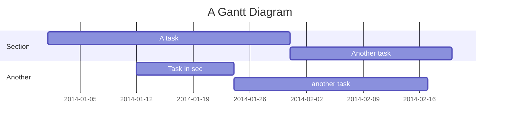

链滴

 产品 榜单 [本站基于开源项目 Sym](https://github.com/88250/symphony) [编程代码问答](https://routinepanic.com/)登录注册

1.  [首页](https://ld246.com/) 
2.  \> 
3.  [标签](https://ld246.com/tags) 
4.  \> 
5.  [Markdown](https://ld246.com/tag/markdown) / 
6.  [使用指南](https://ld246.com/tag/user-guide)

#  Markdown 使用指南 - 基础语法

本贴最后更新于 **1087** 天前，其中的信息可能已经事过境迁

> 本文主要介绍 Markdown 的基础语法，Markdown 扩展语法请参考[这里](https://ld246.com/article/1583305480675)。\
> 简洁版语法可浏览[速查手册](https://ld246.com/article/1583308420519)。

## 总览

几乎所有的 Markdown 引擎都支持 Markdown 发明者 John Gruber 所设计的[基本语法](https://ld246.com/forward?goto=https%3A%2F%2Fdaringfireball.net%2Fprojects%2Fmarkdown%2Fsyntax)，但不同的 Markdown 处理引擎在细节表现方面略有不同，下面逐一介绍。

## 标题

要创建标题的话只需使用井号 `#` 开头，井号的数量对应标题的级别。比如如果你想要创建一个 `<h3>` 则可以通过用三个 `#` 开头：`### 三级标题 `。使用井号的标题语法在 [CommonMark 规范](https://ld246.com/forward?goto=https%3A%2F%2Fspec.commonmark.org)中称之为“ATX 标题”。

| Markdown       | HTML            | 渲染结果 |
| :------------- | :-------------- | :--- |
| `# 一级标题`       | `<h1>一级标题</h1>` | 一级标题 |
| `## 二级标题`      | `<h2>二级标题</h2>` | 二级标题 |
| `### 三级标题`     | `<h3>三级标题</h3>` | 三级标题 |
| `#### 四级标题`    | `<h4>四级标题</h4>` | 四级标题 |
| `###### 五级标题`  | `<h5>五级标题</h5>` | 五级标题 |
| `####### 六级标题` | `<h6>六级标题</h6>` | 六级标题 |

### 标题可选语法

除了使用 ATX 标题外，我们还可以用 Setext 标题：在文本下一行用一个或多个等号 `=` 表示一级标题，一个或多个短横线 `-` 表示二级标题。

| Markdown          | HTML            | 渲染结果 |
| :---------------- | :-------------- | :--- |
| 一级标题 ======       | `<h1>一级标题</h1>` | 一级标题 |
| 二级标题 ------------ | `<h2>二级标题</h2>` | 二级标题 |

### 标题最佳实践

1.  段落之间的 ATX 标题最好使用空行分隔。因为有的 Markdown 引擎不识别缺少前后空行的标题语法。

    | ✅ 稳妥                  | ❌ 不稳妥                |
    | :-------------------- | :------------------- |
    | 这是一个段落。 # 一级标题 另一个段落。 | 这是一个段落。 # 一级标题 另一个段落 |
2.  ATX 标题的井号后**务必加上一个空格**

    | ✅ 稳妥   | ❌ 不稳妥 |
    | :----- | :---- |
    | # 一级标题 | #一级标题 |
3.  尽量不要使用 Setext 语法来写标题，因为 Setext 语法只能写到二级标题

## 段落

使用空行分隔文本即可。

| Markdown                                  | HTML                                                    | 渲染结果             |
| :---------------------------------------- | :------------------------------------------------------ | :--------------- |
| 我很喜欢使用 Markdown。 我将使用 Markdown 来排版我所有的文档。 | `<p>我很喜欢使用 Markdown。` `<p>我将使用 Markdown 来排版我所有的文档。</p>` | 我很喜欢使用 Markdown。 |

### 段落最佳实践

1.  段落开头不要使用空格或者制表符（`\t` 即 Tab 键）来缩进，否则可能会被当做代码块渲染。

    | ✅ 稳妥                | ❌ 不稳妥           |
    | :------------------ | :-------------- |
    | 开头不要缩进。 像这样保持左对齐就好。 | 开头缩进可能会被渲染为代码块。 |
2.  中文传统排版上段落开头有着“空两格”的习惯，可以使用全角空格 `　` 或者 HTML 实体 `&emsp;`。科技领域的文章排版建议不要空两格，段落居左对齐较好

## 折行

如果需要文本折行 `<br>`，可在文本结尾加上两个或更多的空格然后回车。

| Markdown      | HTML                      | 渲染结果          |
| :------------ | :------------------------ | :------------ |
| 这是第一行。 这是第二行。 | `<p>这是第一行。<br>这是第二行。</p>` | 这是第一行。 这是第二行。 |

### 折行最佳实践

目前大部分 Markdown 引擎会自动将换行符 `\n` 转换为 `<br>`，即软换行转硬换行。所以结尾用两个或更多空格的写法虽然稳妥，但是可能也会造成一些小问题：结尾空格在一些编辑器中并不可视；不小心按到或者习惯性按到会造成错误排版。介于这些小问题，可能用 `<br>` 来折行是最稳妥的做法，但这又不太优雅。另外，在 CommonMark 规范中可以在文本结尾使用反斜杠 `\` 来折行，但我也不太推荐这种写法。

综上，我的建议是**不要使用结尾空格、`\` 或者 `<br>`**，因为现在几乎所有的 Markdown 引擎基本都已经支持软换行转硬换行了。

## 加粗和强调

加粗对应粗体，强调对应斜体。

### 加粗

要加粗文本，可以使用两个星号 `**` 或者两个下划线 `__` 包裹待加粗的文本。

| Markdown          | HTML                         | 渲染结果              |
| :---------------- | :--------------------------- | :---------------- |
| 把文本\*\*加粗\*\*一下   | `把文本<strong>加粗</strong>一下`   | 把文本**加粗**一下       |
| 把文本 \_\_加粗\_\_ 一下 | `把文本 <strong>加粗</strong> 一下` | 把文本 \*\*加粗 \*\*一下 |

#### 加粗最佳实践

加粗用星号和用下划线的不同之处在于星号用法前后可以不加空格，但下划线必须要加。

| ✅ 稳妥           | ❌ 不稳妥             |
| :------------- | :---------------- |
| `星号**加粗**无需空格` | `没有空格下划线__加粗__无效` |

### 强调

要强调文本，可以使用一个星号 `*` 或者一个下划线 `_` 包裹待强调的文本。

| Markdown      | HTML                 | 渲染结果        |
| :------------ | :------------------- | :---------- |
| 把文本\*强调\*一下   | `把文本<em>强调</em>一下`   | 把文本*强调*一下   |
| 把文本 \_强调\_ 一下 | `把文本 <em>强调</em> 一下` | 把文本 *强调* 一下 |

#### 强调最佳实践

和加粗类似，星号用法前后可以不加空格，但下划线必须要加。

| ✅ 稳妥         | ❌ 不稳妥           |
| :----------- | :-------------- |
| `星号*强调*无需空格` | `没有空格下划线_强调_无效` |

### 加粗并强调

如果你需要加粗的同时强调文本，可以使用三个星号 `***` 或者三个下划线 `___` 包裹待强调的文本。

| Markdown                 | HTML                                     | 渲染结果               |
| :----------------------- | :--------------------------------------- | :----------------- |
| 同时 \*\*\*加粗并强调\*\*\* 的示例 | `同时 <strong><em>加粗并强调</em></strong> 的示例` | 同时 ***加粗并强调*** 的示例 |
| 同时 \_\_\_加粗并强调\_\_\_ 的示例 | `同时 <strong><em>加粗并强调</em></strong> 的示例` | 同时 ***加粗并强调*** 的示例 |
| 同时 \_\_\*加粗并强调\*\_\_ 的示例 | `同时 <strong><em>加粗并强调</em></strong> 的示例` | 同时 ***加粗并强调*** 的示例 |
| 同时 \*\*\_加粗并强调\_\*\* 的示例 | `同时 <strong><em>加粗并强调</em></strong> 的示例` | 同时 ***加粗并强调*** 的示例 |
| 星号\*\*\*可以不用\*\*\*加空格    | `星号<strong><em>可以不用</em></strong>加空格`    | 星号***可以不用***加空格    |

## 块引用

要创建块引用 `<blockquote>` 的话仅需在段落前加上大于号 `>`。

```
> 原谅我这一生不羁放纵爱自由，也会怕有一天会跌倒
> 背弃了理想 ，谁人都可以
> 哪会怕有一天只你共我

```

渲染结果

> 原谅我这一生不羁放纵爱自由，也会怕有一天会跌倒\
> 背弃了理想 ，谁人都可以\
> 哪会怕有一天只你共我

### 块引用内分段

如果需要分段的话需要可以在分段空行前加上一个 `>`。

```
> 今天我， 寒夜里看雪飘过
> 怀着冷却了的心窝漂远方
>
> 风雨里追赶， 雾里分不清影踪
> 天空海阔你与我

```

渲染结果：

> 今天我， 寒夜里看雪飘过\
> 怀着冷却了的心窝漂远方
>
> 风雨里追赶， 雾里分不清影踪\
> 天空海阔你与我

### 嵌套块引用

块引用可以嵌套使用，在段落前添加两个大于号 `>>` 表示两层嵌套。

```
> 块引用段落
>
>> 嵌套的块引用段落

```

### 块引用包含其他元素

块引用能够包含其他大部分语法元素。CommonMark 规范将块引用定义为容器块，容器块可以包含任意块级元素和行级元素，也就是说块引用可以包含其他任意元素。

```
> ### 标题是叶子块元素
>
> * 列表项一是容器块元素
> * 列表项二也是容器块元素
>
> **加粗**和*强调*是行级元素。

```

渲染结果：

> ### 标题是叶子块元素
>
> *   列表项一是容器块元素
> *   列表项二也是容器块元素
>
> **加粗**和*强调*是行级元素。

## 列表

列表分为有序列表和无序列表。Markdown 中的列表只能包含列表项元素，列表项和块引用一样，都是容器块。也就是说列表项可以包含其他任意元素。

### 有序列表

有序列表可以通过阿拉伯数字后跟 `.` 或者 `)` 来创建，数字不必递增连续。

| Markdown        | HTML                                  | 渲染结果     |
| :-------------- | :------------------------------------ | :------- |
| 1. 列表项一 2. 列表项二 | `<ol><li>列表项一</li><li>列表项二</li></ol>` | 列表项一列表项二 |
| 1. 列表项一 1. 列表项二 | `<ol><li>列表项一</li><li>列表项二</li></ol>` | 列表项一列表项二 |
| 1. 列表项一 3. 列表项二 | `<ol><li>列表项一</li><li>列表项二</li></ol>` | 列表项一列表项二 |

### 无序列表

无序列表可以通过短横线 `-`、星号 `*` 或者加号 `+` 来开头，后面需要跟一个空格来分隔文本内容。

| Markdown        | HTML                                  | 渲染结果     |
| :-------------- | :------------------------------------ | :------- |
| - 列表项一 - 列表项二   | `<ul><li>列表项一</li><li>列表项二</li></ul>` | 列表项一列表项二 |
| \* 列表项一 \* 列表项二 | `<ul><li>列表项一</li><li>列表项二</li></ul>` | 列表项一列表项二 |
| + 列表项一 + 列表项二   | `<ul><li>列表项一</li><li>列表项二</li></ul>` | 列表项一列表项二 |

### 列表项包含其他元素

列表项可以包含其他任意元素，比如段落、块引用、代码块、图片等。使用要点是待包含元素的起始字符要和列表项起始内容“对齐”。

#### 列表项包含段落

```
* 列表项一
* 列表项二第一段
  
  这是第二段
* 列表项三

```

渲染结果：

*   列表项一
*   列表项二第一段

    这是第二段
*   列表项三

#### 列表项包含块引用

```
* 列表项一
* 列表项二第一段
  
  > 第二段是块引用
* 列表项三

```

渲染结果：

*   列表项一
*   列表项二第一段

    > 第二段是块引用
*   列表项三

#### 列表项包含代码块

````
* 列表项一
* 列表项二第一段
  
   ```
  这里是代码块
  echo 你好，世界！
   ```
* 列表项三

````

渲染结果：

*   列表项一
*   列表项二第一段

    ```
    这里是代码块
    echo 你好，世界！

    ```
*   列表项三

#### 列表项包含图片

```
* 列表项一
* 列表项二第一段
  
  
* 列表项三

```

渲染结果：

*   列表项一
*   列表项二第一段

    
*   列表项三

## 代码

代码可以通过反引号 `` ` `` 包裹。

| Markdown       | HTML                      | 渲染结果         |
| :------------- | :------------------------ | :----------- |
| 列出文件命令是 \`ls\` | `列出文件命令是 <code>ls</code>` | 列出文件命令是 `ls` |

### 转义反引号

如果你需要显示反引号，可以用转义符 `\` 来对反引号进行转义。

| Markdown | HTML          | 渲染结果     |
| :------- | :------------ | :------- |
| 打个反引号 \` | `` 打个反引号 ` `` | 打个反引号 \` |

### 代码块

代码块可以使用四个空格缩进或者制表符 `\t` 缩进。

```
    <html>
      <head>
      </head>
    </html>

```

渲染结果：

```
<html>
  <head>
  </head>
</html>

```

**推荐使用围栏代码块语法来排版代码块**，即使用 ` ``` ` 来包裹代码块，并且指定语法高亮语言：

````
```html
<html>
  <head>
  </head>
</html>
```

````

## 分隔线

通过大于等于三个星号 `***`、短横线 `---` 或者下划线 `___` 来创建分隔线。

```
***
---
___

```

渲染结果：

***

## 超链接

通过 `[链接文本](URL)` 来创建超链接。

```
我们来自小众开源社区 [B3log](https://b3log.org)。

```

渲染结果：

我们来自小众开源社区 [B3log](https://ld246.com/forward?goto=https%3A%2F%2Fb3log.org)。

### 添加超链接标题

链接标题是可选的，在圆括号中的 URL 后用双引号包裹。鼠标移到超链接上会浮出显示标题内容。

```
我们来自小众开源社区 [B3log](https://b3log.org "B3log 开源")。

```

渲染结果：

我们来自小众开源社区 [B3log](https://ld246.com/forward?goto=https%3A%2F%2Fb3log.org "B3log 开源")。

### URL 和邮件地址

如果要直接显示 URL 或者邮件地址，可以通过 `<` 和 `>` 来包裹 URL 或者邮件地址。

```
<https://b3log.org>

<os@b3log.org>

```

大部分 Markdown 引擎也支持自动转换，这样可以省去 `<>`：

```
https://b3log.org

os@b3log.org

```

### 超链接格式排版

超链接可以和加粗强调、代码等元素结构一同使用。

```
我们来自小众开源社区 **[B3log](https://b3log.org)**。
我们来自小众开源社区 [`B3log`](https://b3log.org)。

```

渲染结果：

我们来自小众开源社区 **[B3log](https://ld246.com/forward?goto=https%3A%2F%2Fb3log.org)**。\
我们来自小众开源社区 [`B3log`](https://ld246.com/forward?goto=https%3A%2F%2Fb3log.org)。

### 引用风格的超链接

使用引用风格的超链接可以让 Markdown 原文更容易阅读。引用风格的超链接分为两部分：链接引用和链接定义。

#### 链接引用

链接引用用于在需要插入超链接的地方，它由两组方括号构成，第一组方括号用于指定链接文本，第二组方括号用于指定链接标识，链接标识指向链接定义。

```
[链接文本][链接标识]

[链接标识]: https://b3log.org

```

渲染结果：

[链接文本](https://ld246.com/forward?goto=https%3A%2F%2Fb3log.org)

链接引用也可以只由一组方括号构成，这种情况下链接标识将用于链接文本。

```
[链接标识]

[链接标识]: https://b3log.org

```

渲染结果：

[链接标识](https://ld246.com/forward?goto=https%3A%2F%2Fb3log.org)

#### 链接定义

链接定义由三部分构成：

1.  方括号包裹定义链接标识，后跟冒号 `:`
2.  URL，可以直接写也可以用尖括号 `<>` 包裹
3.  链接标题，这部分是可选的，可以用双引号、单引号或者圆括号包裹

```
[链接标识]: https://b3log.org
[链接标识]: <https://b3log.org>
[链接标识]: https://b3log.org "B3log 开源"
[链接标识]: https://b3log.org 'B3log 开源'
[链接标识]: https://b3log.org (B3log 开源)

```

链接定义可以放在整个 Markdown 文本的任何位置。有的人习惯将其放于引用所在段落之后，有的人习惯将其放于文末位置。

### 超链接最佳实践

英文内容天然使用空格分隔，所以在使用自动超链接时不存在分隔问题。但中文会存在该问题，比如：

```
我们的网址是https://b3log.org欢迎开源爱好者加入！

```

这段内容在很多 Markdown 引擎上会渲染不正确。为了尽量保证兼容性，可以考虑使用空格进行分隔：

```
我们的网址是 https://b3log.org 欢迎开源爱好者加入！

```

或者使用尖括号 `<>` 包裹：

```
我们的网址是<https://b3log.org>欢迎开源爱好者加入！

```

这样就能得到预期的渲染结果了：

我们的网址是 [https://b3log.org](https://ld246.com/forward?goto=https%3A%2F%2Fb3log.org) 欢迎开源爱好者加入！

## 图片

使用感叹号 `!` 后跟超链接就可以渲染图片了。

```


```

渲染结果：


### 超链接嵌套图片

如果你需要图片点击可以跳转超链接，只需要在链接文本部分包含图片即可。

```
[](https://ld246.com)

```

渲染结果：

[](https://ld246.com/)

## 转义字符

可使用反斜杠 `\` 来转义如下字符：

| 字符      | 中文名称     |
| :------ | :------- |
| `\`     | 反斜杠      |
| `` ` `` | 反引号      |
| `*`     | 星号       |
| `_`     | 下划线      |
| `{}`    | 花括号      |
| `[]`    | 方括号      |
| `()`    | 圆括号      |
| `#`     | 井号       |
| `+`     | 加号       |
| `-`     | 短横线（减号）  |
| `.`     | 点        |
| `!`     | 感叹号      |
| `\|`    | 竖线（管道符号） |

几乎所有 ASCII 标点符号都可以使用反斜杠进行转义。

## 嵌入 HTML

Markdown 天然支持嵌入 HTML 代码。

```
**Markdown** 和 <em>HTML</em> 混合排版。

```

渲染结果：

**Markdown** 和 *HTML* 混合排版。

### 嵌入 HTML 最佳实践

这在需要设置图片大小、字体颜色时会比较有用，但我们并不建议过多使用 HTML 来进行排版，一来是因为这样做实际上并不通用，因为有的 Markdown 引擎因为安全原因会过滤部分标签或者属性；二来是因为这样做太不 Markdown 了！

另外，请勿在 HTML 中嵌入 Markdown，这样并不工作：

```
<p>**粗体**不会生效。</p>

```

渲染结果：

\*\*粗体\*\*不会生效。

## 总结

使用好空行和空格是 Markdown 排版的关键，很多时候就是因为少了个空行或者空格导致产生了非预期的渲染结果。

随着 CommonMark/GFM 规范日趋完善并逐渐成为业界统一的 Markdown 标准，已经有越来越多的 Markdown 引擎实现了该规范。建议 Markdown 使用者尽量该遵循规范来进行排版，这样才能最大程度地避免细节渲染问题。

## 参考

*   [Markdown Guide](https://ld246.com/forward?goto=https%3A%2F%2Fwww.markdownguide.org)
*   [CommonMark Spec](https://ld246.com/forward?goto=https%3A%2F%2Fspec.commonmark.org)


*   [Markdown](https://ld246.com/tag/markdown)
*   [使用指南](https://ld246.com/tag/user-guide)

10 引用[Vditor 一款浏览器端的 Markdown 编辑器，支持所见即所得（富文本）、即时渲染（类似 Typora）和分屏预览模式](https://ld246.com/article/1549638745630)•[Vanessa](https://ld246.com/member/Vanessa)[思源笔记快乐手册 3.0 （新手指南）](https://ld246.com/article/1668217980464)•[AMBERWIN](https://ld246.com/member/AMBERWIN)[【幼儿园级】思源笔记基本操作介绍](https://ld246.com/article/1667365864518)•[qiancang](https://ld246.com/member/qiancang)

[882502 年前](https://ld246.com/member/88250)[曲靖位置](https://ld246.com/city/%E6%9B%B2%E9%9D%96)3感谢7关注29收藏4赞同10引用10回帖 2 2 2

18.1k 4.2k 844 328 242 82 99 131 12.1k

## 相关帖子

*   [主持人系统主持人简介 主持人可以管理被授权范围内的帖子、回帖和评论等内容。根据管理范围，主持人分为： 标签主持人：管理被授权标签内的内容 领域主持人：管理被授权领域内的内容 可以将社区主持人理解为不同板块的“版主”，版主负责自己版块的内容。 通过主持人系统，我们将管理权进一步分散给社区用户，让大家充分参与到社区的管理运营中，最终 ..](https://ld246.com/article/1591172128000)

    [2.8K](https://ld246.com/article/1591172128000)2 年前
*   [关闭 OAuth 注册，仅支持通过邮箱注册账号通过 GitHub 登录不上的反馈 今天早上收到一些关于使用 GitHub 登录不上的反馈，看了服务器日志发现是在用的 GitHub OAuth 应用被封禁了。 为什么通过 GitHub 登录不上会对社区造成很大影响？因为之前有很大一部分用户是通过 GitHub OAuth 注册的，注册后没有绑定邮箱，也没有绑定其他登 ..](https://ld246.com/article/1585209093171)

    [1.1K](https://ld246.com/article/1585209093171)2 年前
*   [关于禁止外链图片的公告为了给其他人带来更好的访问体验，请大家在发帖时不要使用外链图片，上传图片或文件请使用社区图床。 社区图床仅限于社区（博客端和社区端）使用，禁止外链到其他站点，请知悉。](https://ld246.com/article/1583821127435)

    [2.1K](https://ld246.com/article/1583821127435)2 年前
*   [Markdown 使用指南 - 语法速查手册总览 本文仅列出最常用的 Markdown 语法，未覆盖的细节请参考\[链接\]和\[链接\]。 基础语法 下列元素语法是所有 Markdown 引擎都支持的，可以放心使用。 元素 Markdown 语法 \[链接\] # 一级标题、## 二级标题 \[链接\] \*\*粗体文本\*\* \[链接\] \*斜体文本\* \[链接\] > 引用内容 ..](https://ld246.com/article/1583308420519)

    [10.6K](https://ld246.com/article/1583308420519)6 个月前
*    [Markdown 使用指南 - 扩展语法本文主要介绍 Markdown 的扩展语法，Markdown 基础语法请参考\[链接\]。 简洁版语法可浏览\[链接\]。 总览 在\[链接\]中我们介绍了 Markdown 最常用的排版用法，但有些时候基础语法不足以满足复杂一些的排版需求，这时候就需要使用扩展语法了。 一些个人和组织对基础语法进行了扩展，比如引入表格、围栏代码块 ..](https://ld246.com/article/1583305480675)

    [7.9K](https://ld246.com/article/1583305480675)2 年前
*   [Vditor 快捷键中文 通用 名称 快捷键 备注 表情 :/⌘ E 标题 Ctrl H / ⌘ H 参见下文 粗体 Ctrl B / ⌘ B 斜体 Ctrl I / ⌘ I 删除线 Ctrl S / ⌘ S 链接 Ctrl K / ⌘ K 参见下文 无序列表 Ctrl L / ⌘ L 参见下文 有序列表 Ctrl O / ⌘ O 参见下 ..](https://ld246.com/article/1582778815353)

    [7.8K](https://ld246.com/article/1582778815353)6 个月前
*   [链滴用户服务协议与隐私条款服务条款确认与接纳 云南链滴科技有限公司拥有链滴（ld246.com）及其相关产品、服务和软件的所有权和运作权，链滴科技享有链滴上一切活动的监督、提示、检查、纠正及处罚等权利。用户通过注册程序阅读本服务条款并完成注册即表示用户与链滴已达成协议，自愿接受本服务条款的所有内容。如果用户不同意服务条款的条件，则不能获得使用链 ..](https://ld246.com/article/1580714706243)

    [4.7K](https://ld246.com/article/1580714706243)9 个月前

10 回帖[Markdown 使用指南 - 基础语法](https://ld246.com/article/1583129520165)

## 欢迎来到这里！

我们正在构建一个小众社区，大家在这里相互信任，以平等 • 自由 • 奔放的价值观进行分享交流。最终，希望大家能够找到与自己志同道合的伙伴，共同成长。

[注册](https://ld246.com/register)  [关于](https://ld246.com/article/1440573175609)

请输入回帖内容 ...

*   [Gouzhong1223](https://ld246.com/member/Gouzhong1223) • 2 年前  via Mac OS

    Mark 一下，进我的收藏夹吃灰吧哈哈哈哈哈 😂
*   [Frank2019](https://ld246.com/member/Frank2019) • 2 年前 捐赠者

    好文
*   [iTanken](https://ld246.com/member/iTanken) • 2 年前 • 1 • 1 评论  via Mac OS捐赠者

    *   纠错 

        *   `加粗` HTML 示例空格位置：\
            
        *   `加粗并强调` Markdown 示例被渲染：\
            

    感谢，已做修正。

    [88250](https://ld246.com/member/88250) • 2 年前
*   [PeterChu](https://ld246.com/member/PeterChu) • 2 年前 • 1 

    ### 缩进问题很奇怪啊

    1.  列表一\
        列表一中的段落

    2.  列表二

    3.  列表三

        列表三中的段落

    4.  列表四

    5.  当有后续列表如列表五、列表六后，再次添加列表四中的段落时，无法添加不带有新列表项的段落吗？有点难受。\
        看来不是无法添加，而是“所见即所得”和“即时渲染”2 种模式中不能添加。

    6.  列表五

        > 列表五中的引用

    > 列表五中的引用

    1.  列表六\
        列表六中的段落
    2.  列表七

        | col1 | col2 | col3 |
        | :--- | :--- | :--- |
        | 1    | 2    | 3    |
        | 1    | 2    | 3    |

        奇怪，此处表格怎么没有缩进呢\
        **9.** 列表八

        | col1 | col2 | col3 |
        | :--- | :--- | :--- |
        |      |      |      |
        |      |      |      |

    ***

    1.  缩进的功能没有介绍。不太明白什么情况下 **减少/增加缩进** 可用，什么情况下不可用。
    2.  段落最佳实践中的 2 中，排版段落居左对齐可以说的过去，大致也是潮流，但是，列表下的段落、引用、表格（没试其他元素）如果不和列表项左对齐的话，很别扭很奇怪。
    3.  Vditor 的缩进按钮标识和表格的左/右对齐标识重复了，感觉不太好啊。

    1 回复

    1 操作[PeterChu](https://ld246.com/member/PeterChu) 在 2020-05-19 19:00:56 更新了该回帖
*   [88250](https://ld246.com/member/88250) • 2 年前订阅者作者

    1.  Vditor 编辑器中的增加/减少缩进操作的对象是列表项，不是其他元素
    2.  从 Markdown 规范定义了列表项“延续”，也就是如何让列表项这个块级容器包含其他块级元素：需要让子元素对齐列表项的内容开头，这个对齐指的是“列”上的对齐，比如 `1. foo` 的内容开头 foo 从第四列开始（前面三列是 `1.空格`），所以第二个块要和 foo 对齐的话（延续该列表项，成为该列表项的子节点）需要从第四列开始，就像下面这样（可点本回帖的交互图标来查看 Markdown 原文）

        这里是第二段。

        以上通过“列”来解释比较直观，在规范定义中其实非常复杂，还要考虑制表符 `\t` 和列表项标记符宽度等问题，平常用的话记得按列对齐就行。
    3.  图标重复问题稍后改进

    感谢如此细致的反馈！

    1 回复
*   [PeterChu](https://ld246.com/member/PeterChu) • 2 年前 • 1 

    1.  ~~D 你是通过“分屏预览”模式编辑这段回复的吗~~？
    2.  我发现了，“即时渲染”和“所见即所得”2 种模式下才有 缩进 功能按钮。

        ~~另外，如果不是“分屏预览”模式，则不能在列表下已有文本或内容的段落前手动输入空格达到缩进的目的，敲空格不起作用。~~\
        （这个 🤔 好吧总结一下，

        1.  列表项行单次回车后，光标所在行的下一行没有列表项内段落内容情况下，光标所在行会生成下一列表项，本行成为列表项行。
        2.  列表项行单次回车后，光标所在行的下一行为列表项行的情况下，则光标所在行会变为列表项行，列表项会顺延上一列表项，本行下的所有列表项则会 +1 或顺移一位。
        3.  列表项行单次回车后，光标所在行的下一行为列表项中的段落行，此时本行也会成为列表项中的段落行，而不是列表项行，且会自动缩进，与列表项行内容左对齐。
        4.  若想在 2 个列表项行中间插入列表项内段落行，则需要 `shift + 回车` ，此时光标所在行会自动缩进，且后续列表项符号不会改变。
        5.  若想结束当前列表，则需要在最后一项列表项行/段落后 2 次回车才可以。）
    3.  ~~除“分屏预览”模式外的 2 中模式中，对列表项中的已经存在的段落、内容的编辑有问题啊。\
        比如先将 2 段落输入完后，再为后一段落换行分段落时，该段落会变成下一列表项了。~~

        😲 好吧我发现了，原来此时的换行需要 shift+ 回车。

    ***

    看来还是自己 MD 用的不熟悉啊，这个 MD 列表嵌套缩进好麻烦哇，好怀念 word 的编辑形式 

    还有个小问题就是，嵌套有序列表如果不从字号上区分的话，至少应该将列表项，`1、2、3` 的样式区分一下更好点\~\~，比如最外层的列表项 123 支持加粗，若加粗，则第二层列表项为不加粗 123，第三层列表项则变为 带 1 个括号 `1)` 或者 `(1)` 或者 大/小写字母 abc，若第一层不加粗，则从上面的第三层开始排样式\~\~。(看了下语雀，只支持到 3 层有序列表的嵌套。多层第三层嵌套还挺麻烦。看来多层确实是不太常用到的特性。\
    

    )
*   [ieras](https://ld246.com/member/ieras) • 2 年前  via Mac OS

    这教程不错，就是没找到配置 url 如何新窗口打开等的一些属性呢？\
    还有一个问题就是 能插入 一段 js 代码到 md 文档吗？

    1 回复
*   [88250](https://ld246.com/member/88250) • 2 年前订阅者作者

    标准的 Markdown 语法不支持链接打开新窗口，但有些扩展语法支持，写法不一，目前大部分 Markdown 处理器不支持这些扩展，所以就不介绍了。如果这需求，可以试试直接写 `<a target="_blank">` 但有些平台是会过滤标签属性的，为了解决安全问题。

    插入 JS 代码到 Markdown 中本质上和上面的问题是一个，要看平台是否支持。

    1 回复
*   [ieras](https://ld246.com/member/ieras) • 2 年前  via Mac OS

    哦哦 感谢 D 神的解答！👍
*   [Eliphilo](https://ld246.com/member/Eliphilo) • 3 个月前 

    好详细，感谢 D 大分享总结，评论收藏。

请输入回帖内容 ...

[88250](https://ld246.com/member/88250)

但行好事莫问前程 [曲靖](https://ld246.com/city/%E6%9B%B2%E9%9D%96)

[回帖27280](https://ld246.com/member/88250/comments)[帖子709](https://ld246.com/member/88250/articles)[积分190255](https://ld246.com/member/88250/points)

*   [总览](javascript\:\(0\))
*   [标题](javascript\:void\(0\))
*   [标题可选语法](javascript\:void\(0\))
*   [标题最佳实践](javascript\:void\(0\))
*   [段落](javascript\:void\(0\))
*   [段落最佳实践](javascript\:void\(0\))
*   [折行](javascript\:void\(0\))
*   [折行最佳实践](javascript\:void\(0\))
*   [加粗和强调](javascript\:void\(0\))
*   [加粗](javascript\:void\(0\))
*   [加粗最佳实践](javascript\:void\(0\))
*   [强调](javascript\:void\(0\))
*   [强调最佳实践](javascript\:void\(0\))
*   [加粗并强调](javascript\:void\(0\))
*   [块引用](javascript\:void\(0\))
*   [块引用内分段](javascript\:void\(0\))
*   [嵌套块引用](javascript\:void\(0\))
*   [块引用包含其他元素](javascript\:void\(0\))
*   [列表](javascript\:void\(0\))
*   [有序列表](javascript\:void\(0\))
*   [无序列表](javascript\:void\(0\))
*   [列表项包含其他元素](javascript\:void\(0\))
*   [列表项包含段落](javascript\:void\(0\))
*   [列表项包含块引用](javascript\:void\(0\))
*   [列表项包含代码块](javascript\:void\(0\))
*   [列表项包含图片](javascript\:void\(0\))
*   [代码](javascript\:void\(0\))
*   [转义反引号](javascript\:void\(0\))
*   [代码块](javascript\:void\(0\))
*   [分隔线](javascript\:void\(0\))
*   [超链接](javascript\:void\(0\))
*   [添加超链接标题](javascript\:void\(0\))
*   [URL 和邮件地址](javascript\:void\(0\))
*   [超链接格式排版](javascript\:void\(0\))
*   [引用风格的超链接](javascript\:void\(0\))
*   [链接引用](javascript\:void\(0\))
*   [链接定义](javascript\:void\(0\))
*   [超链接最佳实践](javascript\:void\(0\))
*   [图片](javascript\:void\(0\))
*   [超链接嵌套图片](javascript\:void\(0\))
*   [转义字符](javascript\:void\(0\))
*   [嵌入 HTML](javascript\:void\(0\))
*   [嵌入 HTML 最佳实践](javascript\:void\(0\))
*   [总结](javascript\:void\(0\))
*   [参考](javascript\:void\(0\))

[API](https://ld246.com/article/1488603534762) [关于](https://ld246.com/article/1440573175609) [数据统计](https://ld246.com/statistic) [靠爱发电](https://ld246.com/sponsor) [思源笔记订阅](https://ld246.com/subscribe/siyuan)

© 2023 [链滴](https://ld246.com/)

记录生活，连接点滴

[滇ICP备14007358号-5](https://beian.miit.gov.cn/) • [Sym](https://b3log.org/sym) v3.6.4



