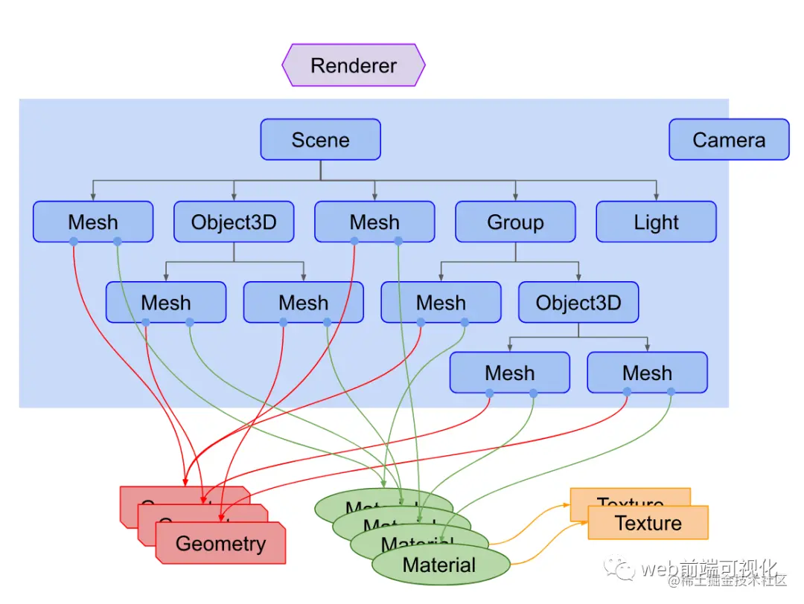
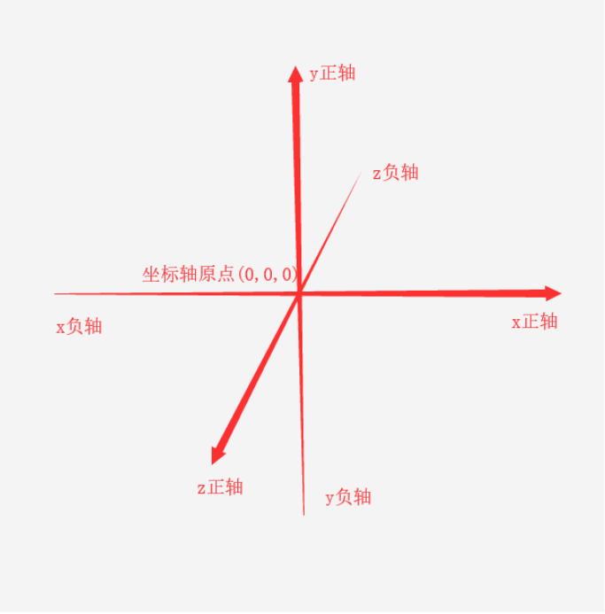
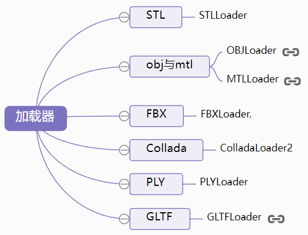

```javascript
模型  地编场景 ue交互开发

blender
    同时修改多个物体数据//选中需要同时修改的物体,修改需要修改的数值,生效瞬间按住Alt即可
    坐标轴//在中间顶部的工具图标按钮中切换坐标轴 
    添加新的三维视图//在三维视图跟图层管理的 隔线 也即在三维视图的右上角 鼠标移上去 当鼠标形状变换时即可拖动 添加新的三维视图
    视图的切换//通过波浪线进行视图的切换 比如切换为俯视图
    按x键删除物体 
    有的时候导入模型太小看不见。那么就全选按A键),然后放大20_30次n按S
```
## 3D格式
```javascript
实际上有数百种 3D 文件类型可用，因为每个 3D 软件程序都有自己的文件类型，并针对该特定软件进行了优化。例如，Blender 有 BLEND，AutoCAD 有 DWG，Clo 有 .zprj，Browzwear 有 .bw，仅举几例。
那如何转换？//用中性（或开源） 3D 文件格式或 FBX。虽然 FBX 是专有格式，但许多软件程序都将其用作交换格式
中性 3D 格式//如果您将 3D 文件转换太多次，就会出现问题。因此，您仍然需要从一开始就选择正确的中性 3d 格式，以避免不必要的转换
    gLTF/GLB// gLTF/GLB 是一种中立的开源格式。Khronos Group为 3D 网络、AR、VR、游戏和 3D 广告创建了这种格式。这是第一个真正定义明确的 3D 标准。此文件格式支持几何、材料、纹理、颜色和动画。这包括PBR（基于物理的渲染），因此阴影和光线会显得更加逼真。    gLTF 基于 JSON，因此它将一些数据存储在外部文件中，例如纹理（JPEG 或 PNG）、着色器 (GLSL) 或几何和动画数据 (BIN)。GLB 文件在内部存储所有这些数据。Khronos 小组正在不断改进和更新这种文件格式。它正迅速成为 3D 购物的标准。
    FBX// FBX方案是最好的互导方案,FBX 是专有的 3D 文件格式。Kardara 最初开发了这种格式。AutoDesk 随后于 2006 年购买了它们并继续支持 FBX。它广泛应用于电影和视频游戏行业。它支持几何、外观（颜色和纹理）以及动画（骨骼和变形）。FBX 最常用于动画，用作不同程序（如 Maya、3DSMax、AutoCAD、Roman's CAD 等）之间的交换格式。
    OBJ//当用作 ASCII 变体时，OBJ 是一种中性 3D 格式。但是，当用作二进制变体时，它是专有的。3D 打印、图形和 3D 扫描都使用这种文件格式，部分原因是它能够存储几何图形以及颜色和纹理信息。此文件格式将颜色和纹理信息存储在扩展名为 .MTL 的单独文件中。OBJ 不支持动画，但它是最流行的 3D 图形交换格式之一。
    USDZ/USD// Apple 和 Pixar 开发了 USDZ/USD。它是专有的 3D 文件格式，主要用于 iOS 设备上的增强现实。这种文件格式在 3D 商务中最为流行，因为您可以使用这种格式在 iPhone 上放置和试用 3D 模型。
    STL// 这种 3D 文件格式最常用于 3D 打印。它是一种中性的 3D 文件格式。这种文件格式只存储几何信息。
    STEP (.STP)//程和国防工业使用 STEP。它是一种中性的 3D 文件格式。这种文件格式可以存储所有几何形状，包括拓扑和几何公差、材料类型、纹理和其他复杂的产品数据。
   (.dae)COLLADA//Khronos 集团创建, 另一种中性 3D 文件格式。此文件格式存储几何、外观、场景和动画。它也是少数支持物理和运动学的格式之一。虽然曾经被大量使用，COLLADA由于未能跟上新技术，随着时间的推移变得越来越不受欢迎。Khronos Group 选择不更新此格式，而是创建了新格式 GLTF。
Unity是用3D模型，3dmax之类是生成模型
模型加载(重点)//常用的3d格式
    问题: 导入到场景内的模型无法查看，而且也没有报错?
        尝试放大一千倍或者缩小一千倍来查看效果, 将模型居中到相机照射的焦点位置查看
    1.GLTFLoader(官方推荐)//const loadedData = await loader.loadAsync('path/to/yourModel.glb');
        //由于glTF专注于传输，因此它的传输和解析的速度都很快。glTF模型功能包括：网格，材质，纹理，蒙皮，骨骼，变形动画，骨骼动画，灯光以及相机。
        在传输到前端的过程中，通常可能传输gltf文件、附属的.bin文件（存储二进制数据）、图片纹理文件（.jpg或.png格式）等
        glTF 导出格式有两种后缀格式可供选择：'.gltf' 和 '.glb'    
            '.bin' 文件，以二进制流的方式存储顶点坐标、顶点法线坐标和贴图纹理坐标、贴图信息等模型基本数据信息；        
            '.gltf' 文件，本质是 json 文件，记录对bin文件中模型顶点基本数据的索引、材质索引等信息，方便编辑，可读性较好；  
                glTF-Embedded是一种使用JSON格式存储模型数据的glTF版本，其中模型中的所有数据都是直接嵌入文件中的。
            //               
            '.glb'  文件格式只导出一个 .glb 文件，将所有数据都输出为二进制流，通常来说会更小一点，若不关心模型内的具体数据可直接选择此类型。
                glTF-Binary是另一种glTF版本，其使用二进制文件存储模型数据，
    //Draco 是 Google 推出的一个用于 3D 模型压缩和解压缩的工具库    
    
    //如果当前的首选不是glTF格式，那么推荐Three.js定期维护并且流行的格式FBX，OBJ或者COLLADA格式，Three.js也有自己独有的JSON格式
    2.'.json' new ObjectLoader().parse(obj) //加载.json格式, 3d对象.toJSON()转成JSON
    3.'.obj'  OBJ格式模型导入      
        OBJ文件的导出通常会和MTL格式一同导出，MTL作为OBJ文件的附属文件，却有着OBJ文件需要贴图材质        
    4.FBX模型导入        
    5.(.dae)COLLADA模型导入      
        
    
CAD//像SU、MS、ArchiCAD、Inventor、Allplan、 VevtorWorks、Civil 3D等软件
    BIM//将以前的CAD图纸转化为立体模型，真到每个窗户都是真实具体尺寸的。具有小场景精细化的业务
        Revit主要用于进行建筑信息建模
        
1、立方体模型数据：
通过建模软件快速生成的，然后导入到上述一些平台中，该类数据比较适合宏观类的业务，比如导航什么的，看看POI点分布什么的看看城市大体情况。
2、卡通模型数据：
通过建模软件完成建模，导入到上述一些平台中，通常是智慧旅游一些表现力丰富的业务
3、人工建模数据：
和上述相同，只是谝写实。现在这类型数据可结合BIM数据（BIM不一定能要的来）制作。
4、BIM模型数据：
真正的建筑可视化模型，将以前的CAD图纸转化为立体模型，真到每个窗户都是真实具体尺寸的。具有小场景精细化的业务。
5、倾斜模型数据：
通过无人机航飞处理生成模型，具有真实建筑属性：长宽高，地理位置等等。这类数据可用于空间分析业务。
所以说，建筑数据可视化还是得根据数据用途，业务场景来设计，而非单纯的使用白模。
```
## 总结Draco的压缩原理
>Draco支持多种3D图形数据格式，包括点云、三角网络格式和多边形网络格式。
### 核心思想

```js
1.  去除冗余信息
2.  利用数据本身的特征//例如，如果数据中有连续的相同值，可以将这些值替换为一个值和一个计数器，从而减少数据的大小。哈夫曼编码
```
### 对不同3D图形数据格式的压缩有什么区别
```
1. 对点云数据，压缩算法通常会对所有点进入顺序，然后利用点之间的相似性进入压缩。来说压缩的效果也比较好。
2. 对三角网数据，压缩算法会优先考量与边缘相近的三角形，因为它更有可能共享顶部点和法锥量。缩小效果也会提高。
3. 对多边形网络数据，压缩算法会优先考量相关的界面结构，以及界面之间的拓击关系，以方便更好地利用公共网络包容的点、边。数据通用工具有很高的分离率和复杂性，因此压缩算法需要更多的复杂和精细才能取得比较好的压缩效果。
```
### 三种3D图形数据格式的压缩原理
```
1. 点云数据的压缩原理
点云数据是一系列的点构成的数据结构，它的压缩通常是基于点的属性和几何形状的局部性，利用点之间的相似性进行压缩。它的原理如下：
（1）点云数据的排序：点云数据的每一个点都有3D坐标和颜色信息。在数据压缩前，需要对点进行排序，将相邻的点放在一起。排序算法一般采用哈希或BSP树等方法。
（2）点云数据的精简：由于点云数据本身就比较小，一般不需要精简。如果需要精简，则可以基于点之间的距离、几何形状和表面拓扑关系等进行压缩。常用的压缩方法有基于Octree的压缩和基于RANSAC的压缩。

2.三角网格数据的压缩原理
三角网格是由一系列三角形构成的数据结构，它的压缩需要考虑各个三角形的拓扑关系，利用共享的点和法矢量进行压缩，其原理如下：
（1）三角网格的划分：三角网格数据通常被分为许多小块，然后对每个小块进行压缩。
（2）表面重建：在压缩前，需要对三角网格进行表面重建。表面重建就是从离散的点云数据中还原表面的拓扑结构。表面重建的方法有Marching Cubes算法和Surface Reconstruction算法等。常用的表面重建工具包括CGAL和PCL等。
（3）三角网格的压缩：三角网格数据的压缩可以基于量化误差和哈夫曼编码等原理。常用的压缩方法有LZ77和LZ78等。

3.多边形网格数据的压缩原理
多边形网格是由一系列多边形（可以是任意形状）构成的数据结构，它的压缩需要考虑各个面之间的拓扑关系。多边形网格数据通常具有很高的分辨率和复杂性，因此压缩算法需要更加复杂和精细才能取得较好的压缩效果。其原理如下：
（1）网格数据的分解：将网格数据分解为多个小块，然后分别压缩。
（2）网格数据的离散化：对网格数据进行离散化，将连续的几何信息转化为离散的数值。一般来说，离散化是基于小块的局部信息进行的，可以选择基于边长、角度和曲率等进行离散化。
（3）网格数据的压缩：压缩算法可以利用网格数据之间的相似性进行压缩，例如共享的点、边和面等。常用的压缩方法有基于哈夫曼编码和基于小波变换的压缩方法等。
```

## 类图


```javascript
HT for Web 提供了一套独特的 WebGL 层抽象，将 Model–View–Presenter (MVP) 的设计模型延伸应用到了 3D 图形领域
    //和类似的JavaScript库（如three.js）一样，包含ht的js库文件，即可使用ht js API开发。
    //HT还支持导入IFC格式的BIM模型文件生成场景，此外还支持3D Tiles格式的倾斜摄影模型文件, Map Tiles
    //BIM模型文件一般较大较重，不利于直接在浏览器中运行。HT 提供了一项高级功能来轻量化 BIM 模型，从而更快地在 Web 上加载。
    //发动机模型是设计师通过 3ds Max 建模，然后导出 obj 与 .MTL文件来定义材质，在 HT 中解析 obj 与 mtl 文件生成 3D 场景中可用的模型
    //该 3d 场景中所有的模型均为线段和六面体搭建，相比较通过 3d Max 建模然后通过 obj 导入来说场景中的三角面会少很多，更加的轻量化
    //HT 的 3d 编辑器进行搭建，场景中的模型有些是通过 HT 建模，有些通过 3dMax 建模，之后导入 HT 中，场景中的地面白色的灯光，是通过 HT 的 3d 编辑器进行地面贴图呈现出来的效果
    //我们建议客户提供卫星图像、设计草图、物业鸟瞰图、CAD图纸、现场照片等给设计师进行建模。
    //以前只能靠 Unity3D/Unreal 游戏引擎实现的 3D/VR 项目，现在慢慢能让 Web 开发人员驾驭，更好的与其他 Web 业务系统融合，
    //毕竟用 Unity3D/Unreal 游戏引擎开发整个业务系统是比较反人类，相信 Web 承担越来越重度的渲染呈现应用是不可逆的趋势
    HDRI文件是一种文件，*.hdr或*.tif格式,记录了图片环境中的照明信息，因此我们可以使用这种图象来“照亮”场景
        可以用作scene的背景,scene.background = new RGBELoader().setPath( 'textures/' ).load( 'royal_esplanade_1k.hdr', ()=>{
                                                hdrEquirect.mapping = THREE.EquirectangularReflectionMapping;} );
    
素材:sketchfab.com


Three.js中级封装做3D, 万物皆三角形
    //Babylon.js高级封装做游戏
    相机,场景,网格都是THREE.Object3D的实例,有位置,有大小
    坐标系: 世界空间和局部空间
    
最小例子：https://github1s.com/johnson2heng/GitChat-Three.js/blob/master/01%E7%AC%AC%E4%B8%80%E8%8A%82%20helloWorld/index.html#L50

调试
    "three": "^0.115.0"//该版本支持vscode快速跳转定义, 最新版不支持..,换版本可能有兼容问题!!
    显示帧数
        import Stats from 'three/examples/jsm/libs/stats.module';
        stats = new Stats();
        document.body.appendChild(stats.dom);
    滑块实时调参
        import dat from 'three/examples/jsm/libs/dat.gui.module';    
        2.const gui = new dat.GUI();
          const datas= {  X:0, Y:0,Z:0 } //监听项
          const f1 = gui.addFolder('柜子和门');//分组
                //最简单  
                f1.add(mesh.position, 'x', -1000, 1000);
                //复杂
                f1 .add(datas, "X", -1000, 1000).name('相机X').onChange(()=> mesh.position.set(datas.positionX, datas.positionY, datas.positionZ)  );                
                f1.open();
    辅助对象 Helper
        1、ArrowHelper 箭头辅助对象        2、AxesHelper 轴坐标系辅助对象(常用,看原点在哪里)
        3、BoxHelper 包围盒辅助对象        4、Box3Helper 模拟3维包围盒辅助对象
        5、CameraHelper 相机视锥体辅助对象( camera : Camera被模拟的相机 )        6、DirectionalLightHelper 平行光的辅助对象
        7、GridHelper 坐标网格辅助对象        8、PolarGridHelper 极坐标格辅助对象
        9、HemisphereLightHelper 半球形光源网格辅助对象        10、PlaneHelper 平面辅助对象
        11、PointLightHelper 点光源菱形网格辅助对象        12、SpotLightHelper 聚光灯锥形辅助对象
        13、RectAreaLightHelper 矩形光辅助对象        14、Skeleton<x>helper 骨骼辅助对象
        15、VertexNormalsHelper 顶点的法线辅助对象        16、VertexTangentsHelper 顶点切向量辅助对象  

渲染器
    const renderer = new THREE.WebGLRenderer(); 
    //如何用到glsl们?     WebGLRenderer-> initGLContext-> new WebGLPrograms -> ShaderChunk ->./ShaderLib/**.glsl.js
    renderer.setSize(window.innerWidth, window.innerHeight);
    document.body.appendChild(renderer.domElement);
    动画循环调用renderer.render(scene, camera);
    
曲线
    THREE.LineCurve3() - 表示由两个3D点定义的线段。在路径动画（如先前示例中看到的盘旋）和粒子系统中常常使用。
    THREE.QuadraticBezierCurve3() - 也称为单曲线轨迹，它由三个3D点（首位点以及一个控制点）构成，平滑地将起始点移动到结束点。 它们可以用于多用场景中，例如在动画时平滑地过渡模型位置。
    THREE.CubicBezierCurve3() - 类似与二次贝塞尔曲线，只是由四个点来定义。相比之下它们更加复杂，但也更加灵活，在创建更流畅的曲线上表现出色。比如让相机跟踪模型运动的时候，就可以使用CubicBezierCurve3来实现更自然的效果。
    THREE.SplineCurve3() - 充当平滑路径的功能。它们由任意数量的点构成，三维空间中的坐标点可以随时间变化。常常用于建立弯曲的道路或特定动画中的精灵。
    THREE.EllipseCurve() - 椭圆曲线由中心点、半径、起始角度和弧长角度定义。 它们比其他路径类型更受限制，但如果需要按预期方式围绕中心点旋转/移动物体，则非常有用。
    THREE.ArcCurve() - 圆弧曲线表示圆形线段。其由圆心、半径、起始角度和弧度价值组成。这些曲线可以用于创建自定义3D几何体或建筑物，其中一个或多个曲线合并成一个形状。
    THREE.CatmullRomCurve3() - 经典样条曲线类型。可以连接任意数量的点，产生平滑、流畅的路径。它们经常用于动画和交互式可视化中。经常用来定义相机运动路径或者某些特效涉及到物体移动的路径
    
相机/控制器
    target/lookAt/上下左右近远/updateProjectionMatrix()更新相机/fov垂直视野角度/aspect宽高比
        camera.target = mesh.position;    //或者 camera.lookAt(mesh.position);
    不断地盯住/跟踪一个目标
        const targetPosition = new THREE.Vector3();
        获取变动目标方法1: targetMesh.getWorldPosition(targetPosition);//存位置进去targetPosition
        获取变动目标方法2: Curve.getPointAt(0-1的数,targetPosition) //返回曲线上相对于曲线总长度的位置，就好像它是一条延伸成直线的线, 存位置进去targetPosition
        turretPivot.lookAt(targetPosition);//盯住targetPosition    
    PerspectiveCamera透视//模拟人眼,近大远小
    OrthographicCamera正交//类似某一方向来个截图
    相机插件//https://github.com/mrdoob/three.js/blob/master/examples/js/controls/OrbitControls.js
        OrbitControls 轨道控制器,让相机可以放近放远, 可以360°绕着物体看, 方便调试'没有它鼠标操作什么反应都没有'
        DeviceOrientationControls 陀螺仪相机控制器，实现移动端陀螺仪控制相机。
        DragControls 控制鼠标拖拽移动物体的功能。
        EditorControls 实现相机的旋转，缩放，平移功能，相对于OrbitControls的功能差不少，不建议使用
        FirstPersonControls 第一视角相机控制器
        FlyControls 飞行相机控制器        
        OrthographicTrackballControls 正交轨迹球控制器 正交相机使用的轨迹球控制器
        TrackballControls 轨迹球控制器 透视相机使用的轨迹球控制器
        PointerLockControls 鼠标锁定相机控制器
        TransformControls 控制模型位置，缩放，旋转的控制器
        VRControls 实现VR双屏相机控制器 
        
Layer
    配合camera.layers.set(0);分组渲染(一组用composer渲染,一组正常渲染)或分组隐藏, '默认的图层都是0和相机对象一样，都会被渲染到画布上，如果把其中一个网格模型的图层值设置为非0，比如3，因为和相机对象的图层0不一样，就不会被渲染出来。'
    layers.set() //删除图层对象已有的所有对应关系，增加与参数指定的图层的对应关系。.set()方法的参数可以理解为二进制中右侧1向左平移的位数，得到的值赋值给图层对象的.mask属性
        //比如设置.set(0)，.mask属性值是1，设置.set(1)，.mask属性值是2，设置.set(2)，.mask属性值是3，设置.set(2)，.mask属性值是4，设置.set(4)，.mask属性值是8
    layers.enable(layer : Integer) //增加图层对象与参数指定图层的对应关系。 layer - 一个 0 - 31 的整数。Layers 对象为 Object3D 分配 1个到 32 个图层,默认的，所有 Object3D 对象都存储在第 0 个图层上

增加图层对象与参数指定图层的对应关系。
网格(Mesh)代表物体的位置和方向
    position/scale/rotation
    
查找某个具体的模型
    1.物体.name = "眼睛"
    2.1.scene.getObjectByName ( "左腿" );
    2.2.scene.traverse(function(obj) {  if (obj.type === "Group") console.log(obj.name); 
    
      
材质(Material):
    color/map纹理/normalMap法线贴图是一种模拟凹凸处光照效果的技术.是凸凹贴图的一种实现/自发光属性emissive/高光颜色属性specular
    /粗糙度属性roughness/depthTest'被挡住还能看到'
    MeshBasicMaterial不会受到光的影响//由于MeshBasicMaterial不使用光照，如果物体显示不出来,材质设为它能显示,那物体就是出现在材质或光照了
    MeshPhongMaterial会受灯光影响的高光材质,油漆面，瓷瓦等光滑物体
        MeshToonMaterial是MeshPhongMaterial卡通着色的扩展
    MeshNormalMaterial法向材质,这种材质会根据面的方向不同自动改变颜色,不会受到光的影响
    MeshLambertMaterial 兰伯特材质，不会出现高光, 粗糙的材质的物体，比如木头或者石头
    MeshDepthMaterial材质的物体，其外观不是由光照或某个材质属性决定的，二十有物体到摄像机的距离决定的。可以将这种材质与其他材质结合使用，从而很容易地创建出逐渐消失的效果
    Points //默认不受光照影响
    RawShaderMaterial与ShaderMaterial类似，不同之处在于内置的uniforms和attributes的定义不会自动添加到GLSL shader代码中
    //注意使用物理材质的时候，一般需要设置环境贴图.envMap
    MeshStandardMaterial一种基于物理的标准材质,提供了比MeshLambertMaterial或MeshPhongMaterial更精确和逼真的结果，代价是计算成本更高
        MeshPhysicalMaterial是MeshStandardMaterial的扩展，MeshPhysicalMaterial可以更好地控制反射率
    MeshMatcapMaterial不对灯光作出反应,灯光和阴影是通过MatCap和Map贴上去的
    线条 //在上一节我们讲几何体时，没有讲解如何画直线，是由于直线需要单独的材质进行实现
        LineBasicMaterial({color:0x00ff00})//线条材质
        LineDashedMaterial({color:0xff0000})//虚线 ,需要重新计算位置才能显示出虚线line.computeLineDistances()
    


基本属性和方法
    needsUpdate//如果修改了Material内的内容，需要将此属性设置为true，然后Three.js会在下一帧里面将修改内容同步到WebGL的显存内
    map//此属性可以配置当前材质的纹理贴图，是一个THREE.Texture对象, material.map = texture
    纹理的重复方式:
        var texture = new THREE.TextureLoader().load( "textures/water.jpg" );
        texture.wrapS = THREE.RepeatWrapping; //设置水平方向无限循环
        texture.wrapT = THREE.RepeatWrapping; //设置垂直方向无限循环
        texture.repeat.set( 4, 4 ); //水平方向和垂直方向都重复四次
        //UV坐标将被用于纹理映射
    颜色:   
        var color = new THREE.Color(1, 0, 0 );//"rgb(255, 0, 0)" 0xff0000 "#ff0000"  "rgb(100%, 0%, 0%)"       'skyblue'    "hsl(0, 100%, 50%)"    
 

精灵Sprite //类似cesium的广告牌
粒子points //和精灵的效果是一样的，粒子的作用就是为解决很多精灵而出现的，我们可以使用粒子去模型数量很多的效果，比如下雨，下雪等

BufferGeometry(高性能)和Geometry(低性能)可通过自己的fromXX方法互转//BufferGeometry存储的都是一些原始的数据，性能比Geometry的性能高，很适合存储一些放入场景内不需要再额外操作的模型
    BoxBufferGeometry 正方体
    CylinderBufferGeometry 圆柱
    SphereBufferGeometry 球
    
    ConeGeometry 圆锥
    PlaneGeometry 平面
    TorusGeometry 圆环
    TorusKnotGeometry 圆环结几何
    ExtrudeGeometry拉伸成型, 利用圆形配合直线轨迹线生成圆柱体,配合曲线轨迹生成弯曲的水管等
Geometry和BufferGeomety内置了一些常用的方法:
    center()// 此方法为居中方法，可以根据边界框居中几何图形
    computeBoundingBox() // 此方法可以可以计算几何的边界框，方法调用后，会更新Geometry.boundingBox属性，我们可以通过Geometry.boundingBox属性获取到一个包围几何体的立方体的每个轴向的最大值和最小值
    dispose()// 将几何体从内存中删除，这个方法必须记得使用。如果频繁的删除模型，一定要记得将几何体从内存中删除掉。
    
光源
    intensity/color/position/target朝向位置/shadow/castShadow是否接收投影
    DirectionalLight=> 阳光
        new THREE.DirectionalLight( 0xffffff, 0.5 ); //=> 阳光
        .shadow.camera.上下左右近远 //限制阴影范围, 提高性能
        .shadow.mapSize.height//阴影密度
    PointLight=> 灯泡
    RectAreaLight=> 条形照明或明亮的窗户
    SpotLight=> 聚光灯
    
    AmbientLight从各个方向向每个对象添加恒定数量的光。
        new THREE.AmbientLight( 0x404040 ); // 创建一个灰色的环境光 
    HemisphereLight天空颜色和地面颜色之间的渐变 ，可用于模拟许多常见的照明场景。//环境光会影响场景中的所有对象。因此，无需为场景添加多个环境光

    阴影
        1.renderer.shadowMap.enabled = true; '默认情况下，阴影是禁用的'
        2.产生阴影的物体.castShadow = true;
        3.接收阴影的物体物体.recieveShadow=true; //接收阴影 8:47-12:47
    
动画
    function animate() {
        requestAnimationFrame(animate); //循环调用函数
        //改变物体位置
        renderer.render( scene, camera ); //渲染界面
    }
    animate();
    变型动画 //修改模型顶点的位置  morph targets的中文翻译是"形变目标"或"融合形态"。
            //在使用morph targets时，我们可以通过将基础网格和目标网格进行插值来得到一个中间状态的几何体。通过不断改变插值系数，我们可以平滑地将基础网格变形为任何一个目标网格，从而实现形变动画。
            geometry.morphTargets[0] = {name:'t1',vertices:动画目标geometry.vertices}
            geometry.computedMorphNormals();//通知开启动画
            mesh = new THREE.Mesh(geometry,material)
            mesh.morphTargetsInfluences[0] = 0-1之间的数//1则已经变化成了 目标动画目标geometry 了
    骨骼动画    
    
通过导入模型显示动画 //https://github.com/johnson2heng/GitChat-Three.js
    模型动画组成:
        KeyframeTrack是基类，每种数据类型都有一个子类：
            NumberKeyframeTrack某秒数值如透明度/VectorKeyframeTrack某秒位置/QuaternionKeyframeTrack/BooleanKeyframeTrack/StringKeyframeTrack
        动画片段（AnimationClips）        
            //在我们成功导入模型以后，如果模型拥有相关的动画属性，会在返回的模型数据中产生一个名为animations的数组，数组的每一个子项都是一个AnimationClips对象
            eg:第一个AnimationClips对象有可能保存的是人物走动的动画，第二个AnimationClips对象用于跳跃，第三个用于攻击动画等等。
            对象内部四个属性: 
                name当前的动画的一个名称 / uuid一个不会重复的uuid / duration当前动画一个循环所需要的时间 / tracks轨迹当前动画每一次切换动作所需要的数据
                
        动画混合器（Animation Mixer）//播放权力在动画混合器的手中。还可以同时控制几个动画，混合它们或者合并它们。        
        动画播放器（Animation Actions）//动画播放器，暂停或者停止，加快或减慢, 是否使用淡入淡出效果。        
        
        动画对象组（Animation Object Groups）
            如果你希望一组模型对象共享当前的动画，我们可以使用动画对象组来实现
    导入方法:
        变形动画
            //并将材质的morphTargets设置为ture，可以使用变形动画
            mesh = new THREE.Mesh(geometry, new THREE.MeshLambertMaterial({morphTargets: true}));  
            //然后我们创建了一个针对于该模型的混合器        
            mixer = new THREE.AnimationMixer(mesh);
            //接着使用变形目标数据创建一个动画片段
            const clip = THREE.AnimationClip.CreateFromMorphTargetSequence('gallop', geometry.morphTargets, 30); 
            const clip = new AnimationClip('slowmove', length=-1自动计算tracks长度, [new VectorKeyframeTrack('.position', times, values)]);
            //使用混合器和动画片段创建一个动画播放器来播放：
            const action = mixer.clipAction(clip); //创建动画播放器,   循环mixer.update(delta)
            action.setDuration(1); //设置当前动画一秒为一个周期
            action.play(); //设置当前动画播放
        骨骼动画
            mixer = new THREE.AnimationMixer(obj); //通过当前模型创建混合器
            action = mixer.clipAction(gltf.animations[0]); //通过动画数据创建播放器
            action.play();//直接调用播放器的播放事件让动画播放：
            //最后，我们还是需要在循环渲染中更新混合器，并将每一帧渲染的间隔时间传入        
        function render() {
            control.update();
            var time = clock.getDelta();
            if (mixer) {mixer.update(time);}////由于模型导入是异步的，所以我们再模型没有加载完之前是获取不到混合器的
            renderer.render(scene, camera);
        }
    
场景交互
    new Raycaster( origin, direction, near, far );//光线投射主要用于物体选择、碰撞检测以及图像成像等方面
        origin - 光线投射的原点矢量。
        direction - 光线投射的方向矢量，应该是被归一化的。
        near - 投射近点，用来限定返回比near要远的结果。near不能为负数。缺省为0。
        far - 投射远点，用来限定返回比far要近的结果。far不能比near要小。缺省为无穷大。
        .set（origin，direction）
        .setFromCamera ( coords, camera )//使用当前相机 和 界面的2d坐标 设置射线的位置和方向
        .intersectObject ( object, recursive, optionalTarget)//[ { distance, point, face, faceIndex相交的面的索引, indices组成相交面的顶点索引, object }, ... ]
        .intersectObjects ( array, recursive, optionalTarget)
        
实现一个模型的点击事件
    //首先，我们通过点击事件回调的event获取到点击的位置：
        mouse.x = ( event.clientX / window.innerWidth ) * 2 - 1;
        mouse.y = - ( event.clientY / window.innerHeight ) * 2 + 1;
        默认没有经过矩阵转换过的显示区域的宽和高分别是2，即中心点也是webgl场景的坐标原点，左上角的坐标是(-1.0, 1.0, 0.0)， 右下角的坐标轴是(1.0, -1.0, 0.0)。
    //点击点的位置 -> 没有矩阵转换过的平面坐标 -> 场景内的原始坐标
        如果webgl的渲染区域不是占满窗口状态，我们还需要获取到显示区域距离窗口左上角的偏移量，再计算位置：    
            //通过dom的getBoundingClientRect方法获得当前显示区域距离左上角的偏移量
            var left = renderer.domElement.getBoundingClientRect().left;
            var top = renderer.domElement.getBoundingClientRect().top; 
            //根据浏览器的设备类型来获取到当前点击的位置
            var clientX = dop.browserRedirect() === "pc" ? event.clientX - left : event.touches[0].clientX - left;
            var clientY = dop.browserRedirect() === "pc" ? event.clientY - top : event.touches[0].clientY - top;    
            //计算出场景内的原始坐标
            mouse.x = (clientX / renderer.domElement.offsetWidth) * 2 - 1;
            mouse.y = -(clientY / renderer.domElement.offsetHeight) * 2 + 1;    
    //获取到坐标以后，我们需要使用射线的setFromCamera()方法配合场景坐标和相机更新射线的位置：
    raycaster.setFromCamera( mouse, camera );//coords,camera     
    var intersects = raycaster.intersectObjects( scene.children );//if(intersects.length > 0)    
    // 这里在提醒一句，很多小伙伴有时候发现点击了以后射线无法获取到相交的物体，那是因为为了节约性能，我们需要设置第二个参数为true，让Three.js遍历模型所有的子类去判断是否相交。    

实现一个简单的框选案例
    //在鼠标按下时，记录鼠标按下时的场景坐标：
        //获取到显示区域距离窗口左上角的偏移量
        domClient.x = renderer.domElement.getBoundingClientRect().left;
        domClient.y = renderer.domElement.getBoundingClientRect().top;
        //计算出当前鼠标距离显示区域左上角的距离
        down.x = e.clientX - domClient.x;
        down.y = e.clientY - domClient.y;
    
    //使用之前学习到的box对象方法来计算出模型的包围盒中心位置，这样对多个复杂模型比较管用：    
        for (let i = 0; i < group.children.length; i++) {
            let box = new THREE.Box3();
            box.expandByObject(group.children[i]);  
                  
            //获取到平面的坐标
            let vec3 = new THREE.Vector3();
            box.getCenter(vec3);
            let vec = vec3.project(camera);
                    
            modelsList.push({
                    component: group.children[i],
                    position: {x: vec.x * half.width + half.width,   y: -vec.y * half.height + half.height},
                    normalMaterial: group.children[i].material})
        } 
        //如果简单的几何体的话，可以直接使用mesh的位置来计算。通过相机将世界坐标的位置转换为平面坐标，并将模型放到一个数组内以便后期使用 

    document.addEventListener("mousemove", movefun, false);//鼠标移动事件是为了判断每个模型是否处于框内
    document.addEventListener("mouseup", upfun, false);//鼠标抬起事件将绑定的事件清除
    //在鼠标移动事件中，我们计算出当前四个边的位置，并且循环判断哪些模型的位置处于框内，处于框内的模型的材质将被修改为框选材质：
        for (let i = 0; i < modelsList.length; i++) {
            let position = modelsList[i].position;
            //判断当前位置是否处于框内
            if (position.x > min.x && position.x < max.x && position.y > min.y && position.y < max.y) { modelsList[i].component.material = material; }
            else{ modelsList[i].component.material = modelsList[i].normalMaterial;}
        }    
    //在最后的鼠标抬起事件内，将框选框隐藏，并将所有材质修改为默认材质：
        function upfun(e) {    
            //清除事件
            document.body.removeChild(div);
            document.removeEventListener("mousemove", movefun, false);
            document.removeEventListener("mouseup", upfun, false);    
            //将所有的模型修改为当前默认的材质
            for (let i = 0; i < modelsList.length; i++) {modelsList[i].component.material = modelsList[i].normalMaterial;}
        }

EffectComposer（效果合成器）post-processing//应用一个或多个图形效果，例如景深、发光、胶片微粒或是各种类型的抗锯齿
    //https://r105.threejsfundamentals.org/threejs/lessons/resources/images/threejs-postprocessing.svg
    EffectComposer(renderer).addPass( 
                            RenderPass(scene,camera) 
                           ).render()
                           //bloomComposer用于生成辉光材质，finalComposer用于渲染整个场景
                           //为了区分辉光对象和非辉光对象，我们需要改变其图层编号。将需要变为辉光的对象的图层编号设为1，其余默认为0
                           //最后，我们把不需要辉光的部分转为黑色材质，使其辉光效果失效
                           //设置一个还原材质的方法，将转为黑色材质的物体进行还原
                           //在render方法中先转换材质，生成辉光效果，然后还原材质，最后渲染整个场景，从而实现部分辉光的效果
        renderToScreen//是否将当前的内容渲染到画布上。通常来说你需要在你最后添加的pass设置这一项为true，true結果將會輸出到屏幕上
    Z-buffer的值越大，物体距离就越远
    renderer.clearDepth()//Depth Buffer深度缓存, 物体之间总会存在前后的遮挡关系, Z-buffer的值越大，物体距离就越远
    ShaderPass( CopyShader ) //CopyShader是为了能将结果输出，普通的通道一般都是不能输出的，要靠CopyShader进行输出
        //postprocessing pipeline在 2 个屏幕外缓冲区之间来回渲染。最后一遍完成后，需要将结果复制到实际屏幕上。这就是 CopyShader 所做的。
        //可以想象，您可以构建您的通道，以便最终通道直接渲染到可见屏幕，但在实践中，这会引入一些复杂性。
    THREE.RenderPass根据scene和camera渲染出一个场景，和普通的webGLRenderer一样,简单说就是RenderPass用来生成第一张原始图，用来传给后面通道使用，所以一般RenderPass会作为第一个通道
    THREE.BloomPass增强场景中的亮度, /必须renderer.autoClear = false;才能生效!!!/
    THREE.OutlinePass其可为边缘添加发光效果, 
        //menGroup.layers.enable(1)无效, menMesh.layers.enable(1)才有效,因为raycaster 只与具有几何形状的东西相交
    THREE.UnrealBloomPass通道可以在场景的物体中产生泛光/辉光效果
    
    THREE.FilmPass使用扫描线和失真来模拟电视屏幕效果
    THREE.GlitchPass随机的在屏幕上显示电脉冲
    THREE.MaskPass添加掩码，后续通道只会影响掩码区域，取消掩码需要加入THREE.ClearMaskPass通道
        //this.renderer.autoClear = false; // 要使用高级效果组合器MaskPass，必须设置为false
    THREE.TexturePass保存当前通道的输出，作为后续使用
    THREE.ShaderPass自定义的通道，一般在构造函数中指定相关的参数即可    
        THREE.FXAAShader:添加抗锯齿的效果
    THREE.AdaptiveToneMappingPass:自适应色调映射
    
由模型生成模型边缘线框
    遍历模型的子obj们 ,用一个group存生成的LineSegments们
    const edges = new THREE.EdgesGeometry(obj.geometry);
    const lineBasematerial = new THREE.LineBasicMaterial({ color: new THREE.Color(0.1, 0.3, 1), side: THREE.FrontSide, linecap: 'round', linejoin: 'round', });
    const line = new THREE.LineSegments(edges, lineBasematerial);


性能:
    material/geometry.dispose(); //删除材质/几何体
    使用merge方法合并不需要单独操作的模型
        几何体mesh.updateMatrix(); //提取位置.position、缩放.scale和四元数.quaternion的属性值 转化为 变换矩阵设置本地矩阵属性.matrix        
        geometry.merge(何体mesh.geometry, 几何体mesh.matrix); //将几何体合并
    在循环渲染中避免使用更新：
        //几何体：
        geometry.verticesNeedUpdate = true; //顶点发生了修改
        geometry.elementsNeedUpdate = true; //面发生了修改
        geometry.morphTargetsNeedUpdate = true; //变形目标发生了修改
        geometry.uvsNeedUpdate = true; //uv映射发生了修改
        geometry.normalsNeedUpdate = true; //法向发生了修改
        geometry.colorsNeedUpdate = true; //顶点颜色发生的修改
        //材质
        material.needsUpdate = true
        //纹理
        texture.needsUpdate = true;
```
## 坐标图

## 加载器


## canvas
```javascript
canvas
    canvas.toDataURL('image/png',1)//转图片
    contextType
        "2d", 建立一个 CanvasRenderingContext2D 二维渲染上下文。
        "webgl" (或"experimental-webgl") 这将创建一个 WebGLRenderingContext 三维渲染上下文对象。只在实现WebGL 版本 1(OpenGL ES 2.0) 的浏览器上可用。
        "webgl2" (或 "experimental-webgl2") 这将创建一个 WebGL2RenderingContext 三维渲染上下文对象。只在实现 WebGL 版本 2 (OpenGL ES 3.0) 的浏览器上可用。Experimental
        "bitmaprenderer" 这将创建一个只提供将 canvas 内容替换为指定ImageBitmap功能 的ImageBitmapRenderingContext  。
```
## SVG之ViewBox
```javascript
d3.js中级封装//Data Driven Document 数据驱动文档
    类似echart高级封装,2D的数据可视化
    <g>//分组元素 ，是 SVG 画布中的元素，意思是 group。此元素是将其他元素进行组合的容器
    - 矩形 <rect>    - 圆形 <circle>    - 椭圆 <ellipse>    - 线 <line>    - 折线 <polyline>    - 多边形 <polygon>    - 路径 <path>
        下面的命令可用于路径数据：
        - M = moveto        - L = lineto        - H = horizontal lineto        - V = vertical lineto        - C = curveto
        - S = smooth curveto        - Q = quadratic Bézier curve        - T = smooth quadratic Bézier curveto
        - A = elliptical Arc        - Z = closepath
        <svg xmlns="http://www.w3.org/2000/svg" version="1.1">
            <path d="M150 0 L75 200 L225 200 Z" />
        </svg>
//比例尺(键值映射器)
var linear = d3.scaleLinear().domain([0, max]).range([0, 300]);
```

## 高级的Three.js

```javascript
src\renderers\WebGLRenderer.js
    src\renderers\webgl\WebGLBackground.js //同目录下一大堆
        src\renderers\shaders\ShaderLib.js
            src\renderers\shaders\ShaderChunk.js //索引了src\renderers\shaders\ShaderChunk目录下的好多
                //有的用到了src\renderers\shaders\ShaderLib下的好多
```

