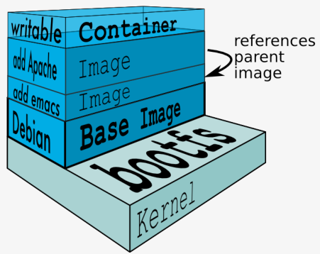

## Docker 属于 Linux 容器的一种封装，提供简单易用的容器使用接口, 相当于一个虚拟机进程



```javascript
win10专业版开启 Hyper-V安装 Docker Desktop for Windows即可
其他老的用docker toolbox工具集的docker-machine
第一层是虚拟机linux(有自己的网络,window通过docker-machine ssh进入去配置网络,镜像源等)//2 无网络访问权限是正常的//docker-machine restart可以重启
    第二层是image(镜像) //本地镜像存储于虚拟机的目录/var/lib/docker
        第三层是container(容器)
        
docker run hello-world      #测试是否能用
docker -v       #版本c     
docker info     #查看有关docker安装的更多详细信息
docker version  #包括：docker server，docker client, 详细信息
docker network ls #网络
//有的win docker  会出现Failed to switch because your Windows version is not compatible.无法切换到linux,不知道怎么解决

Docker debian apt-get更换国内源解决Dockerfile构建速度过慢 ?? //在Dockerfile中添加如下代码：       
    RUN mv /etc/apt/sources.list /etc/apt/sources.list.bak//#备份旧的配置文件    
    COPY sources.list /etc/apt/ //#替换为我们自定义的配置文件,自己网上找一份就可以        
    RUN npm config set registry https://registry.npm.taobao.org //npm config set registry https://registry.npmjs.org
    
解决windows系统无法对docker容器进行端口映射的问题, 明明3000/tcp -> 0.0.0.0:3333 访问了localhost:3333却访问不到:
    //因为服务中使用的localhost指的是这个Linux环境的地址，而不是我们的宿主环境Windows
    //所以docker-machine ip default   # 其中，default 是docker-machine的name，可以通过docker-machine -ls 查看找到这个Linux的ip地址是192.168.99.100    
    //所以应该访问的是:http://192.168.99.100:3333/users/login
```

## image（镜像）: Docker把应用程序及其依赖打包在 image 文件可以看作是容器的模板

```python
docker images		#列出所有镜像
daemon.json #配置镜像源的文件
#下载CentOS7 镜像
docker pull centos:7.2.1511

docker run -ti centos bash	#运行或安装centso
docker run -ti ubuntu bash  #拉取安装最新 Ubuntu镜像
exit #退出

 docker rmi IMAGEID 			#删除镜像 docker rmi 镜像名称：label
docker tag IMAGEID REPOSITORY:TAG	 	#重命名镜像的仓库和标签
docker commit 容器id REPOSITORY:TAG 	#保存为新镜像
docker build -t [username]/[repository]:[tag]  #构建一下 image 文件
docker push [username]/[repository]:[tag]      #发布 image 文件到dockerhub
```

## container(容器) : 

```python
docker ps		 #列出正在运行的容器     <==>  docker container ls --all
docker ps -a 	 #列出所有容器

#运行容器
    docker start containerid  
    docker run 命令会从 image 文件生成容器。

#进入（执行）容器
    docker attach containerid     
    或
    docker exec -ti containerid  /bin/bash

docker cp package.json ff524254:/userauth #复制文件到容器里

#停止/kill中止，容器
    docker stop containerid 
#删除容器
    docker rm containerid 
#重命名容器
    docker rename a b
#命令用于从正在运行的 Docker 容器里面，将文件拷贝到本机。下面是拷贝到当前目录的写法。
    docker container cp [containID]:[/path/to/file]\
    
0.0.0.0:49155->5000/tcp 表示本地主机的 49155 被映射到了容器的 5000 端口
```

配置centos7解决 docker Failed to get D-Bus connection 报错

```python
# 在创建docker容器时添加--privileged
docker run --privileged  -ti -e "container=docker"  -v /sys/fs/cgroup:/sys/fs/cgroup  centos  /usr/sbin/init
docker run --privileged-m 24576M -memory-swap -1 -p 8020:8020 -p 7180:7180 -p 21050:21050 -p 50070:50070 -p 50075:50075 -p 50010:50010 -p 50020:50020 -p 8890:8890  -p 60010:60010 -p 10002:10002 -p 25010:25010 -p 25020:25020 -p 18088:18088 -p 8088:8088 -p 19888:19888 -p 7187:7187 -p 11000:11000 -t -p 8888:8888 -i -d --hostname=hadoop --name=linux_hadoop  镜像id
#docker的linux镜像配置ssh，让win10的xshell连接
docker run --privileged  -ti -e "container=docker"  -v /sys/fs/cgroup:/sys/fs/cgroup -p 50001:22  a9db  /usr/sbin/init
#注意-p 50001:22这句，意思是将win10的50001端口和container的22端口绑定，这样win10访问127.0.0.1:50001等价于访问container的22端口

#拉动并运行我们命名的Dockerized nginx Web服务器webserver
docker run --detach --publish 50001:80 --name webserver nginx
```

取安装最新 Ubuntu镜像

```python
ctrl+c   #停止 Node 进程
ctrl+d   #退出容器，等同于exit,  退出容器且关闭, docker ps 查看无 
ctrl+p+q #退出容器但不关闭, docker ps 查看有
-t                          #终端界面。
-i                          #允许与终端界面交互。
--privileged		#为此容器授予扩展权限
-publish , -p		#将容器的端口发布到主机 -P随机生成
--memory , -m		#内存限制
--memory-swap		#交换限制等于内存加交换：' - 1以启用无限制交换
--hostname , -h		#容器主机名
-d                          #是--detach后台执行
--env , -e		        #设置环境变量
--volume , -v		#绑定一个卷 ，其实是在宿主的C:\ProgramData\Docker\volumes Volume上创建一个directory, 在该目录放东西会在容器里同步地放东西,一个联动的目录
    --volume /tmp/data1:/tmp/data2 
    #主机的/tmp/data1（可以是一个绝对路径，也可以是一个数据卷名如果数据卷不存在，docker会自动创建数据卷）目录
       -v /d/PycharmProjects:/test
    #与容器中的/tmp/data2（必须是绝对路径）目录一一对应 
--rm                        #参数，在容器终止运行后自动删除容器文件
```

> docker-compose

```javascript
文件夹1(包含Dockerfile)
文件夹2(包含Dockerfile)
文件夹3(包含docker-compose.yml) //docker-compose.yml里包含文件夹1和文件夹2 
    //docker-compose up--no-recreate的时候会逐个运行它们的Dockerfile

Dockerfile 文件:用来定制镜像
        在Dockerfile文件这个目录下执行命令：
            docker build -t imagename1:v1 . //.表示上下文的目录,v1是镜像标签
            docker build -t node-web-development/userauth .     /*node-web-development/userauth是镜像名词*/
        FROM 告诉Docker使用哪个镜像源     
        ADD . /app/    //移动当前目录下面的文件到app目录下 
        WORKDIR /app    //进入到app目录下面，类似cd  
        RUN 是在 docker build 时运行 //安装依赖 
        EXPOSE 3000   //对外暴露的端口
        CMD 是在 docker run   时运行 ["node", "app.js"] //程序启动脚本
        
        //运行一行命令,就存档一下,失败时重新执行可以从存档开始 
       ~:

     
        

        
docker-compose.yml//在包含它的目录下运行:
    //把很多命令搞在一起,一次就启动很多容器等，定义构成应用程序的服务，这样它们可以在隔离环境中一起运行
        docker-compose up//目录下运行, -f，--file 指定docker-compose.yml//--force-recreate 强制重新创建 //--no-recreate 如果容器已经存在,不重新创建
            docker-compose up notes//单纯启动容器,不会重新构建
            docker-compose build notes//更新Dockerfile或其构建目录的内容的更改到容器里
                docker-compose up --build notes//重新创建镜像，然后生成容器.        
        docker-compose exec notes sh //在正在运行的容器中执行命令
        docker-compose run notes bash//启动web服务并bash作为其命令运行，运行一次性命令
        docker-compose start notes// 
        docker-compose ps //列出包含的容器们
        docker-compose images//列出包含的镜像们 
        常用命令:
        docker-compose up -d 启动（修改docker-compose.yml后需要使用此命令使更改生效）；
        docker-compose logs 打印日志；
        docker-compose logs -f 打印日志，-f表示跟随日志；
        docker logs -f qinglong 和上面两条相比可以显示汉字；
        docker-compose pull 更新镜像；
        docker-compose stop 停止容器；
        docker-compose restart 重启容器；
        docker-compose down 停止并删除容器；        
    ports:
      - 8091:80 //内部的80映射到外部是8091
    volumes:
      - ./backend:/usr/src/app //让/usr/src/app指向本地backend文件夹
      - /var/lib/mysql //只是指定一个路径，Docker 会自动在创建一个数据卷（这个路径是容器内部的
      

kitematic//是docker推出的GUI工具,使操作docker的方式变得更简单直观

Kubernetes //是Google开源的一个容器编排引擎，它支持自动化部署、大规模可伸缩、应用容器化管理。
    /是底层资源与容器的一个抽象层, 可以算是分布式时代的Linux/
    在Kubernetes中，我们可以创建多个容器，每个容器里面运行一个应用实例，然后通过内置的负载均衡策略，
        实现对这一组应用实例的管理、发现、访问，而这些细节都不需要运维人员去进行复杂的手工配置和处理。
```


```javascript
pm2-runtime 专为 Docker 容器设计，它将应用程序保持在前台，使容器保持运行，
pm2 专为在后台发送或运行应用程序的正常使用而设计。
```

