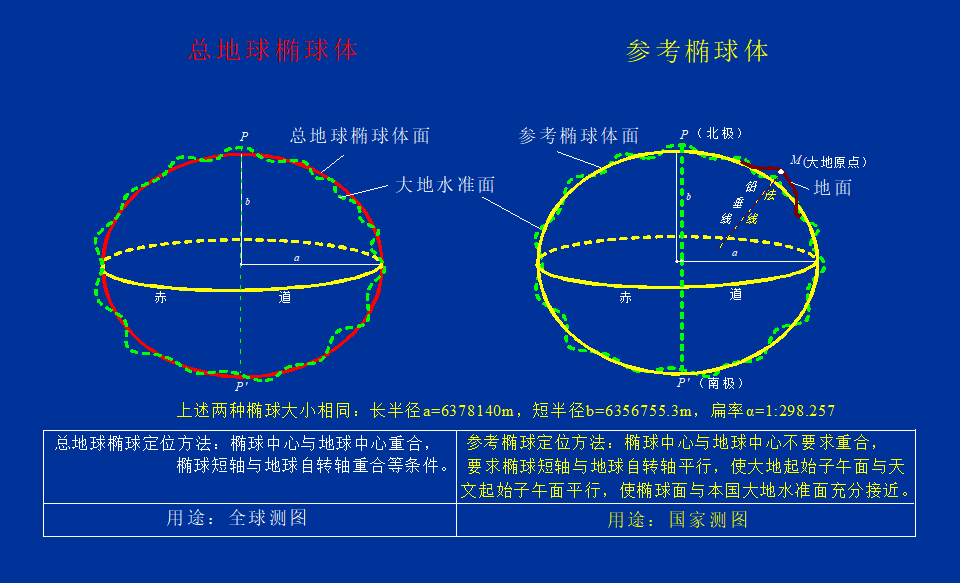
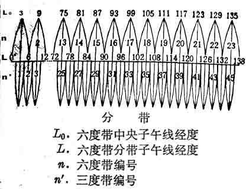

## EPSG:4326 和 EPSG:3857
```js
EPSG:4326（WGS 84）//单位：经纬度    #EPSG代表欧洲石油调查组，该组织参与测量和应用大地测量
	//WGS 1984=EPSG:4326
	4326 只是WGS84 的[EPSG](https://epsg.org/)标识符。
	WGS84 包括地球的标准坐标系、原始高度数据的基准/参考椭球。
    CRS84等效于EPSG:4326//经纬度相反?
    OGC CRS URN
        eg:urn：ogc：def：crs：OGC：1.3：CRS84
        // urn是标识符，ogc是组织，def是另一个静态交易，crs是类型（坐标参考系统），
        //OGC是权限，1.3是版本，CRS84是投影
    OpenGIS(Open Geodata Interoperation Specification) 开放的地理数据互操作规范, 由OGC提出     
    OGC//(Open Geospatial Consortium)开放地理空间信息联盟 
EPSG:3857（WGS 84投影版）  默认米为单位（Web Spherical Mercator投影)  #单位：米   平面坐标放大6倍  ,/geoserver的900913等同它/
    等效于EPSG:900913
    EPSG:900913是一个已经废弃的代码，曾经代表Web Mercator投影，它通常用于在线地图应用程序，例如Google Maps和OpenStreetMap。它已经被EPSG:3857所取代。Web Mercator投影的特点是能够在不同的地图上无缝地显示。
```
### [EPSG:4979](http://spatialreference.org/ref/epsg/4979/)
1. EPSG:4979包括椭圆体上方的高度，而 4326 不包括。
2. EPSG 4326 是二维的。EPSG 4979是三维版的EPSG 4326 
### EPSG:4978
1.  EPSG:4979 的数据表现为经纬度+高程(单位:米)；
2.  EPSG:4978 的数据则表现为平面直角坐标(单位:米)，其原点在地心，X轴指向赤道和本初子午线的交点，Z轴指向北极点

## 椭球体


```javascript
我国目前使用的五种大地坐标系统包括
    3个参心坐标系(即1954北京大地坐标系、1980国家大地坐标系和新1954年北京大地坐标系)
    2个地心坐标系(即WGS84，CGCS2000)。,/区别:只有扁率有微小差异/ ,//长半轴、短半轴和扁率,原点
```


```csharp
子午面：竖切面
    天文子午面:包含地面某点A的铅垂线和地球自转轴的平面称A点的天文子午面
    大地子午面:通过地面A点和地球椭球体旋转轴的平面，称A点的大地子午面
```

## 坐标系统类型与投影方法
```javascript
大地测量坐标系统
    1.地理坐标系统（经纬度) 
        地心坐标系（原点为地球质心，以参考椭球为基准）
        参心坐标系（原点为参考椭球中心，以总地球椭球为基准）
    2.投影坐标系 由 以下参数确定//由地理坐标系GCS为基准生成, 平面坐标系统地图单位通常为	米	//    地图投影	是把椭球体转换为平面的方法  
        地理坐标系（由基准面确定，比如：北京54、西安80、WGS84）
        投影方法
            墨卡托投影,		等角 正 切圆柱	//Mercator投影
            高斯-克吕格投影		等角 横 切圆柱   //圆柱体横过来
            		
           UTM投影,			横轴等角割圆柱	//通用横轴墨卡托投影（Universal Transverse Mercator，简称UTM）
               //UTM投影与高斯投影的主要区别在南北格网线的比例系数上
           Lambert兰勃特投影,       正轴等角割圆锥	 
           Albers阿尔伯斯投影,      正轴等面积割圆锥

墨卡托投影（Mercator projection）
    墨卡托投影以其创立者荷兰地图学家墨卡托命名，其学名为“正轴等角圆柱投影”，假设地球被包围在圆柱体中，地球的赤道与圆柱相接触，然后再假想地球中心有一个光源，光源把地球表面上的图像投影到圆柱体上，再将圆柱体展开，展开后的地图就是墨卡托投影的世界地图，过程如下图所示：
高斯-克吕格投影（Gauss-Kruger）
    高斯-克吕格投影以其创立者高斯和克吕格命名，其学名为“横轴墨卡托投影”，以中央经线与圆柱体相切，再进行投影，如下图所示：
UTM 投影（Universal Transverse Mercator）
    UTM 投影，其全称为“通用横轴墨卡托投影”，UTM 投影与高斯-克吕格投影十分相似，但圆柱体并不是与地球相切，而是穿过地球与南北极往里一点相切，如下图所示：
网络墨卡托投影（Web Mercator）
    网络墨卡托投影由 Google Map 发明，借鉴于墨卡托投影，但在投影时并不是把地球当作一个椭球体，而是当作一个正球体。


坐标示例:
    38,424,817|2,553,755 EPSG4326
    443,407|2,560,887 EPSG4547
    
高斯-克吕格投影（Gauss–Krüger projection）=横轴墨卡托投影（transverse Mercator projection）=高斯投影
    //高斯 设计提出的横轴等角椭圆柱投影的高斯投影，这种投影法经德国    克吕格尔 加以补充，成为高斯-克吕格投影
        //为减少投影变形，高斯-克吕格投影分为3°带(1∶1万)和6°带投影( 1∶2.5万及1∶5万)。中央子午线以能够被15整除的经度作为该区域的中央子午线
            //高斯投影6度带：我国6度带中央子午线的经度，由69°起每隔6°而至135°，共计12带（12～23带）23带是各分界点！！！，中央子午线的经度L0=6n-3
            // 高斯投影3度带：我国带共计22带（24～45带）。L0=3N
        
ARCGIS里为（Y，X） XY已经颠倒！！！！！！！！
国家统一坐标(38496772,4041212)解读 //高斯平面直角坐标系在纵坐标前面再冠以带号//X七位。Y八位，前两位代表带号。
    Y: 4041212 与赤道的距离
    
    X: 38|496772  横坐标有500千米的偏移,38是带号  //为了保证X是正数，X是加上了500000m的，也就是原点向西移动了500000m，自然是6位正数。
    （纵向）经线上，纬度1度111千米；1条经线的长度2万千米；
    （横向）纬线上，经度1度111*cos(纬度)千米    

UTM投影分带方法与高斯-克吕格投影相似
    将北纬84度至南纬80度之间按经度分为60个带,每带6度.从西经180度起算,两条标准经线距中央经线为180KM左右,中央经线比例系数为0.9996.
```

## 分带命名规则
```javascript
在Beijing 1954目录中，有四种不同的命名规则：
    Beijing 1954 3 Degree GK CM 117E
    Beijing 1954 3 Degree GK Zone 39
    Beijing 1954 GK Zone 20
    Beijing 1954 GK Zone 20N
它们的含义说明分别如下：
    3度分带法的北京54坐标系，中央经线在东经117度的分带坐标，横坐标前不加带号
    3度分带法的北京54坐标系，分带号为39（中央经线为3*39=117），横坐标前加带号
    6度分带法的北京54坐标系，分带号为20（中央经线为6*20-3=117），横坐标前加带号
    6度分带法的北京54坐标系，分带号为20（中央经线为6*20-3=117），横坐标前不加带号
在Xian 1980目录中，也有四种不同的命名规则：
    Xian 1980 3 Degree GK CM 117E
    Xian 1980 3 Degree GK Zone 39
    Xian 1980 GK CM 117E
    Xian 1980 GK Zone 20
它们的含义说明分别如下：
    3度分带法的西安80坐标系，中央经线为东经117，横坐标前不带带号
    3度分带法的西安80坐标系，分带号为39（中央经线为3*39=117），横坐标前加带号
    6度分带法的西安80坐标系，中央经线为东经117，横坐标前不带带号
    6度分带法的西安80坐标系，分带号为20（中央经线为6*20-3=117），横坐标前加带号
    注释：
        数字E 是75E 到135E ,很明显 东经75度 到 东经 135度
        GK 是高斯克吕格
                Degree GK xx是每3度 一个文件(共21个)
               没有Degree的 GK xx 是每6度 一个文件 (共11个)
        CM 是CentralMeridian 中央子午线，
        Zone是分带号
        N是表示不显示带号。
        
中国共分五个时区：
    中原时区以东经120度为中央子午线。3度带
    陇蜀时区以东经105度为中央子午线。6度带
    新藏时区以东经90度为中央子午线。3度带
    昆仑时区以东经75度为中央子午线。6度带
    长白时区以东经135度为中央子午线。6度带
```


## 基础 概念
```javascript
椭球体		指旋转椭球体,以地球南北短轴旋转而来,	如WGS-84
    椭球定位和定向:		按一定的规则将椭球体与大地体套合在一起
地球表面:		字面意思,曲折不平
大地水准面:	水面, 与重力垂直, 曲折不平
参考椭球体:	圆圆的,数学上的//参考椭球是大地控制网计算和显示点坐标（如纬度，经度和海拔）的首选的地球表面的几何模型
1个椭球体			=	n个参考椭球体(大地基准面)(由椭球体偏移(定位定向)而来)
大地基准面(Datum)	=	参考椭球体偏移后（Spheroid）
北美最常用的基准面是：
     NAD	1927 (North American Datum 1927) 		使用 Clarke 1866 椭球//北美洲基准面（NAD）
    NAD 	1983 (North American Datum 1983)		使用 GRS 1980 	 椭球
    WGS 	1984 (World Geodetic Survey 1984) 		使用 WGS 1984 	 椭球//世界大地测量系统（英语：World Geodetic System, WGS）
中国的高程系统采用的是正常高系统
    以大地水准面为基准的高程系统称为正高
    以似大地水准面为基准的高程系统称为正常高
```

## 地图分幅编号J48G024008

```csharp
//地图编号
国际1：100万地形图的标准分幅方法：
从赤道起，每4一行，到88，共22横行，A B C……V为行号
从180经度算起，自西向东每6为一纵行，全球分为60纵行用1 2 3……60

J-50是1：100万的地形图，（J为北纬36度-40度，50为东经114度-120度）大概为河北、北京地区。

为使各种比例尺不混淆，分别采用不同的字符作为各种比例尺的代码。
1：50万用B，
1：25万用C，
1：10万用D，
1：5万用E，
1：2.5万用F，
1：1万用G，
1：5000用H

解读编号：
J48G024008.jpg==(J,48) (G) (024,008).jpg
```