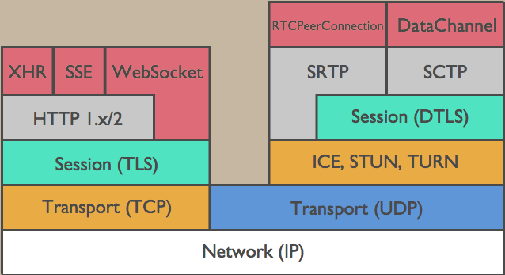
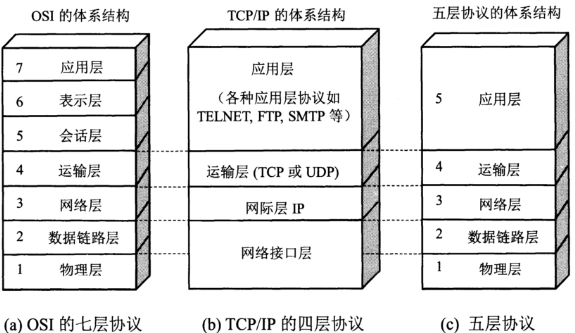

---

> 长链接历史

```javascript
WebSocket (双向连接)和 EventSource (单向连接)
    //EventSource 接口用于接收服务器发送的事件。它通过HTTP连接到一个服务器，以text/event-stream 格式接收事件, 不关闭连接。
    
历史: /轮询 -> Comet ->  WebSocket -> SSE/
        Comet(一种利用长连接的规范,后端响应时写死循环): Ajax Push，HTTP Streaming和HTTP Server Push 实现了它
        WebSocket借鉴了Comet
        Server-Sent Events (服务端事件)使用流信息向浏览器推送信息。它基于 HTTP 协议
            new EventSource('服务器地址' )
            content-type: text/event-stream
    
http 长连接和 websocket 的长连接区别
    HTTP1.1通过使用Connection:keep-alive进行长连接，HTTP 1.1默认进行持久连接。在一次 TCP 连接中可以完成多个 HTTP 请求
         发送多次请求头
        Keep-Alive保持有限时间 //可以在不同的服务器软件（如Apache）中设定这个时间。
        keep-alive双方并没有建立真正的连接会话，服务端可以在任何一次请求完成后关闭。
    /websocket是一个真正的全双工/
        发送1次请求头
        WebSocket 它本身就规定了是真正的双工的长连接，两边都必须要维持住连接的状态。
```


---

> WS


```javascript
WebSocket协议 //ws://example.com:80/some/path        
    建立在 TCP 之上,通过 HTTP 的 101 状态码建立连接, 默认端口也是80和443
    支持文本/二进制数据/没有同源限制

握手过程
    请求: 101 状态码 //设置协议/版本/标识
        Sec-WebSocket-Protocol:jsonrpc,protocol2 
        Sec-WebSocket-Version:13 
        Upgrade:websocket 
    响应: 
        Connection:Upgrade  //多出链接建立标识
        Sec-WebSocket-Accept:lWc5qBYvZLWjFVzUOegIyRDnSG0= 
        Sec-Websocket-Protocol:jsonrpc 
        Upgrade:websocket

//用法
    var ws = new WebSocket("wss://echo.websocket.org", arg2是子协议);//执行上面语句之后，客户端就会与服务器进行连接。
    
    ws.onopen = function(evt) { //用于指定连接成功后的回调函数。
                console.log("Connection open ..."); 
                ws.send("Hello WebSockets!");
                //发送 Blob 对象的例子。
                var file = document.querySelector('input[type="file"]').files[0];
                ws.send(file);
                //发送 ArrayBuffer 对象的例子。
                var img = canvas_context.getImageData(0, 0, 400, 320);
                var binary = new Uint8Array(img.data.length);
                for (var i = 0; i < img.data.length; i++) {
                binary[i] = img.data[i];
    }
    ws.send(binary.buffer);
    };           
    ws.addEventListener('open', function (event) {//如果要指定多个回调函数，可以使用addEventListener方法。
    ws.send('Hello Server!');
    });
    ws.onmessage = function(event) {//指定收到服务器数据后的回调函数。
              console.log( "Received Message: " + event.data);
              //注意，服务器数据可能是文本，也可能是二进制数据（blob对象或Arraybuffer对象）。
              if(typeof event.data === String) {    console.log("Received data string");  }
              if(event.data instanceof ArrayBuffer){    var buffer = event.data;    console.log("Received arraybuffer");  }
              ws.close();
    };
    
    ws.onclose = function(event) {//指定连接关闭后的回调函数。
              var code = event.code;
              var reason = event.reason;
              var wasClean = event.wasClean;
              console.log("Connection closed.");
    };   
   
//四、API
    4.2 webSocket.readyState
    readyState属性返回实例对象的当前状态，共有四种。
        switch (ws.readyState) {
          case WebSocket.CONNECTING:    break;
          case WebSocket.OPEN:    break;
          case WebSocket.CLOSING:      break;
          case WebSocket.CLOSED:    break;
          default:    break;
        }
    //除了动态判断收到的数据类型，也可以使用binaryType属性，显式指定收到的二进制数据类型。
        // 收到的是 blob 数据
        ws.binaryType = "blob";//ws.binaryType = "arraybuffer";
        ws.onmessage = function(e) {
          console.log(e.data.size);//e.data.byteLength
        };
    4.7 webSocket.bufferedAmount
    实例对象的bufferedAmount属性，表示还有多少字节的二进制数据没有发送出去。它可以用来判断发送是否结束。
        var data = new ArrayBuffer(10000000);
        socket.send(data);
        
        if (socket.bufferedAmount === 0) {
          // 发送完毕
        } else {
          // 发送还没结束
        }
    4.8 webSocket.onerror
    实例对象的onerror属性，用于指定报错时的回调函数。
    socket.onerror = function(event) {  // handle error event};
    socket.addEventListener("error", function(event) {  // handle error event});

//推荐一款非常特别的 WebSocket 服务器：Websocketd。
//它的最大特点，就是后台脚本不限语言，标准输入（stdin）就是 WebSocket 的输入，标准输出（stdout）就是 WebSocket 的输出。
```


---

> 层级

```javascript
OSI(Open System Interconnect 开放式系统互联)参考模型: 
/重点 tcp ip 分别是什么层/
```





```javascript
路由器工作于 网络层，     根据MAC地址,用来隔离广播域（子网），连接的设备分属不同子网，工作范围是多个子网之间，负责网络与网络之间通信。 //交换机能做的，路由都能做
交换机工作于 数据链路层， 根据IP地址, 用来隔离冲突域，连接的所有设备同属于一个广播域（子网），负责子网内部通信。
```


---

> TCP/IP

```javascript
TCP三次握手（连接）//TCP传输控制协议  UDP用户数据报协议 //SYN：同步序列编号（Synchronize Sequence Numbers）    //ACK：确认字符(Acknowledgement）
    /记住SASA傻傻/    
    第1次握手：------>SYN（syn=随机数A）        客户端状态变为 [SYN_SENT]
    第2次握手：<----- ACK（ack=随机数A+1） 
              <----- SYN（ack=随机数B）       服务端状态变为  [SYN_RECV]
    第3次握手：------>ACK(ack=随机数B+1）       双方的状态变为 [STABLISHED]
相当于
    你能收到吗？我收到了，你呢？我也收到了
为什么不是两次握手？
    两次握手就变成：你能收到吗？我收到了，你呢？（B不知道A收没收到）

TCP四次挥手（断开）
    FIN：结束标志
    （1） TCP客户端发送一个FIN，用来关闭客户到服务器的数据传送。
    （2） 服务器收到这个FIN，它发回一个ACK，确认序号为收到的序号加1。和SYN一样，一个FIN将占用一个序号。
    （3） 服务器关闭客户端的连接，发送一个FIN给客户端。
    （4） 客户端发回ACK报文确认，并将确认序号设置为收到序号加1。
相当于
    A:“我要断了。”A->FIN_WAIT1
    B:“好,我也要断了.”B->CLOSE_WAIT | A->FIN_WAIT2
    B:”好,我已经断了,你断吧”B->LAST_ACK
    A:”好的”A->TIME_WAIT | B->CLOSED  ，A等待2MSL,保证B收到了消息,否则重说一次”我知道了”,A->CLOSED
```


---

> HTTP POST GET

```javascript
四种POST方法上传数据到服务器(Content-Type):
    1.application/x-www-form-urlencoded 
        title=test&sub%5B%5D=1&sub%5B%5D=2&sub%5B%5D=3 
    2.multipart/form-data 
        ----WebKitFormBoundaryrGKCBY7qhFd3TrwA （请求头的Content-Type:multipart/form-data; boundary=----8d602a57d78bace,Boundary属性，4个“-”）
        （有boundary分隔符隔离，采用了键值对的方式，当上传的字段是文件时，会有Content-Type来表名文件类型；content-disposition，用来说明字段的一些信息；）
                -- ----8d602a57d78bace（开始分隔符，6个“-”）
                Content-Disposition: form-data; name="fileName"; filename="ApplicationLog.dll"（没有分号）
                Content-Type: application/octet-stream
                （空一行不然会出错  \r\n)
                要post的内容1
                -- ----8d602a57d78bace（开始分隔符，6个“-”）
                Content-Disposition: form-data; name="fileName"; filename="ApplicationLog.dll"
                Content-Type: application/octet-stream
                
                要post的内容2
                --  ----8d602a57d78bace--（结束分隔符,前面6个“-”，后面2个“-”）
    3.application/json 
        {"title":"test","sub":[1,2,3]} 
    4.text/xml 
        <value><i4>41</i4></value> 

localhost 是一个域名，通过回送网络接口访问主机上运行的网络服务
    IPv4回送地址 127.0.0.1和IPv6回送地址:: 1         //127.0.0.1 这个地址通常分配给loopback(虚拟网卡)
localhost不经过网络层（网卡），只在本机内部回送

http的底层是在应用层里的一个特殊处理的socket
    socket是用来管理端口的抽象概念

get(url能看到参数 2kb) //http://host/path?键=值
post(提交的信息封装在请求体,安全 2GB)

REST Representational State Transfer 客户端通过四个HTTP动词，对服务器端资源进行操作，实现"表现层状态转换"
    每一个URI代表一种资源；看Url就知道要什么, 看http method就知道干什么,看http status code就知道结果如何


常用状态码（14个最常用) (/重点/)
    1xx信息（正在处理）
    2xx成功
        201        Created 在HTTP协议中，201 Created 是一个代表成功的应答状态码，表示请求已经被成功处理，并且创建了新的资源
        204	没内容
        206	局部内容, 包含  Content-Range 首部
    3xx重定向（资源已被分配了新的 URL）
        301	   url已永久更新浏览器会记住(有缓存)  //换域名时用(SEO友好)
        302	   url已临时更新(无缓存)             //做活动时用(237中303|307细化了302,但基本不用)  
        304    未修改，访问缓存资源
    4xx客户端错误
        400   报文有错误
        401   未授权(登录)禁止访问
        //402 未付款 
        403   禁止该用户访问  
        405  , /方法不允许/
        //409   Conflict 表示请求与服务器端目标资源的当前状态相冲突。如已经登录了
    5xx服务器错误
      //501    Not Implemented
        502    错误网关
        503    服务器不可用
        504    网关超时

报文结构:
    报文头
    空行(CL-RF) 回车换行(\r \n)
    报文主体
```


