逃离

## 中线指标一：MACD 白线下穿黄线（A股中2个死叉就会跌的，但好多个金叉才能确认会涨）（所谓的顶背离）

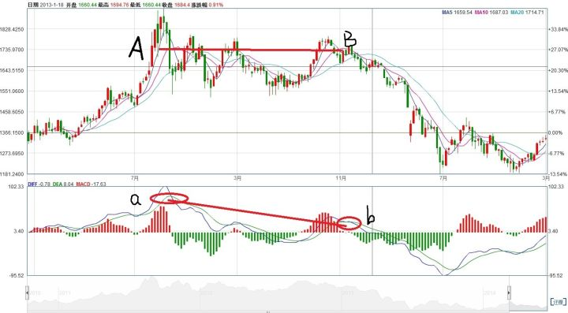

 A区域和B区域平均价格相差不大，但是在与之相对应的MACD指标中a点与b点先后出现俩个死叉，而这俩个死叉的相对位置和标的物价位的相差成明显相反的效果。这种情况后市必然大跌。

MACD的顶背离在A股市场中是一个准确率极其高的指标。再重复一遍，MACD的顶背离在A股市场中是一个准确率极其高的指标

---

融资买入占比作为监测场内杠杆水平的一个重要指标，是一个体现市场活跃度的数据，杠杆比例相对较高，说明市场气氛活跃，即使不赚指数，也会存在赚钱效应。

当场内杠杆水平开始大幅下降，但是大盘还没大幅下跌的时候，大家一定要警惕，这可能是一个最后逃生时机，比如15年6月。

# 一、高位吊颈线

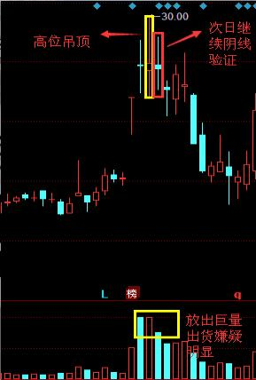

1、如果吊颈线出现在上升趋势之后，则构成一个看跌的K线图形态。

2、在分析吊颈线时，有一点非常重要：当吊颈线出现后，必须等待下一个时间单位的看跌信号对它加以验证。

形式1：吊颈线次日的开市价向下跳空缺口越大，验证信号就越强烈。

形式2：吊颈线次日是一根黑色K线，并且它的收盘价格低于上吊线的实体，则完成了看跌的验证信号

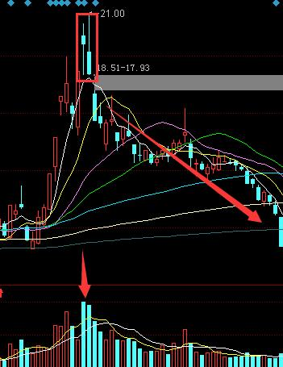

# 二、断头铡刀

一根大阴线切断了三根均线，改变了均线的排列为空头排列，后势看空

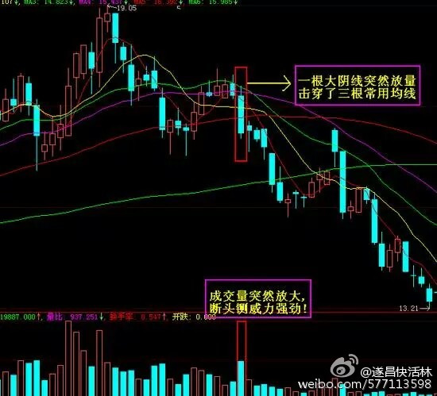

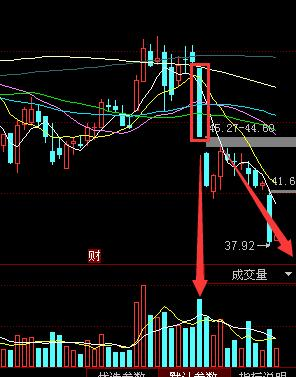

# 三，黄昏之星

在有一定涨幅的k线排列中，第一天收出的阳线，第二天是一个十字星，第三天是一根跌幅较大的长阴线。

这三天的K线组合，就叫黄昏之星。

 1. 出现了黄昏之星，后期多为下跌走势。应跳出来观望为上

黄昏之星表示股价回落，是卖出信号，应伺机抛货。

第一天股价继续上升，拉出一根阳线,第二天波动较小，形成一根小阳线或小阴线，构成星的主体部分，第三天形成一根包容第二天并延伸至第一天阴线实体。

黄昏之星，指的是在高位跳空高开，并且形成一个上下影线都很长的十字星形状的K线，通常如果遇到的是阴线，并且放量，那么黄昏即将到来

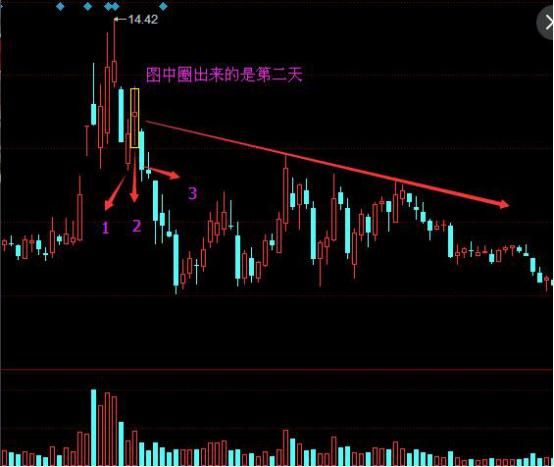

# 四、看跌捉腰带线

上影线特别差，巨量

　2、在上升趋势中的看跌捉腰带线，表明行情将停滞或反转。

　3、在盘档中的看跌捉腰带线，以试盘线居多，多头尖兵线的出现意味着行情向上突破盘整失败，抛压太重，趋势以继续横盘居多。

　4、在下降趋势中的看跌捉腰带线，表明多头反弹微弱，空头抛压力量强大，行情将继续下跌

# 五、看跌吞没形态

1、看跌吞没形态出现在一轮明显的上升趋势中，如果吞没形态具有下面列出了这样的一些参考性要素和特征，那么它们构成重要反转信号的可能性将大大地增强

2、在看跌吞没形态中，第一天的实体非常小，而第二天的实体非常大。这种情况可能说明原有趋势的驱动力正在消退，而新趋势的潜在力量正在壮大。

3、看跌吞没形态出现在超长期的或非常急剧的市场运动之后。如果存在超长期的上升趋势，则增加了以下这种可能性：潜在的买家已经入市买进，持有多头。在这种情况下，市场可能缺少足够的新的多头头寸的供应，无力继续推动市场上升。如果存在非常急剧的市场运动，则市场可能已经朝一个方向走得太远，容易遭受获利盘空头的抛盘打击。

4、在看跌吞没形态中，第二个实体伴有超额的交易量。这种情形可能属于巨量出货爆跌现象。

5、在看跌吞没形态中，第二天的实体向前吞没的实体不止一个

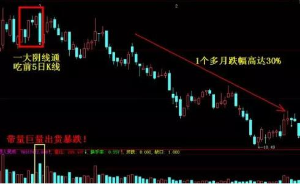

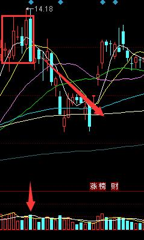

# 六、平顶

1、平顶形态出现于一轮短暂的上升趋势中，两根K线有相同的最高价，意味行情摸高见顶，股价行将反转。

2、虽然平顶形态反转下跌的力度较小。但仍需要注意风险，毕竟真金白银

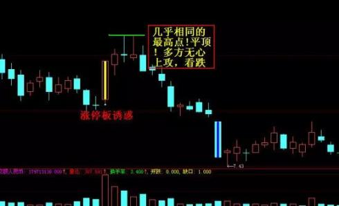

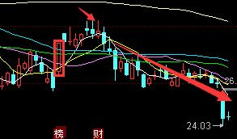

---

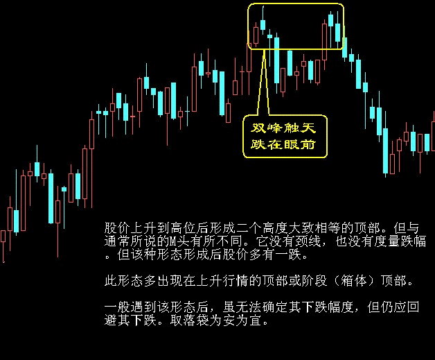

---

## 看筹码

频繁交易，活跃流通的股份，就叫筹码

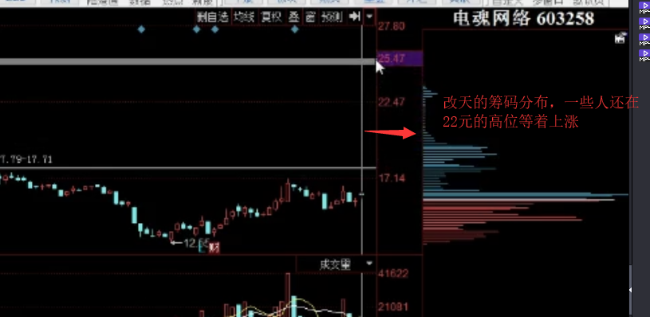

筹码在上方套牢比较多的股票，除非近期有消息利好，否则上涨的可能性不大

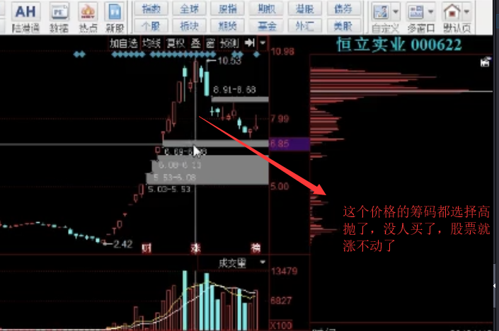

---

## 反包不成功的

## 高位股要快进快出防止被割韭菜

---

## 如何判断庄家出货了？

1.看尾盘最后几分钟集合竞价时，有没有突然大涨

2.高位出现连续放量阴线

3.高位出现上涨无量，下跌放量的震荡

4.高位放量，上影线很长，却没有涨（滞涨）

---

## 沿着5日线上涨的票，不涨停不卖出，偏离5日线太远的时候20%就可以卖出了

