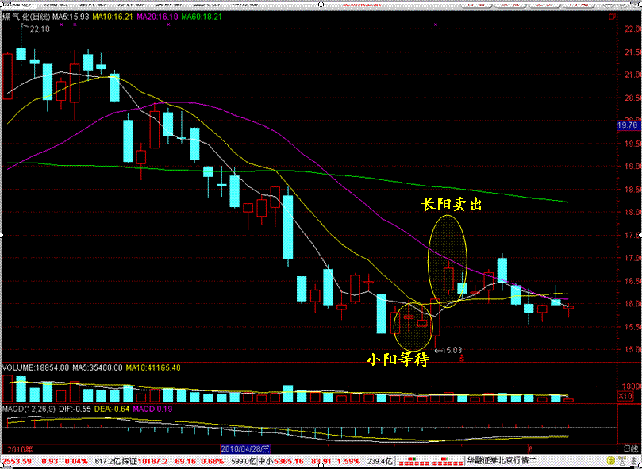
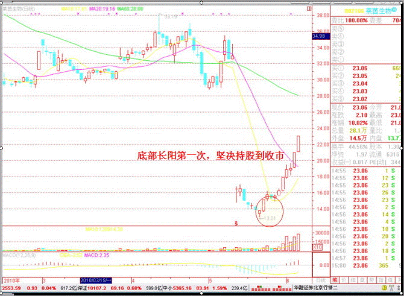
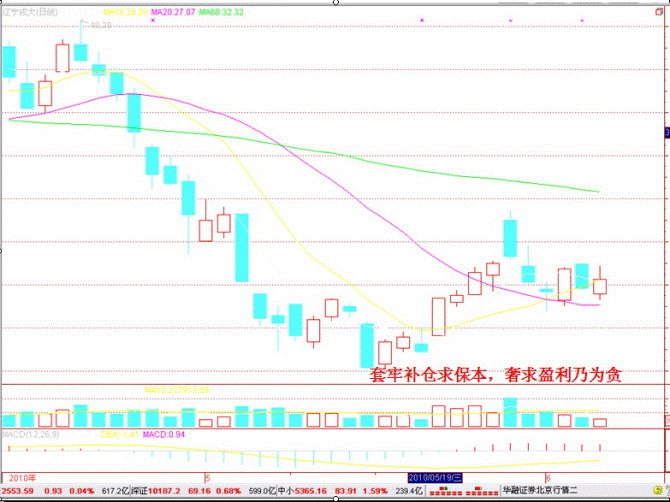

```javascript
12道关于中国股市的简单数学题，看不懂就先别炒股了
1.关于收益率
假如你有100万，收益100%后资产达到200万，如果接下来亏损50%，则资产回到100万，显然亏损50%比赚取100%要容易得多；
2.关于涨跌停
假如你有100万，第一天涨停板后资产达到110万，然后第二天跌停，则资产剩余99万；反之第一天跌停，第二天涨停，资产还是99万元；
3.关于波动性
假如你有100万，第一年赚40%，第二年亏20%，第三年赚40%，第四年亏20%，第五年赚40%，第六年亏20%，资产剩余140.5万元，六年年化收益率仅为5.83%，甚至低于五年期凭证式国债票面利率；
4.关于每天1%
假如你有100万，每天不需要涨停板，只需要挣1%就离场，那么以每年250个交易日计算，一年下来你的资产可以达到1203.2万，两年后你就可以坐拥1.45亿。
5.关于每年200%
假如你有100万，连续5年每年200%收益率，那么5年后你也可以拥有2.43亿元个人资产，显然这样高额收益是很难持续的；
6.关于10年10倍
假如你有100万，希望十年后达到1000万，二十年达到1亿元，三十年达到10亿元，那么你需要做到年化收益率25.89%。
7.关于补仓
如果你在某只股票10元的时候买入1万元，如今跌到5元再买1万元，持有成本可以降到6.67元，而不是你想象中的7.50元；
8.关于持有成本
如果你有100万元，投资某股票盈利10%，当你做卖出决定的时候可以试着留下10万元市值的股票，那么你的持有成本将降为零，接下来你就可以毫无压力的长期持有了。如果你极度看好公司的发展，也可以留下20万市值的股票，你会发现你的盈利从10%提升到了100%，不要得意因为此时股票如果下跌超过了50%，你还是有可能亏损；
9.关于资产组合
有无风险资产A（每年5%）和风险资产B（每年-20%至40%），如果你有100万，你可以投资80万无风险资产A和20万风险资产B，那么你全年最差的收益可能就是零，而最佳收益可能是12%，这就是应用于保本基金CPPI技术的雏形；
10.关于赌场赢利
分析了澳门赌客1000个数据，发现胜负的概率为53%与47%，其中赢钱离场的人平均赢利34%，而输钱离场的人平均亏损时72%，赌场并不需要做局赢利，保证公平依靠人性的弱点就可以持续赢利。股市亦如此。
11.关于投资成功的概率
如果你投资成功的概率是60%，那么意味着你连续投资100次，其中60次盈利，40次亏损。如果你把止盈和止损都设置为10%和-10%，那么意味着最终的收益率是350%（1.1^60*0.9^40=4.50）
解读：是的，朋友们，已经亮瞎你的眼了吧，3.5倍的收益率！而接下来你需要思考的是你怎么能保证你的胜率是60%呐，不要想当然，这个成功率对于多数人来说也是几乎不可能达到的。
12.关于止盈止损
索罗斯说过他不在乎胜负的概率，而期望盈利的时候比亏损时候能多赚一些。假设我们每次止盈是10%，每次止损是-5%，那么连续投资100次，假设胜负概率是50%，那么意味着你最终的收益率是803.26%（1.1^50*0.95^50=9.0326）
解读：是的，你没有看错，收益率是800%。前提是你可以坚决的止损和止盈，其次你能保证50%的概率能到达更多的止盈机会吗？
```

## 复权就是就将分红，配送等等对股价直接造成非交易影响的价格变化处理掉，使得K线图完整连贯

---

## 中国a股高开的缺口必回补，有利好消息往往第二天高开，结果在高开时买入肯定没什么赚钱

国家要股市有人进去，就要让国家队让它涨，才有人买，有人买让资量提升，才可以收税

个股也要紧跟指数的形式，除了妖股

大A股N年以来的规律就是，任何牛市都需要一个先行品种，把市场引爆了，产生赚钱效应，然后才会有源源不断的新钱进来。这次负责引爆的肯定就是芯片板块了，去年四月算是芯片股的第一波，然后这个行情估计可以走三到四年。


大部分散户觉得自己挣不到钱，原因我之前分析过，主要有三个。


1、入场时机不对，A股2/3的开户都集中在2007+2015这两年，每次都是牛市一爆就连滚带爬的冲进来，所以很容易追高。


2、交易频繁，损耗成本过高。有些高频散户一年全仓进出20次以上，这方面就多出了4-5%的成本。而股市的长期预期收益其实和GDP增速是差不多的，每年也就6-7%，都被折腾完了。


3、交易习惯太差，赚钱就想卖，亏钱就想补仓。利润被切断，亏损被放大，取死之道也。

---

量价判断1，如何先人一步看懂大盘走势？

1. 缩量到极致，表示市场面临着再次方向选择,即将变盘。根据市场和外围环境的变化预判是要往上的，随后市场和咱们预判一致选择放量上行。

1. 随后到达下一个关键点位60日均线，60日均线作为传统的牛熊分界线必然受市场关注，且这里前期叠加了前期巨量的套牢盘，想要突破必须要再次放量，没量突破是不可能的，随即进行了一小波的回调，既然上升趋势形成，回调后必然是要往上再次试探，但是试探后能不能再次突破就要考验市场有没有这个能力，也就是量能。如果市场量能充足能够突破上攻，咱们选择继续锁仓。相反，上攻量能不足就是减仓节点。

1. 具体在盘中怎么看量能的变化，能够先人一步盘中提前执行策略，一些长期关注的老朋友都是很清楚的，最好用并且效用较好的就是上证指数的30分钟K线图。

1. 开盘9:30-10:00的量能至关重要，记住这里观察与判断不是和前一根K线进行对比。由于咱们天然开盘半小时和临近收盘半小时交投活跃量能较大，需要和前期相同时间段的K线量能进行对比才有意义，一般可以参考前3天的量能。

1. 如果用具体的数据量化进行判断则有两个对比点，一是和最近一次突破关键点位的量能对比；其次，则是达到最近3个交易日相同时间段平均量能的30%。

1. 量能变化在关键点位参考意义更大，多空双方激烈交战。关键位置拿下后，多空双方力量短期就会比较明朗. 

---

做T 解套

    日内做T

        目前股票操作执行T+1，是指当天买进的股票，只能在第二天卖出。为此，就产生了“T+0”操作技巧。

        

        比如，你手中已持有某一被套的股票1000股，成本12元/股。

        当天振幅较大，先泛绿下跌，在9元/股处你买进500股。随后该股飘红上涨，在10元/股你卖出500股（受T+1规定限制）。

        此时，你完成了一个标准的T+0操作。你当天获利500元（未扣除交易费）。

        这样原来被套的1000股要亏2000块的，现在亏1500块而已了。

    

    一个星期做一次T

        在区间波动范围内高抛低吸


---

# 买


跌出“母女”线，一般反弹两三天










# 卖


---

缺口理论

    缺口是早盘集合竞价的时候形成的

    缺口理论参考幅度3%以上的缺口

    

    缺口要跟压力位对比来判断才有意义

    

    缺口代表着支撑

    向下突破缺口的股票直接出

    向上突破缺口，突破了上方的压力，先买进再说！


