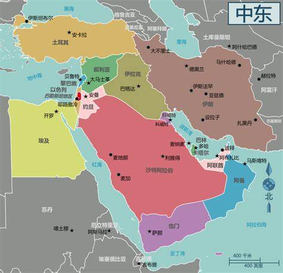

> 政事堂:

明年会有钓鱼岛争端 2021年9月7日

接下来的放水会推高一线城市的房价 2020年3月24日

2021年8月23日

房改->福利分房->商品房  

财政包干(交足中央,剩下都是自己的)->分税制(上交中央大部分)+土地财政 

---

> 远方青木：

要避免经济危机	

1.那商品要一直涨，人民才会消费。要是大家觉得以后会跌，自然想着以后再买。	

2.确保货币足够,M2增速要保持,货币不够的话,没人买商品就会降价

1. 降息:经济不好时,大家都把钱存银行,要降息（🇨🇳未来要做的）

1. 印钱:而印钱要信用支撑

1. 国际信用:要靠赚外汇同等印钱

1. 国内信用:抵押印钱

1. 靠房[停止了] 

1. 靠股市[未来会涨]

1. 经济不好时，如何让经济增长，信用（未来的钱）和支出（现在的钱）就是社会的收入，要么让人和资本家不存钱（增加支出）（降息）,要么让大家借钱(信用扩张)

1. 对外信用扩张：印钱是因为有多少外汇(美元)(对于国家间，外汇就是信用，就是收入）就对应印多少人民币，大家就有钱了（凭空印钱只会让钱比商品多东西涨价）

1. 美元信用扩张靠美国债,但目前到顶了,再增国债利息都要还不起了

1. 对内信用扩张：外汇停止增加，就不能印钱，就会缺钱，国内的信用扩张就得靠抵押品（房和股市）

1. 降息:降息降到负利率,未来利率会越来越低,除非科技革命,造成生产力提高,经济变好

1. 结论:

1. 未来利率变低,钱就要拿出来,去股市了,股市会涨

1. 理财选锁定利率的产品,未来利率会变低的

---

> 金灿荣2019:

1.  2019下半年经济企稳, 进入二三十年的高速增长期(到我四五十岁)  ,因为有人口红利和工程师红利

1. 第四次工业革命要来了, 中国很可能会赢

1. 修宪是为了解决台湾等的问题

1. 贸易战会结束，科技战要十几年

1. 十年(我33岁):	就可以民族复兴了(超过美国)

1. 量子计算，6G虚拟世界实现

1. 台湾两三年内出事会死人,五年后出事不会死人(那时有十几条055了,围而不打)

---

> 公众号

- 做什么事情都要用二八定律，想想什么是最重要的，最应该花时间做的（八成的时间在学习区，二成的时间在舒适区）

- 看了个公众号，里面都是事业有成的大龄青年，比我大2到8岁，很多出过国的，高学历的，有车有房的，好多年入30万+的，感觉没钱真的不好找女朋友

- 做做减法，删删好友

---

> 猫哥的视界:

- 达不到非常优秀, 选择去二线

- 我觉得未来(农村)土地改革的契机至少要满足两个条件，其一，我们顺利实现产业升级（能吸纳更多的农业剩余劳动力），第二，我们的城市率提高到65%以上。

- 国际油价将长期在40——70美元/桶这个区间低位震荡，中国货币政策未来将保持低增速供应。

- 胃镜胶囊机器人，市场价3000多元一粒，医保后自费1000多元——预计未来5年内这个胶囊机器人会降成白菜价。

- 10年内(我33岁前) 炒股大部分癌症估计都能攻克，我的寿命会有质的飞跃, 纳米机器人实现大规模商用

- 人民币会升值

- 风口在股市,  现在买股票=2008年买房子

- 在核心城市圈发展, 压力太大可以去周边的卫星城市

- 抛弃美元及美元计价的资产, 持有人民币以及人民币计价的资产

- 20年(我43岁): 关于人体器官衰竭预计就可实现

- 2050年(我54岁)，可控核聚变实现，5G改变社会来一波洗牌量子革命与人工智能再来一波洗牌；可控核聚变商用就是终极洗牌

- 美国石油美元不行了，又要转到军工美元了，特朗普需要破坏和平来达到保护政府不被军工集团干趴的目的

- 未来教育会精英化，课外补习就是手段，大学的课外补习市场潜力巨大

- 2019到2022年，全球经济是一个衰退期

---

> 血饮

中国股市上涨需要外部资本持续流入和内部经济增长不断向上两个条件。只有流动性不断增长、资金水平面不断上涨才能够推动股市上涨，这是股市上涨的充要条件，而实体经济发展是股市上涨的基础，如果实体经济增长没有好转，利润问题无法解决，那么任何股市上涨都将不可持续。 

> 卢文克

- 由于美债危机，未来黄金会一直升值的

- 一带一路可以帮助相关国家摆脱08年金融危机到现在的影响， 脱离美债，不被美国割羊毛

---

1. 发展地点肯定在［珠三角大湾区］了

1. 发展方向呢？［程序员］？

买房 

等额本息

---

我开个厂想请一些工人3000块钱请不到,工人的工资越来越高了,

因为工人的稀缺性,有更高的工资的厂请他们去

其他工厂为什么能给更高的工资,因为产品卖的出去

为什么能卖得出去,因为大家都有钱买,

为什么都有钱买,,因为大家能赚到钱

为什么大家都能赚到钱,因为工厂卖得出去,

工厂赚到钱,扩大生产,缺更多的人,用更高的工资请工人,

工人更有钱了,买更多的产品

---

## 价值投资可以投茅台，五粮液，平安持有以年限为单位操作，以月为单位，不可以大篆，但肯定不会大亏

根据目前云计算的市场份额来看，这一波“区块链+”最大的受益者，除了央行的金融领域之外，恐怕就是马云的阿里云和任正非的华为云。

饭统戴老板:

08年后的四万亿和货币松绑，造成了楼价的飙升

互联网红利跟工程师红利并行，按照金灿荣说的，大概有二三十年

猫哥说明年一年内美国经济很可能就会不好，2020中期美企需要偿债了，美股就会出大问题，两三年内崩溃，从2019年底买入股票，到2020或者2025年再出，

单讲讲怎么研究企业的财报。

我最关注4个指标：销售现金占比［大于1表示供不应求］、销售额、毛利率、现金。

---

随着美国页岩气开采技术革命，新开采技术的逐步应用，美国境内油气资源自我保障率得到大幅度提升，特别是国际石油需求市场结构也发生了较大幅度变化，美国进口中东地区石油的相对比例较大幅度下降。据此，美国适时转变了控制中东地区石油的策略。美国是当今国际石油市场的主要参与者，美国的石油企业在国际石油市场占主导地位，在美国对中东地区石油资源依赖程度下降的情况下，国际石油市场供应和价格对美国的影响程度也随之下降，稳定的中东地区石油输出量和稳定石油价格对美国的石油企业并非全是好事，反而会使美国石油企业丧失通过投机谋取暴利的机会，只有不稳定或波动才会给投机活动带来机遇。为了美国石油企业的利益，通过非经济措施控制国际石油市场规模，使国际石油市场在波动中运行，有时还要提升国际石油市场波动幅度，只有通过使中东地区部分石油生产国动荡，无法正常生产石油，才能达到国际石油市场频繁波动的目的。当前动荡中的利比亚、伊拉克、叙利亚等国家不能恢复石油生产就是最好的例证。随着美国石油自给保障率的进一步提高，未来的国际石油市场波动可能更加不可预测，市场投机行为会更加猖獗，石油价格波动会更加频繁、幅度会更大。

# 中东 -> 石油 -> 经济

